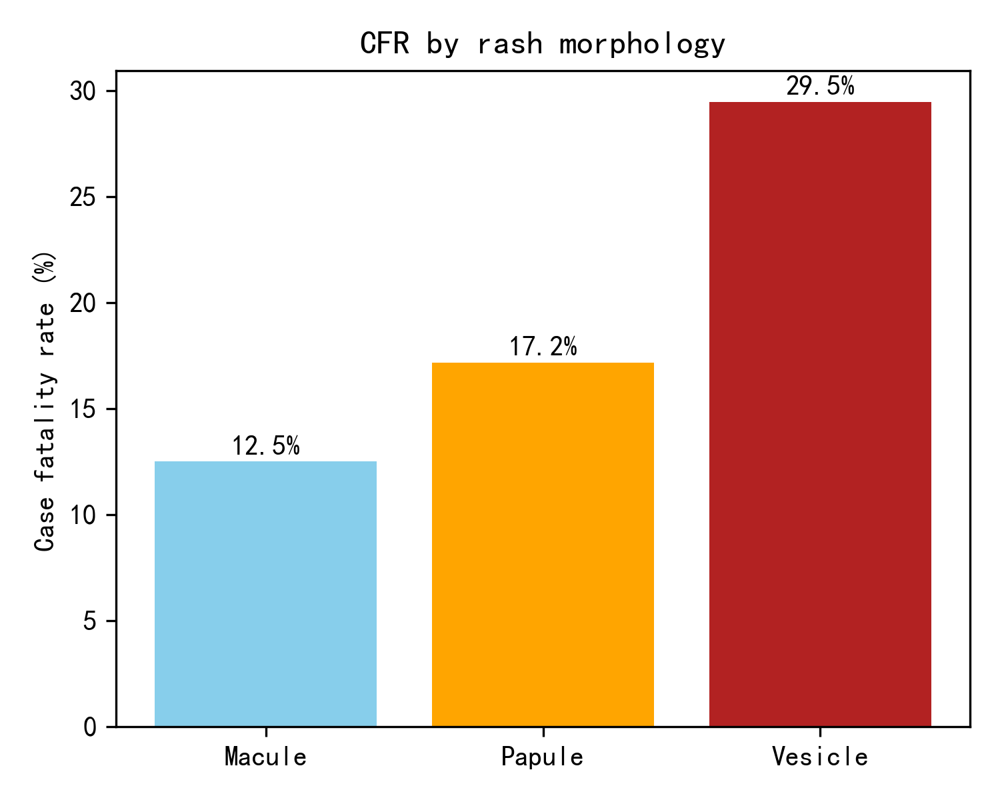
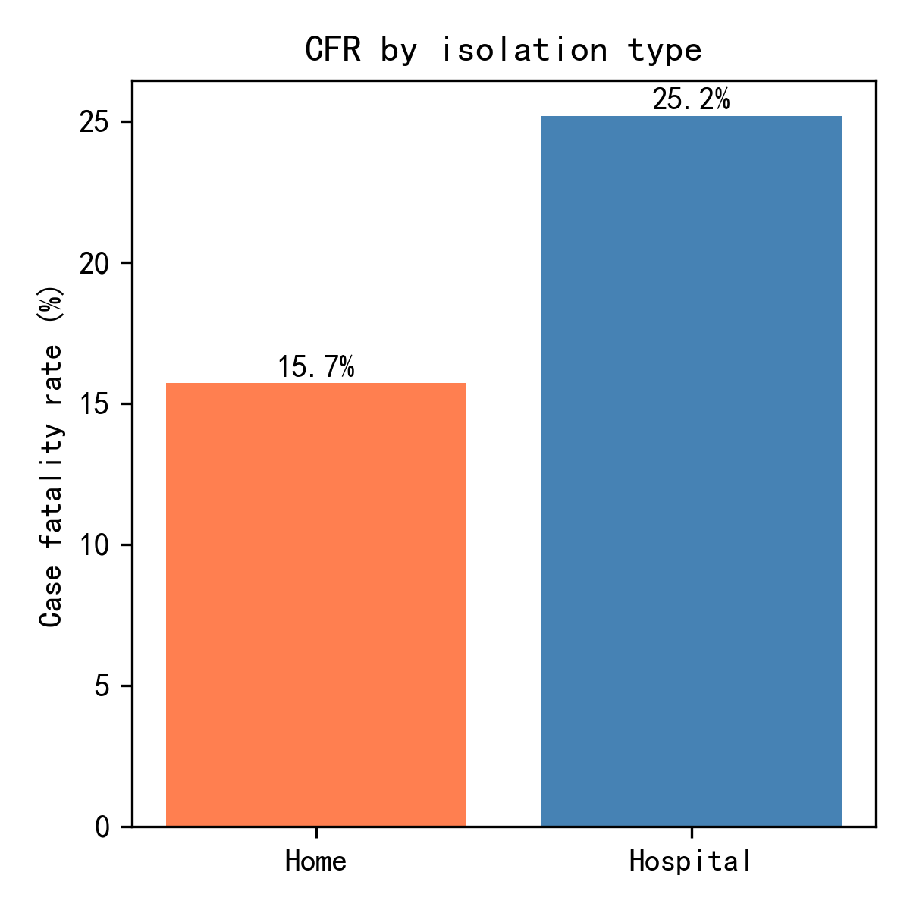
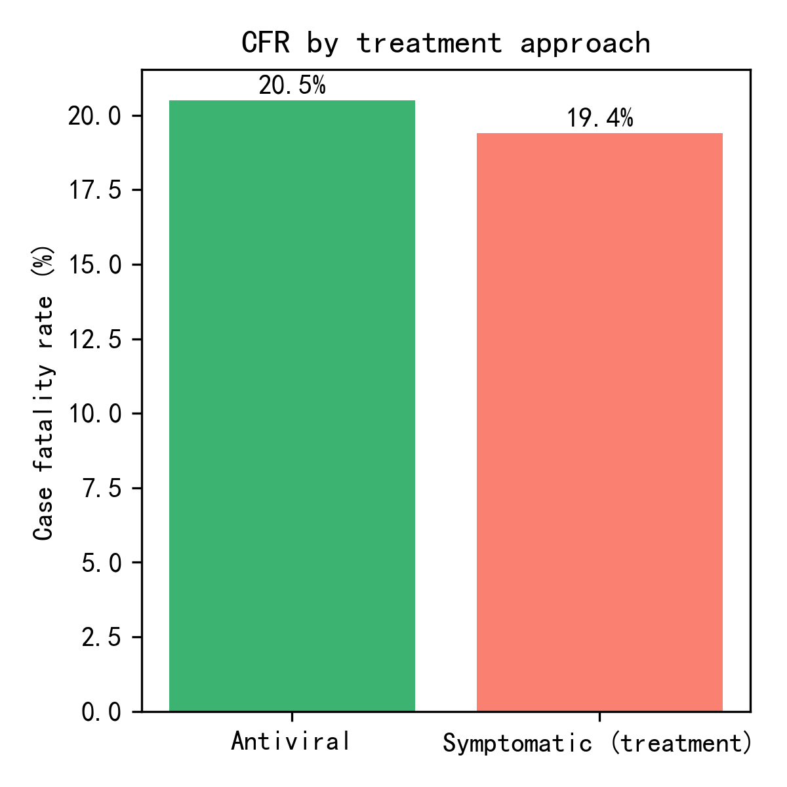

## HFMD Case-Fatality Analysis: Key Drivers and Actions

### Executive Summary
Among 282 HFMD cases (56 deaths, 226 recoveries), vesicular rash, home isolation, and symptomatic-only treatment were independently associated with higher mortality. CFR reached 29.5% in vesicle-dominant rashes versus ~18% for macules/papules, and home-isolated patients faced a 5.4-percentage-point excess risk compared with hospital isolation.

### Symptom Patterns
- **Temperature**: Counter-intuitively, peak fever was slightly lower in fatal cases (37.99 °C) than in survivors (38.70 °C), illustrated in . This suggests hyper-pyrexia alone is not the primary warning sign.
- **Rash morphology**: Vesicular presentation carried a 29.5% CFR vs. 18.2% (papule) and 12.5% (macule) as shown in . Vesicles may reflect higher viral load or systemic dissemination, warranting closer monitoring.

### Prevention & Control Gaps
- **Isolation setting**: Home isolation was linked to a 19.9% CFR compared with 14.5% for hospital isolation (see ). Limited bedside surveillance and delayed escalation likely explain the gap.

### Treatment Choices
- **Antiviral use**: Patients receiving antivirals experienced a 20.5% CFR vs. 19.4% under symptomatic care alone ()—a marginal difference indicating either late administration or limited drug efficacy.

### Recommendations
1. Triage all vesicular-rash cases to hospital isolation for continuous monitoring; do not permit home isolation if vesicles predominate.
2. Develop an early-antiviral protocol initiated within 24 h of vesicle onset, paired with rapid-load diagnostics to confirm timing.
3. Equip home-isolation kits with twice-daily tele-checks and clear escalation thresholds (persistent vomiting, lethargy, respiratory distress
