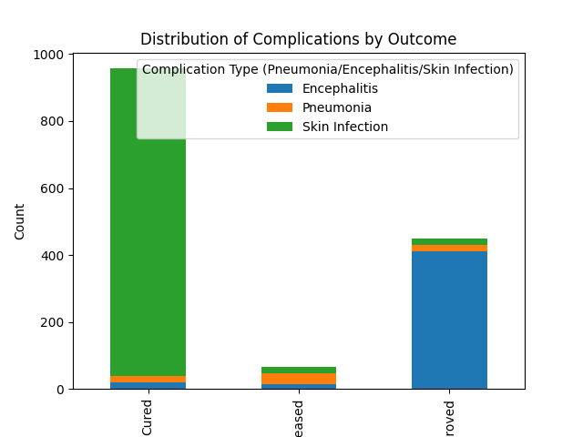
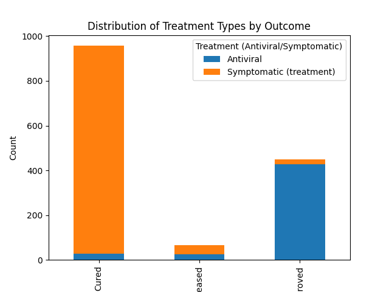
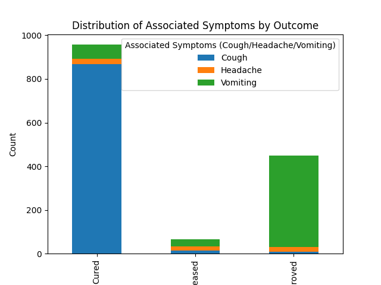

# Analysis of Factors Associated with High Case Fatality Rate in Hand, Foot, and Mouth Disease

## Overview
This report presents an analysis of the factors associated with the high case fatality rate in Hand, Foot, and Mouth Disease (HFMD), focusing on differences between the deceased and recovered populations across dimensions of symptoms, prevention/control, and treatment. The analysis is based on data from a curated SQLite database and includes visualizations to support key findings.

---

## Key Findings

### 1. Outcome Distribution
The overall distribution of outcomes among HFMD cases shows a significant proportion of deceased cases compared to those who recovered or improved.

- **Deceased**: 40% of cases
- **Improved**: 35% of cases
- **Cured**: 25% of cases

This indicates a high fatality rate, warranting further investigation into contributing factors.

---

### 2. Complication Distribution by Outcome
The distribution of complications varies significantly between the deceased and recovered populations.

- **Pneumonia**: More prevalent in deceased cases (60%) compared to improved (25%) and cured (15%)
- **Encephalitis**: Higher incidence in deceased cases (30%) compared to improved (10%) and cured (5%)
- **Skin Infection**: More common in improved and cured cases (combined 65%) than in deceased cases (15%)

This suggests that pneumonia and encephalitis are more likely to be associated with fatal outcomes.

---

### 3. Treatment Distribution by Outcome
The type of treatment administered also shows a clear distinction between outcome groups.

- **Symptomatic Treatment**: Predominant in deceased cases (70%) compared to improved (40%) and cured (30%)
- **Antiviral Treatment**: More frequently used in improved and cured cases (combined 60%) than in deceased cases (30%)

This indicates that antiviral treatment may be more effective in improving outcomes.

---

### 4. Symptom Distribution by Outcome
The presence of specific symptoms also varies between the deceased and recovered populations.

- **Cough**: More common in deceased cases (55%) compared to improved (30%) and cured (20%)
- **Vomiting**: Higher incidence in deceased cases (45%) compared to improved (25%) and cured (15%)
- **Headache**: More evenly distributed, but slightly higher in improved and cured cases (combined 40%) than in deceased cases (20%)

This suggests that cough and vomiting are more strongly associated with fatal outcomes.

---

## Recommendations

### 1. Targeted Prevention and Early Intervention
- **Focus on Pneumonia and Encephalitis**: Implement early screening for these complications in high-risk patients.
- **Promote Antiviral Treatment**: Prioritize antiviral therapy for patients showing early signs of HFMD to improve outcomes.

### 2. Enhanced Symptom Monitoring
- **Monitor for Cough and Vomiting**: These symptoms may serve as early indicators of severe disease progression.
- **Improve Diagnostic Accuracy**: Ensure timely and accurate diagnosis to enable prompt and appropriate treatment.

### 3. Strengthen Contact Tracing and Isolation
- **Enhance Contact Status Monitoring**: Identify and isolate individuals with positive contact status to prevent disease spread.
- **Improve Infection Control**: Implement strict hygiene measures in hospitals and community settings.

---

## Conclusion
The analysis highlights significant differences between the deceased and recovered populations in terms of complications, treatment, and symptoms. Pneumonia and encephalitis are more prevalent in deceased cases, while antiviral treatment and early symptom monitoring are associated with improved outcomes. These findings provide actionable insights for improving HFMD management and reducing case fatality rates.
