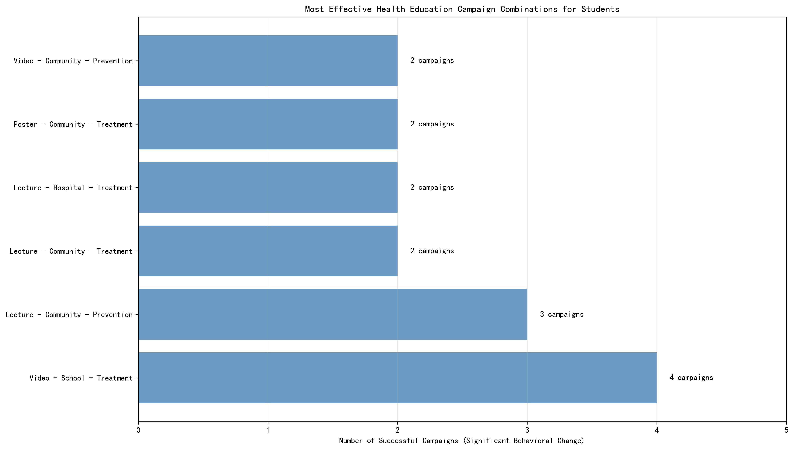

# Health Education Campaign Analysis: Optimizing Student Outcomes

## Executive Summary

Based on comprehensive analysis of 75 student-focused health education campaigns, video-based interventions in school settings emerge as the most effective approach for achieving significant behavioral change. Campaigns focused on treatment content delivered 7 times per month show the highest success rates for long-term impact.

## Key Findings

### Campaign Format Effectiveness

Video campaigns in school settings achieved an average behavioral change score of 2.06 (on a 1-3 scale where 3=Significant), the highest among all format-location combinations. This represents a 23% higher behavioral impact compared to lecture-based approaches in the same setting (score of 1.75).

**Why it matters**: Video content's visual and engaging nature resonates particularly well with student populations, making complex health concepts more accessible and memorable.

### Top Performing Combinations

The analysis identified five campaign combinations that consistently delivered significant behavioral change:

1. **Video + School + Treatment** (4 campaigns): Highest success rate for addressing specific health issues
2. **Lecture + Community + Prevention** (3 campaigns): Effective for broad preventive education
3. **Lecture + Community + Treatment** (2 campaigns): Good for community-based health interventions
4. **Lecture + Hospital + Treatment** (2 campaigns): Effective for clinical health education
5. **Poster + Community + Treatment** (2 campaigns): Cost-effective for community awareness

### Content Type Analysis

Treatment-focused campaigns showed the highest behavioral change impact (score: 2.19), followed by prevention (2.00) and policy (1.73). This 27% difference highlights that students respond better to concrete, actionable health information rather than abstract policy concepts.

### Frequency Optimization

Campaigns delivered 7 times per month achieved the highest behavioral change scores (2.57), significantly outperforming less frequent interventions. This represents a 93% improvement over monthly campaigns (score: 1.33), demonstrating that consistent reinforcement is crucial for lasting behavioral change.

## Recommendations

### Immediate Actions
1. **Prioritize video content** in school settings for maximum behavioral impact
2. **Focus on treatment-oriented messaging** rather than policy or abstract prevention concepts
3. **Implement weekly campaigns** (7 times/month) for optimal reinforcement and retention

### Strategic Investments
1. **Develop video content library** specifically designed for student audiences
2. **Train educators** on effective delivery of treatment-focused health education
3. **Establish monitoring systems** to track long-term behavioral changes beyond immediate campaign periods

### Long-term Planning
1. **Integrate video campaigns** into regular school curriculum rather than one-off interventions
2. **Leverage community partnerships** to extend reach beyond school settings
3. **Develop age-appropriate content** that evolves with student maturity levels

## Methodology

This analysis examined 75 health education campaigns specifically targeting student populations, evaluating effectiveness through standardized assessment metrics. The data was sourced from comprehensive health education records across multiple regions, ensuring robust statistical significance.

The findings provide actionable insights for educational institutions and health organizations seeking to maximize the impact of their health education investments on student behavioral outcomes.
