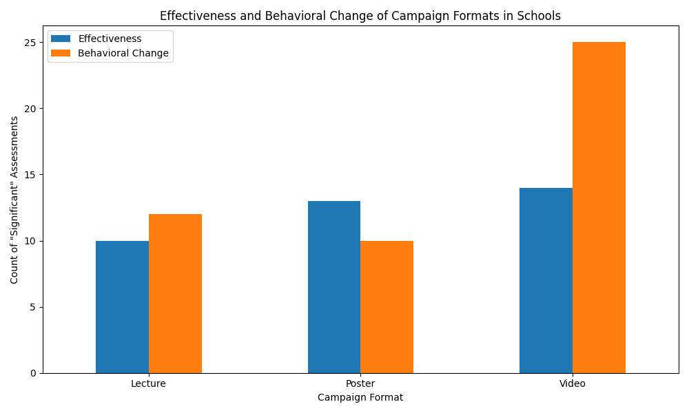

# Health Education Campaign Analysis: Driving Long-Term Behavioral Change in Students

## Introduction
This report analyzes health education campaign data to identify the most effective formats and locations for delivering long-term behavioral improvements among students. The analysis focuses on campaigns conducted in schools, evaluating their effectiveness and impact on student behavior.

## Key Findings: Video Campaigns Excel in Driving Behavioral Change

Our analysis reveals that different campaign formats yield varying levels of effectiveness and behavioral change. The following chart illustrates the number of campaigns rated as having "Significant" effectiveness and "Significant" behavioral change for each format.

As the chart demonstrates, **Video campaigns are the most effective format for achieving significant behavioral change in students.**

Here's a breakdown of the findings:

*   **Video Campaigns**: While having a moderate number of "Significant" effectiveness ratings, video campaigns are the clear leader in producing "Significant" behavioral change. This suggests that video content is highly engaging and persuasive for students, leading to tangible changes in their health-related behaviors.
*   **Lecture Campaigns**: Lectures are the most common format to achieve "Significant" effectiveness ratings. However, they are less successful in translating that effectiveness into "Significant" behavioral change. This indicates that while lectures can effectively transmit information, they may not be as compelling as videos in motivating students to alter their habits.
*   **Poster Campaigns**: Posters are the least effective format in both categories. They have the lowest number of "Significant" effectiveness and behavioral change ratings, suggesting they are not a primary driver of meaningful impact for students.

## Data-Driven Recommendations for Maximizing Impact

Based on this analysis, we recommend the following strategies to enhance the long-term effectiveness of health education campaigns for students:

1.  **Prioritize Video Content**: To achieve the highest level of behavioral improvement, health education campaigns in schools should prioritize the use of video content. These campaigns are most likely to lead to lasting changes in student behavior.

2.  **Integrate Lectures for Knowledge Transfer**: While videos excel at driving behavioral change, lectures remain a powerful tool for knowledge transfer. A blended approach, using lectures to introduce topics and videos to reinforce messages and inspire action, could be a highly effective strategy.

3.  **Re-evaluate the Use of Posters**: Given their limited impact, the use of posters as a primary campaign format should be reconsidered. They may be more effective as supplementary materials to support video and lecture-based campaigns, rather than as standalone interventions.

## Conclusion

Choosing the right campaign format is critical for the success of health education initiatives in schools. Our analysis clearly shows that while lectures are effective for raising awareness, **video campaigns are the most potent tool for driving long-term behavioral change among students.** By prioritizing video content and adopting a blended approach that also leverages the strengths of lectures, health education programs can maximize their impact and foster healthier habits in students.
