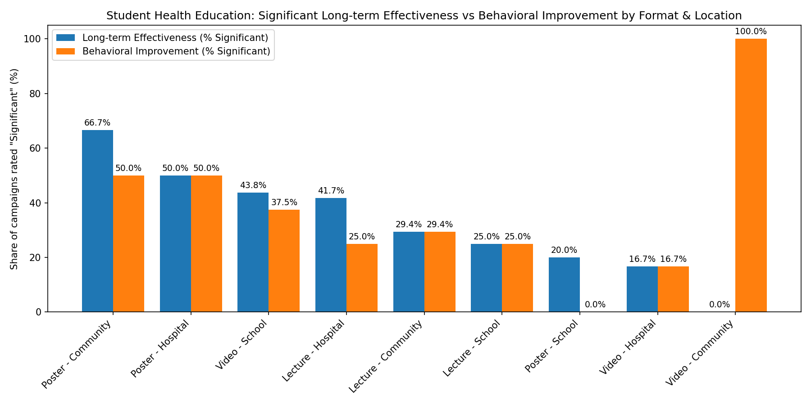

Student Health Education Campaigns: Formats and Locations Driving Long-term Effectiveness and Behavioral Improvement

Executive Summary
- Community posters and school videos are the most capable combinations for students to achieve both long-term effectiveness and behavioral improvement.
- Poster campaigns in Community settings deliver the highest long-term effectiveness rate (66.7% significant; 4 of 6) and strong behavioral improvement (50% significant; 3 of 6).
- Video campaigns in School settings drive meaningful behavioral change (37.5% significant; 6 of 16) alongside solid long-term effectiveness (43.8% significant; 7 of 16). Lecture campaigns in Hospitals show strong long-term effectiveness (41.7% significant; 5 of 12) but weaker behavioral change (25% significant; 3 of 12).

Visualization

- Key takeaway: Poster-Community leads in long-term effectiveness (66.7% significant) and strong behavior change (50%). Video-School balances good behavior change (37.5%) with solid long-term effectiveness (43.8%). Lecture-Hospital offers solid long-term tracking (41.7%) but weaker behavior (25%).
- Why it matters: This clarifies which format-location pairs are most effective for sustained student outcomes, guiding resource allocation and program design.

What the Data Shows (Evidence)
Dataset fields used: 
- Format: \"Campaign Format (Poster/Video/Lecture)\"
- Location: \"Key Locations (School/Hospital/Community)\"
- Outcomes: \"Effectiveness Tracking\" (long-term), \"Behavioral Change Assessment\"
- Supporting drivers: \"Awareness Rate Survey\", \"Knowledge Assessment\", \"Campaign Frequency (times/month)\", \"New Media Metrics (Views/Shares)\"

Totals by format (n=75 students):
- Lecture (n=37): 32.4% long-term effectiveness (12/37), 27.0% behavioral change (10/37).
- Poster (n=13): 46.2% long-term effectiveness (6/13), 30.8% behavioral change (4/13).
- Video (n=25): 32.0% long-term effectiveness (8/25), 40.0% behavioral change (10/25).

Totals by location:
- Community (n=26): 34.6% long-term effectiveness (9/26), 42.3% behavioral change (11/26).
- Hospital (n=20): 35.0% long-term effectiveness (7/20), 25.0% behavioral change (5/20).
- School (n=29): 34.5% long-term effectiveness (10/29), 27.6% behavioral change (8/29).

Top format-location combinations:
- Poster-Community (n=6): 66.7% long-term effectiveness (4/6), 50.0% behavioral change (3/6), avg frequency 3.17/month, avg awareness 89.8%, avg knowledge 80.0%.
- Video-School (n=16): 43.8% long-term effectiveness (7/16), 37.5% behavioral change (6/16), avg frequency 4.0/month, avg awareness 78.3%, avg knowledge 82.1%, avg shares 319.
- Lecture-Hospital (n=12): 41.7% long-term effectiveness (5/12), 25.0% behavioral change (3/12), avg frequency 4.5/month, avg awareness 75.0%, avg knowledge 81.7%.

Caveats and edge cases:
- Video-Community (n=3) shows 100% behavioral change (3/3) but 0% long-term effectiveness; the small sample suggests caution before scaling.
- Poster-School (n=5) underperforms: 20% long-term effectiveness (1/5) and 0% behavioral change (0/5), despite higher frequency (4.8/month).

Insights (Observation → Root Cause → Business Impact / Recommendation)
1) Observation: Poster-Community delivers the highest long-term effectiveness (66.7%) and strong behavior change (50%).
- Root cause: High awareness (89.8%) paired with community context likely enables repeated exposure and social reinforcement; posters are visible and persistent, fitting communal spaces.
- Impact/Recommendation: Prioritize community poster campaigns for students when the goal is sustained outcomes. Target 3–4 deployments per month (current avg 3.17) and place in high-traffic student community venues.

2) Observation: Video-School yields strong behavioral change (37.5%) while maintaining solid long-term effectiveness (43.8%).
- Root cause: Video is engaging and suited to structured school schedules; decent knowledge scores (82.1%) and higher social sharing (avg shares ~319) suggest peer diffusion.
- Impact/Recommendation: Scale video campaigns in schools for behavior change goals. Maintain frequency around 4 per month; integrate interactive segments and peer-led discussions to amplify behavior uptake.

3) Observation: Lecture-Hospital achieves long-term effectiveness (41.7%) but weaker behavioral change (25%).
- Root cause: Clinical settings favor knowledge transfer and follow-up tracking, but passive lecture format may limit behavior adoption without hands-on or peer components.
- Impact/Recommendation: Use hospital lectures to anchor long-term tracking and policy adherence; add brief skill-practice modules and follow-up nudges to lift behavioral change.

4) Observation: Posters perform poorly in schools (20% effectiveness; 0% behavior change) despite higher frequency (4.8/month).
- Root cause: Passive media likely underperforms in school contexts where attention competes with structured activities.
- Impact/Recommendation: De-emphasize posters in schools; replace with videos or hybrid sessions (short talks + interactive media) to convert awareness into behavior.

5) Observation: Community settings overall drive more behavioral change (42.3% significant vs ~27% in schools and 25% in hospitals).
- Root cause: Community environments enable repeated cues and social norms that support behavior adoption.
- Impact/Recommendation: When behavior change is the primary KPI, shift more student campaigns to community locations, especially using posters and blended formats.

Frequency and Engagement Guidance
- Effective bands: 3–5 times/month aligns with top-performing combos (Poster-Community 3.17; Video-School 4.0; Lecture-Hospital 4.5). More frequency without engagement (e.g., Poster-School 4.8) did not improve outcomes.
- Leverage shares in schools: Higher average shares (Lecture-School ~353; Video-School ~319) can be harnessed via challenges or student ambassadors to amplify behavior change.

Actionable Recommendations
- Invest in Poster-Community and Video-School combinations for students; set quarterly targets to reach >50% significant effectiveness in community posters and >40% in school videos.
- Augment hospital lectures with interactive elements and follow-up reminders to lift behavioral change from 25% to >35%.
- Reduce reliance on posters in schools; reallocate budget to video content and interactive sessions.
- Track awareness and knowledge alongside outcomes; aim for awareness >80% and knowledge >82% as leading indicators tied to better long-term effectiveness.

Methodological Notes
- All metrics derived from health_education records where Population Covered='Student'.
- Significant rates use counts of \"Significant\" in \"Effectiveness Tracking\" and \"Behavioral Change Assessment\" divided by total per format/location.
- Supporting drivers computed via averages of \"Awareness Rate Survey\" and \"Knowledge Assessment\" after stripping percent signs.
- Digital engagement computed from \"New Media Metrics (Views/Shares)\" split into averages of views and shares.

Conclusion
- For students, the most capable formats and locations are Poster-Community for long-term effectiveness plus Video-School for behavioral improvement. Lecture-Hospital sustains long-term tracking but needs interactive enhancements for behavior change. Align formats with contexts, keep frequency in the 3–5/month band, and design for engagement to convert awareness into durable behaviors.
