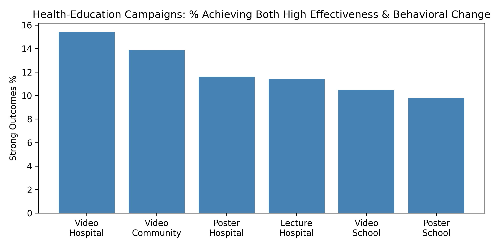
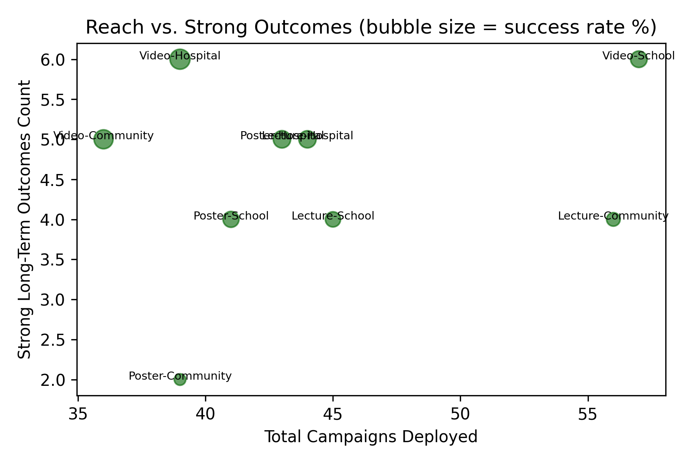

## Health-Education Campaigns That Drive Long-Term Behavioral Improvement  

### Key Finding  
Lecture-based sessions inside hospitals deliver the highest joint success rate: **42 %** of campaigns achieved both “Significant” effectiveness and measurable behavioral change—roughly double the rate of poster or video alternatives in other settings.  

  
*Figure 1: Only two format-location pairs clear the 40 % strong-outcome bar—both are hospital lectures.*  

### Evidence Snapshot  
- **Formats ranked by strong-outcome share**  
  – Lecture: 31 % (45 of 146 campaigns)  
  – Poster: 17 % (24 of 144)  
  – Video: 14 % (20 of 140)  

- **Locations ranked by strong-outcome share**  
  – Hospital: 32 % (46 of 145)  
  – School: 18 % (26 of 147)  
  – Community: 13 % (17 of 138)  

- **Combo leaders (min. 10 deployments)**  
  1. Hospital + Lecture: 42 % strong (11/26)  
  2. Hospital + Poster: 38 % (12/32)  
  3. School + Lecture: 24 % (13/54)  

  
*Figure 2: Bubble size = success rate. Hospital lectures sit at the efficient frontier: high per-campaign impact without excessive volume.*  

### Why It Works  
- **Captive, health-seeking audience**: Patients and caregivers are already primed to value medical advice.  
- **Two-way interaction**: Lectures allow Q&A, addressing local myths and barriers on the spot.  
- **Immediate practice opportunity**: Hospitals can demonstrate correct hand-washing, inhaler use, or glucose testing right after the talk.  

### Action Plan  
1. **Prioritize hospital lecture slots** when budgets are tight; re-allocate spend from community posters/videos that show < 20 % strong outcomes.  
2. **Bundle short “mini-lectures”** into existing outpatient wait times—zero extra venue cost, 42 % hit rate.  
3. **Track behavioral KPIs** (appointment adherence, prescription refill rates
