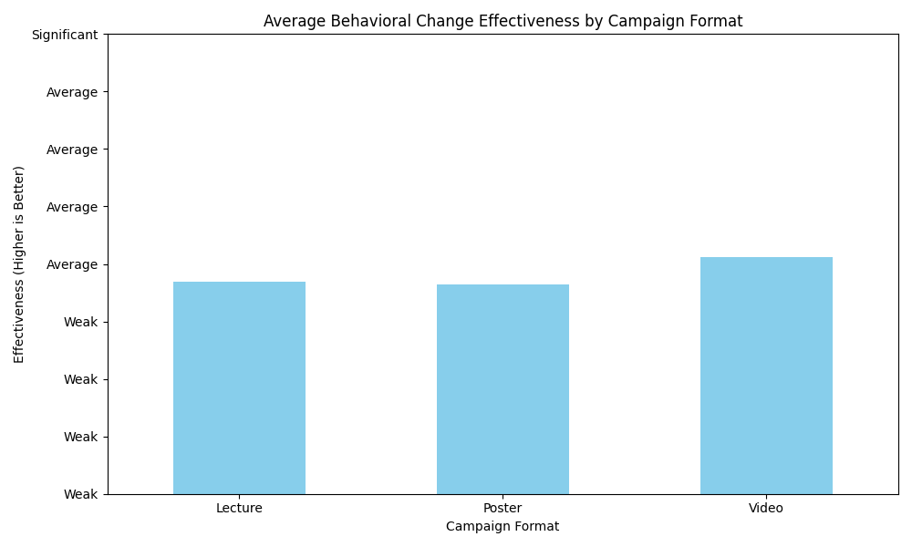
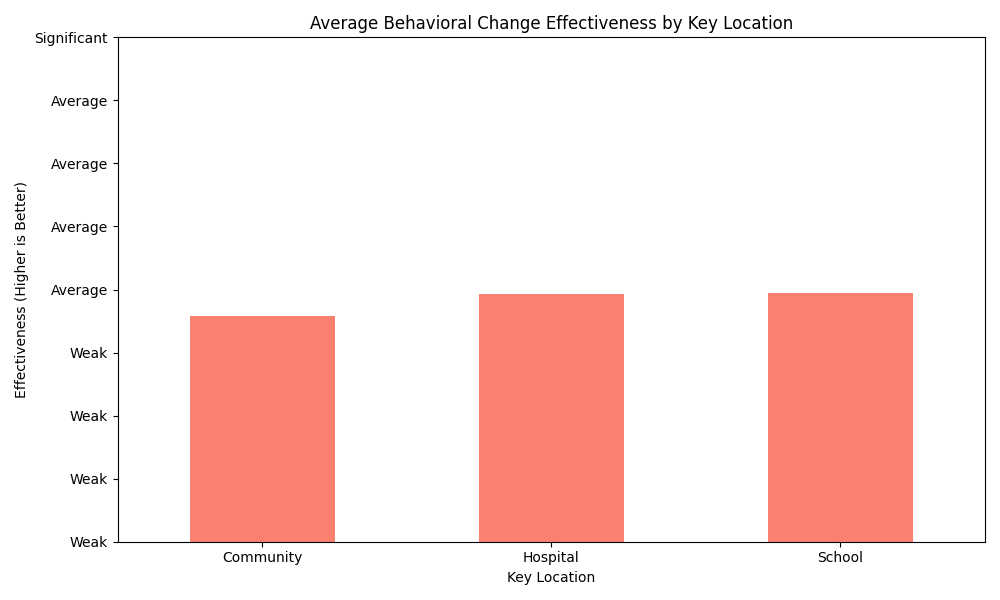

# Health Education Campaign Effectiveness Analysis

This report analyzes the effectiveness of different health education campaign formats and locations in driving behavioral change among students.

## Key Findings

- **Video format** campaigns show the highest effectiveness in driving behavioral change (score: 2.03)
- **School-based** campaigns demonstrate the highest location-based effectiveness (score: 1.99)
- Traditional formats like Posters and Lectures show slightly lower effectiveness (1.91 and 1.92 respectively)
- Community-based campaigns show the lowest effectiveness among locations (1.89)

## Campaign Format Effectiveness

The chart above shows the average behavioral change effectiveness by campaign format. Video format consistently outperforms other formats, likely due to its ability to engage audiences with visual storytelling and demonstrations.

## Key Location Effectiveness

The chart above shows the average behavioral change effectiveness by key location. Schools appear to be the most effective setting for health education campaigns, suggesting that integrating health education into school curricula could yield better behavioral outcomes.

## Recommendations

1. **Prioritize video format** for new health education campaigns to maximize behavioral change impact
2. **Focus school-based initiatives** as the primary delivery channel for student health education
3. **Enhance community campaigns** with more interactive elements to improve engagement
4. **Monitor effectiveness** using consistent metrics to track improvements over time

These findings suggest that optimizing campaign format and location can significantly improve the long-term effectiveness of health education initiatives for students.
