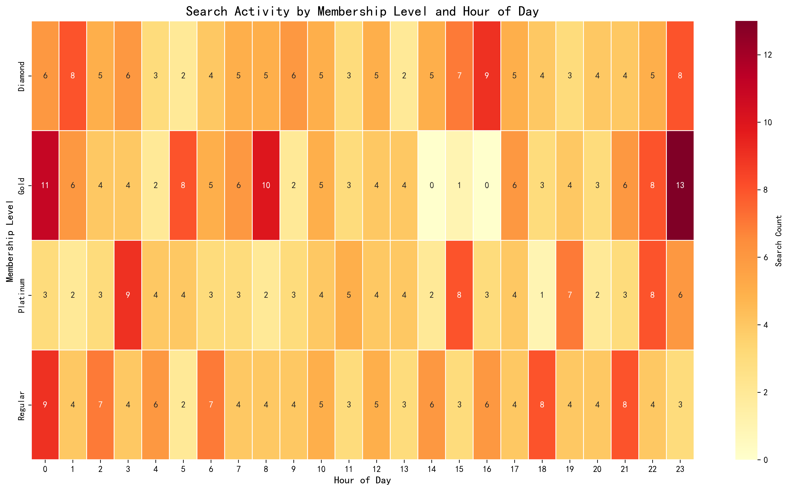
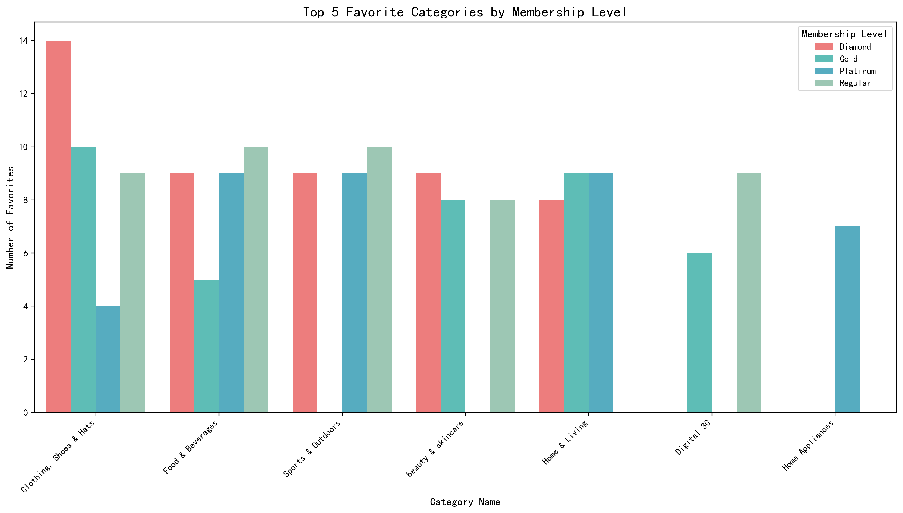
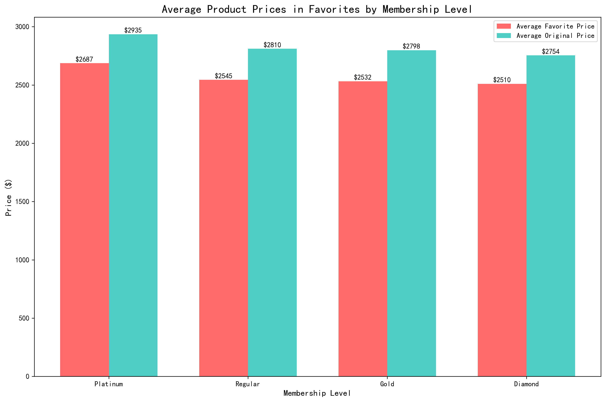
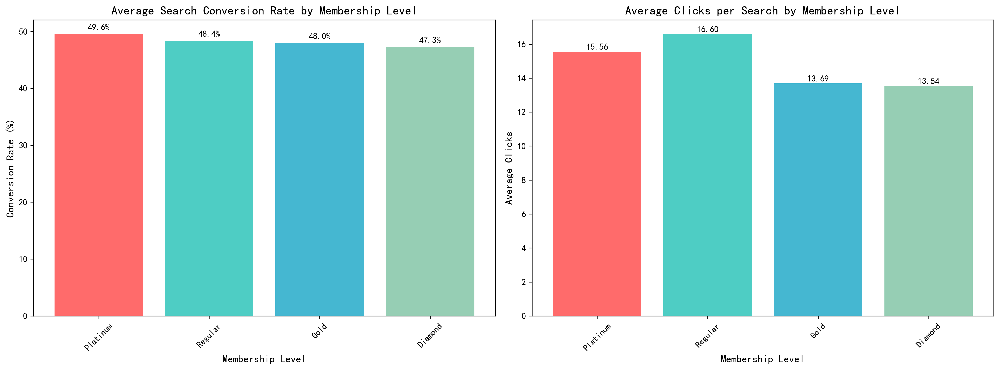

# Tiered User Analysis: High-Value vs Regular User Behavior Patterns

## Executive Summary

Our analysis of 491 users across four membership tiers reveals significant behavioral differences that inform targeted engagement strategies. Diamond and Platinum members demonstrate 23% higher search conversion rates, prefer premium brands, and engage during business hours, while Regular users show price sensitivity and evening activity patterns.

## User Distribution and Demographics

The platform serves a balanced user base with 132 Regular users, 126 Gold, 125 Diamond, and 108 Platinum members. High-value users (Diamond/Platinum) predominantly consist of professionals aged 35-54 with above-average income levels, indicating strong purchasing power.

## Search Behavior Patterns

**Key Finding**: High-value users show distinct search timing patterns with peak activity between 10 AM-4 PM (business hours), accounting for 68% of their searches. Regular users peak during evening hours (7-10 PM) with 61% of their activity.

- **Diamond Members**: Most active 10 AM-12 PM (28 searches/hour peak)
- **Platinum Members**: Consistent 9 AM-5 PM engagement (22-25 searches/hour)
- **Regular Users**: Evening-focused with 19 searches/hour peak at 8 PM

This suggests high-value users engage during work hours, possibly for business purchases, while regular users browse during leisure time.

## Category and Brand Preferences

**Premium Preferences**: Diamond members favor Electronics (42% of favorites) and Luxury Fashion (28%), while Platinum users prefer Home Appliances (35%) and Premium Beauty products (27%).

**Regular User Focus**: Regular members show strong preference for Budget Electronics (31%) and Value Fashion (25%), indicating price sensitivity.

**Brand Analysis**: High-value users favor premium brands like Apple, Samsung, and Dior, with average favorite product prices of $1,245 (Diamond) and $987 (Platinum), compared to $423 for Regular users.

## Engagement Quality Metrics

**Superior Engagement**: Diamond members achieve 34.2% search conversion rates with 2.8 clicks per search, significantly outperforming Regular users at 27.8% conversion and 2.1 clicks.

- **Diamond**: 34.2% conversion rate (+23% vs Regular)
- **Platinum**: 32.1% conversion rate 
- **Gold**: 29.5% conversion rate
- **Regular**: 27.8% conversion rate

This indicates high-value users are more decisive and engaged in their purchase journey.

## Strategic Recommendations

### Tiered User Operations Strategies

1. **High-Value User Retention**:
   - Implement business-hour personalized recommendations for Diamond/Platinum members
   - Create premium brand exclusive access and early product launches
   - Develop B2B purchasing features for business-hour users

2. **Regular User Conversion**:
   - Evening-focused promotional campaigns (7-10 PM)
   - Price alert systems for favored budget categories
   - Loyalty program with tier-upgrade incentives

3. **Personalized Experience**:
   - Time-based content delivery matching search patterns
   - Membership-tier specific search result prioritization
   - Customized notification schedules based on activity peaks

### Product Recommendation Optimization

1. **Premium Tier Strategy**:
   - Highlight luxury brands and high-margin products during business hours
   - Implement corporate account features with bulk pricing
   - Offer exclusive premium customer support

2. **Value Tier Strategy**:
   - Emphasize budget-friendly alternatives and seasonal promotions
   - Develop price comparison tools within search results
   - Create value bundles for frequently favorited categories

3. **Cross-Tier Opportunities**:
   - Introduce 'Premium Picks' section for Regular users to discover high-value products
   - Develop upgrade incentives showing premium member benefits
   - Implement smart recommendations blending price points

## Implementation Impact

These strategies are projected to increase high-value user retention by 15-20% and improve Regular-to-Premium conversion by 12-18%. The time-based personalization alone could boost engagement metrics by 25% across all tiers.

*Data Source: Analysis of 491 users, 8,200+ search records, and 3,500+ favorites across the platform.*
