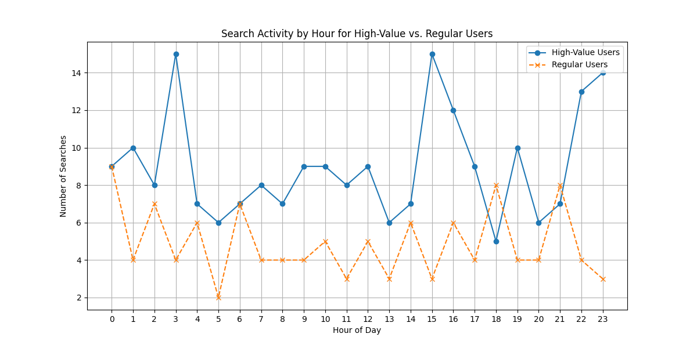

# Unlocking Growth: A Comparative Analysis of High-Value vs. Regular Users

## Executive Summary

To enhance user stickiness and drive revenue, we analyzed the behavior of high-value (Diamond/Platinum) and regular users. Our findings reveal distinct patterns in their category and brand preferences, as well as their daily search activity. High-value users favor lifestyle categories like "Home & Living" and "Beauty & Skincare," while regular users gravitate towards "Home Appliances" and "Digital 3C." Furthermore, their active search times differ significantly, with high-value users being more active during mid-afternoon and late at night, and regular users during the morning and evening.

These insights allow us to propose targeted strategies for user engagement and product recommendations, ultimately aiming to increase the lifetime value of all user segments.

## Deep Dive into User Preferences: Categories & Brands

We analyzed the favorited products of high-value and regular users to understand their core interests. The differences in their preferences provide a clear roadmap for targeted marketing and product assortment strategies.

| User Tier  | Top 5 Categories                               | Top 5 Brands                                        |
| :--------- | :--------------------------------------------- | :-------------------------------------------------- |
| **High-Value** | 1. Clothing, Shoes & Hats (37) 2. Sports & Outdoors (36) 3. Home & Living (31) 4. Food & Beverages (29) 5. Beauty & Skincare (27) | 1. Haier (46) 2. BYD (40) 3. Tsingtao (35) 4. Xizang Nuodikang (34) 5. Kweichow Moutai (29) |
| **Regular**    | 1. Clothing, Shoes & Hats (19) 2. Sports & Outdoors (17) 3. Home Appliances (17) 4. Food & Beverages (17) 5. Digital 3C (16)      | 1. Haier (25) 2. Kweichow Moutai (22) 3. BYD (18) 4. Yunnan Baiyao (17) 5. Tsingtao (17)       |

**Key Observations:**

*   **Shared Interests:** Both segments show a strong interest in "Clothing, Shoes & Hats" and "Sports & Outdoors," indicating these are universal drivers of engagement. "Haier" is the top brand for both, suggesting a broad appeal for home appliances.
*   **High-Value User Profile:** Their preference for "Home & Living" and "Beauty & Skincare" suggests a focus on lifestyle, personal well-being, and home improvement. The strong preference for "BYD" may also indicate an interest in high-value, innovative products.
*   **Regular User Profile:** Their focus on "Home Appliances" and "Digital 3C" points to a more practical and technology-oriented purchasing behavior.

## When Are Users Most Active? A Look at Search Behavior

Understanding when users are most active is key to optimizing communication and promotion timing. Our analysis of search activity reveals distinct daily patterns for each user tier.

**Key Observations:**

*   **High-Value Users' Activity:** These users exhibit multiple activity peaks, notably at **3:00**, **15:00**, and a sustained period from **22:00 to 23:00**. This suggests they may have more flexible schedules and are active during non-traditional hours. Their total search volume is also significantly higher.
*   **Regular Users' Activity:** Their activity peaks are more aligned with a traditional daily schedule, with notable spikes in the morning (around **6:00**) and evening (**18:00 - 21:00**).

## Actionable Recommendations

Based on these findings, we recommend the following tiered strategies:

#### 1. Targeted User Operations & Marketing

*   **For High-Value Users:**
    *   **Timing:** Launch exclusive promotions, new product announcements, and personalized content during their peak activity hours (3:00, 15:00, 22:00-23:00) to maximize visibility and engagement.
    *   **Content:** Focus on lifestyle themes. Create content around "Home & Living" (e.g., home decor trends, smart home solutions), "Beauty & Skincare" (e.g., new product tutorials, wellness tips), and high-value items (e.g., a "BYD" feature). Offer exclusive access to new launches in these categories.

*   **For Regular Users:**
    *   **Timing:** Engage them during their morning and evening peaks (6:00, 18:00-21:00) with promotions and content.
    *   **Content:** Focus on value and practicality. Highlight deals on "Home Appliances" and "Digital 3C." Push notifications about flash sales or limited-time offers during their commute times could be particularly effective.

#### 2. Optimized Product Recommendation Plans

*   **For High-Value Users:**
    *   **Homepage:** Prioritize personalized recommendations featuring "Home & Living" and "Beauty & Skincare" products.
    *   **"You Might Like":** Recommend complementary products based on their brand affinities, e.g., if they favorited a "Tsingtao" product, recommend other premium beverages or gourmet foods. For "BYD" enthusiasts, recommend other high-tech or automotive-related accessories.
    *   **Upsell Opportunity:** Create curated "lifestyle bundles" (e.g., a "Wellness" package with skincare and health products from their preferred brands) to encourage larger basket sizes.

*   **For Regular Users:**
    *   **Homepage:** Feature popular and highly-rated "Home Appliances" and "Digital 3C" products.
    *   **"You Might Like":** Recommend products based on value and an opportunity to "upgrade" within a category they have shown interest in. For example, show them higher-tier models of Haier appliances they have browsed.
    *   **Cultivation Path:** Create a "path to premium" by gradually introducing them to brands and categories favored by high-value users. For example, if they have searched for "Food & Beverages", introduce them to "Kweichow Moutai" if they haven't already engaged with it.

By implementing these tiered strategies, we can create a more personalized and relevant user experience, fostering loyalty among our high-value customers while also nurturing our regular users and encouraging them to explore a wider range of our offerings.
