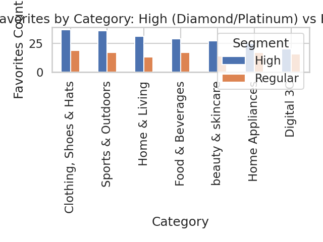
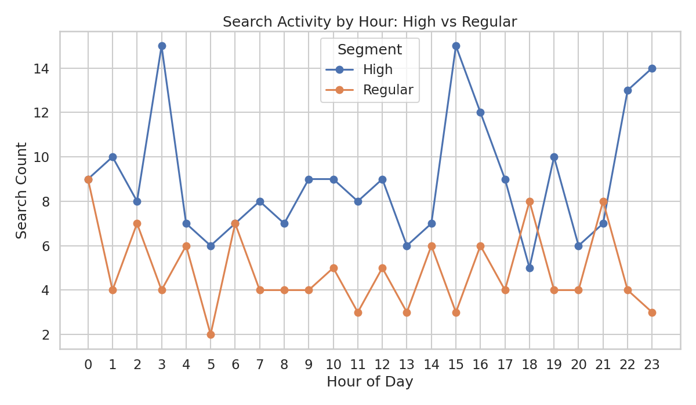
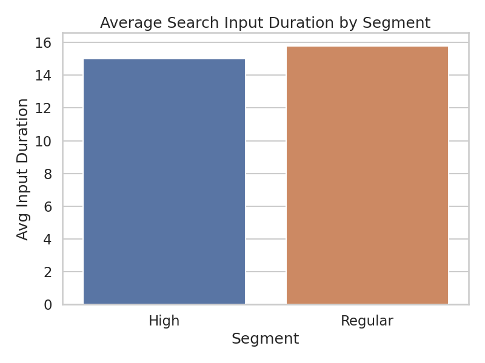

E-commerce Tiered User Insights: High-Value vs Regular Users

Overview
- Goal: Increase user stickiness and revenue by comparing Diamond/Platinum (High) versus Regular users across Favorites and Search—Category/Brand preferences and Search active time—and recommend tiered operations and product recommendation strategies.
- Data sources and methods:
  - Membership and segmentation: user_basic_information_table (“Membership Level”) → High = Diamond/Platinum (233 users), Regular = Regular (132 users); Gold excluded from core comparison per brief focus.
  - Favorites analysis: product_favorites_table joined with product_basic_information_table (“Category Name”, “Brand Name”) and user_basic_information_table for segment attribution via SQL; aggregated to counts by segment.
  - Search analysis: search_behavior_records_table joined with user_basic_information_table; hourly activity via strftime('%H', “Search Time”), search engagement via averages of “Input Duration”, “Viewed Result Count”, “Clicked Result Count”, “Search Conversion Rate”.
  - Visuals created with Python (matplotlib/seaborn) in analysis_plots.py.

Key Insights and Visual Evidence

1) Favorites—Category Preferences (High vs Regular)
- Conclusion: High-value users favor Fashion and Sport-heavy categories, while Regular users lean more into Home Appliances and Digital.
- Evidence (SQL join across favorites → products → users; plotted in favorites_category_comparison.png):
  - High top categories: Clothing, Shoes & Hats (37 favorites), Sports & Outdoors (36), Home & Living (31), Food & Beverages (29), Beauty & Skincare (27).
  - Regular top categories: Clothing, Shoes & Hats (19 favorites), Sports & Outdoors (17), Home Appliances (17), Food & Beverages (17), Digital 3C (16).
- Visual: 
- Why it matters: High tiers exhibit lifestyle/premium orientation (apparel, sports, home lifestyle), which align with higher-margin goods. Regular users show practical/electronics orientation (home appliances, digital), implying price sensitivity and utility-driven purchases.
- Root Cause: High tiers likely value premium brands/experience; Regular users value function and price.
- Business Impact / Recommendation:
  - High: Promote premium lifestyle bundles (apparel + sports accessories + home décor), VIP exclusives, and curated capsules with seasonal drops.
  - Regular: Feature high-value appliances and Digital 3C deals, clear ratings/price comparisons, and energy-saving or warranty messaging.

2) Favorites—Brand Preferences (High vs Regular)
- Conclusion: High tiers gravitate to established premium brands with strong reputations; Regular users mix the same leaders with more value-oriented pharma and liquor brands.
- Evidence (favorites_brand.csv via SQL; summarized in Python):
  - High brands: Haier Smart Home Co., Ltd. (46 favorites), BYD Co., Ltd. (40), Tsingtao Brewery Co., Ltd. (35), Xizang Nuodikang Pharmaceutical Co., Ltd. (34), Kweichow Moutai Co., Ltd. (29).
  - Regular brands: Haier Smart Home Co., Ltd. (25 favorites), Kweichow Moutai Co., Ltd. (22), BYD Co., Ltd. (18), Yunnan Baiyao Group Co., Ltd. (17), Tsingtao Brewery Co., Ltd. (17).
- Why it matters: These brands are revenue drivers; aligning promotions and recommendation tiles with segment-specific brand affinity will raise CTR and conversions.
- Root Cause: High tiers recognize and prefer premium or nationally recognized leaders; Regular tiers lean into known value and health-related brands.
- Business Impact / Recommendation:
  - High: Elevate Haier/BYD/Moutai/Tsingtao in hero positions with premium bundles and limited editions; add brand badges and long-term loyalty perks.
  - Regular: Promote Haier value lines, Moutai & Tsingtao in bundle promotions, and Yunnan Baiyao for everyday health—emphasize discounts, installment payments, and durability.

3) Search Activity and “Search Active Time”
- Conclusion: Both segments spend similar time entering search queries; Regular users browse and click more per search while converting at the same rate as High users. Peak search hours differ by segment.
- Evidence (search_hour.csv, search_input_detail.csv; plotted in search_hour_activity.png and input_duration_by_segment.png):
  - Average Input Duration (proxy for search active time):
    - High: 15.0 seconds
    - Regular: 15.79 seconds
  - Engagement per search (averages):
    - Viewed results: High 28.4 vs Regular 32.41
    - Clicked results: High 14.44 vs Regular 16.6
    - Conversion rate: High 0.48 vs Regular 0.48 (equal)
  - Peak hours: High users peak at 03:00 (15 searches), Regular at 00:00 (9 searches).
- Visuals:
  - 
  - 
- Why it matters: Regular users need more result exploration; improving ranking/relevance will reduce effort while holding conversion. Segment-specific timing supports targeted push/search suggestion strategies.
- Root Cause: High tiers likely more decisive or benefit from favorites/brand familiarity; Regular users require more comparison.
- Business Impact / Recommendation:
  - Search UX:
    - High: Boost autocomplete with brand logos and top SKUs; first-screen result curation and quick-buy modules to reduce browsing friction.
    - Regular: Offer richer filters, comparisons, and “Top-Rated Value” lists; highlight discounts and warranties; add educational snippets for appliances/digital categories.
  - Timing: Schedule High-tier notifications and curated drops around 2–4 AM windows; Regular-tier promotions around evening-to-midnight.

4) Search Category/Brand Intent via Keywords
- Conclusion: Direct keyword matches to brand/category were sparse (search_brand.csv and search_category.csv had no dominant counts), indicating many searches are generic or phrase-based rather than exact brand/category terms.
- Why it matters: Users may rely on exploratory keywords (“smart fridge”, “running shoes”) not exact brand/category names, reducing signal extraction from search text.
- Root Cause: Lack of synonym mapping and brand/category dictionaries in keyword matching.
- Business Impact / Recommendation:
  - Implement synonym/alias dictionaries and brand/category ontologies in search (e.g., map “fridge” to “Home Appliances” and common brands like Haier).
  - Add query understanding (spell variations, colloquialisms) and related queries; track brand/category intent attribution to improve recommendations.
  - Measure search-to-favorite conversion uplift after ontology deployment.

Operational Playbook: Tiered Strategies & Recommendation Plans

High (Diamond/Platinum)
- Assortment & Recommendations:
  - Premium lifestyle bundles: Clothing + Sports accessories + Home & Living curated sets.
  - Brand-first modules: Haier, BYD, Moutai, Tsingtao prominent tiles with limited editions and VIP access.
  - Cross-category luxury pairings (e.g., Home & Living + Beauty & Skincare).
- Search & Merchandising:
  - Autocomplete: brand logos, quick links to flagship SKUs; “Shop the collection” carousels.
  - First-screen curation based on favorites and recent views; one-click checkout trials.
- Promotions & Timing:
  - Night-owl drops (2–4 AM) for High tiers; early access and member-only events.
  - Loyalty benefits: tiered cashback, concierge support, exclusive content.
- KPIs:
  - +CTR on brand tiles > 10%, +AOV via bundles > 8%, repeat purchase rate lift > 5%.

Regular
- Assortment & Recommendations:
  - Value-driven: Home Appliances and Digital 3C deals; “Top-rated under $X”.
  - Gamified savings: coupons, streak bonuses, and price alerts.
  - Product education: comparison charts, warranty highlights, energy ratings.
- Search & Merchandising:
  - Rich filtering and side-by-side comparisons; “Value picks” badges.
  - Improve relevance for appliance/digital queries; promote reputable entry-level lines.
- Promotions & Timing:
  - Evening-to-midnight promos; reminder nudges for abandoned searches/carts.
  - Installment plans, bundle discounts (appliance + accessories).
- KPIs:
  - Reduce average viewed results per search by 10–15% while maintaining 0.48 conversion; +add-to-cart rate by 8–12%.

Implementation Notes
- SQL steps:
  - Favorites category/brand counts: JOIN product_favorites_table f → user_basic_information_table u (on “User ID”) → product_basic_information_table p (on “Product ID”), GROUP BY segment + “Category Name” / “Brand Name”.
  - Search hour/activity: JOIN search_behavior_records_table s → user_basic_information_table u; CAST(strftime('%H', s.\"Search Time\")) as hour; aggregate counts; averages on “Input Duration”, “Viewed Result Count”, “Clicked Result Count”, “Search Conversion Rate”.
- Python plotting: analysis_plots.py generated three visuals:
  - favorites_category_comparison.png: grouped bar comparing High vs Regular favorites by category.
  - search_hour_activity.png: line chart of search counts by hour for each segment.
  - input_duration_by_segment.png: bar chart of average input duration by segment.

Closing
- Actionable takeaway: Lean into premium lifestyle and brand-led merchandising for High tiers; streamline comparisons and value narratives for Regular users. Optimize search UX with segment-specific features and timing. Enhance query understanding via brand/category ontologies to unlock intent-driven recommendations. Quantitative baselines (favorites counts, search engagement metrics, and peak hours) provide clear targets for A/B tests and performance tracking.
