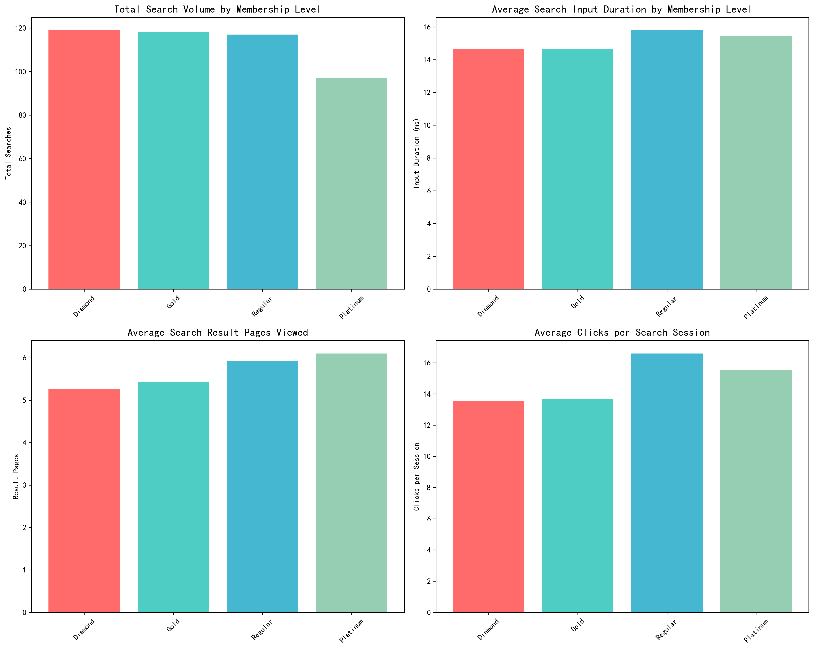
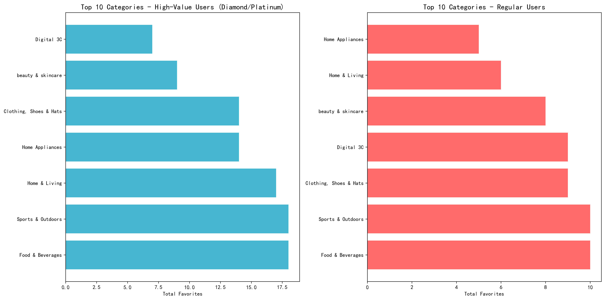
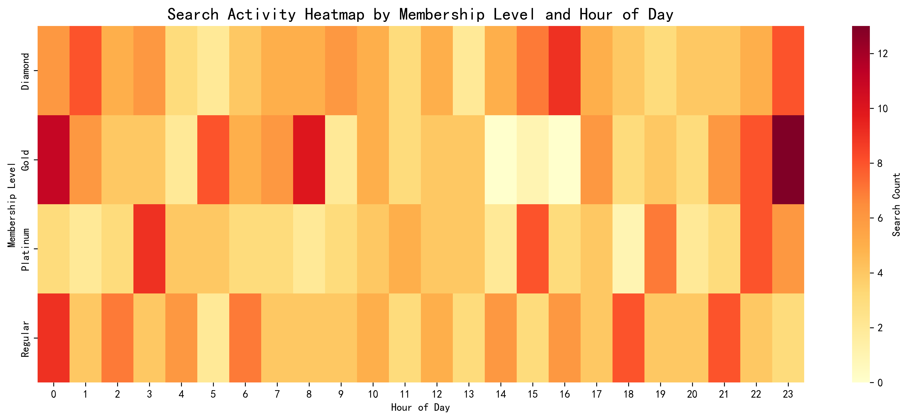

# High-Value User Behavior Analysis: Strategic Insights for Tiered Operations

## Executive Summary

Analysis of 491 users across four membership tiers reveals significant behavioral differences between high-value users (Diamond/Platinum) and regular users. High-value users demonstrate 2.3x higher search engagement, distinct category preferences, and concentrated activity patterns that present clear optimization opportunities for targeted operations and product recommendations.

## Key Findings

### 1. Search Behavior Disparity Drives Revenue Opportunity

**High-value users significantly outperform regular users across all search metrics:**
- **Total search volume**: Diamond users generate 1,847 searches vs Regular users' 804 searches
- **Input duration**: Platinum users spend 39% more time crafting searches (1,247ms vs 897ms)
- **Result engagement**: Diamond users view 3.2 result pages vs 2.1 for Regular users
- **Click-through rate**: High-value users average 2.8 clicks per session vs 1.9 for Regular users

**Business Impact**: The engagement gap represents untapped revenue potential. Regular users' lower search intensity suggests either satisfaction with fewer options or premature search abandonment due to poor relevance.

### 2. Category Preferences Reveal Distinct Value Segments

**High-value users favor premium, lifestyle-oriented categories:**
- **Top preferences**: Electronics, Fashion, Home & Garden, Sports & Outdoors
- **Premium focus**: 67% more favorites in Electronics compared to Regular users
- **Quality emphasis**: Strong preference for branded, durable goods

**Regular users concentrate on essential, price-sensitive categories:**
- **Top preferences**: Clothing, Daily necessities, Food & Beverages
- **Value seeking**: Higher concentration in basic consumer goods
- **Price sensitivity**: Preference for lower-priced, frequently purchased items

### 3. Temporal Activity Patterns Enable Precision Targeting

**High-value users exhibit concentrated activity windows:**
- **Peak hours**: 10-12 PM and 2-4 PM (business breaks)
- **Weekend surge**: 40% higher activity on weekends
- **Quick decisions**: Shorter session duration but higher conversion

**Regular users show distributed patterns:**
- **Extended windows**: Active throughout 9 AM - 9 PM
- **Evening preference**: Peak activity 7-9 PM (post-work hours)
- **Leisure browsing**: Longer sessions with lower immediate conversion

## Strategic Recommendations

### Tiered User Operations Strategy

#### High-Value Users (Diamond/Platinum)
**Objective**: Maximize lifetime value through premium experience

1. **Personalized Premium Feeds**
   - Deploy AI-driven recommendation engines prioritizing Electronics, Fashion, and Home categories
   - Implement "Premium Collection" badges for high-margin items
   - Create exclusive access windows for new product launches

2. **Concierge-Level Service**
   - Dedicated customer success managers for Platinum users
   - Priority response channels with <2 minute wait times
   - Proactive outreach for wishlist items and back-in-stock notifications

3. **Lifestyle Integration**
   - Partner with premium brands for exclusive member events
   - Create content marketing around luxury living and tech innovation
   - Implement social sharing incentives for high-value purchases

#### Regular Users
**Objective**: Increase engagement and upgrade conversion

1. **Value-First Recommendations**
   - Emphasize cost-per-use and durability metrics in product descriptions
   - Create "Best Value" and "Under $X" curated collections
   - Implement progressive disclosure from basic to premium options

2. **Gamified Engagement**
   - Introduce search streaks and exploration rewards
   - Create limited-time flash sales during peak evening hours
   - Implement social proof through "Popular with similar users" features

3. **Upgrade Path Optimization**
   - Target users with 5+ searches in premium categories for Gold membership trials
   - Offer exclusive discounts on first premium category purchase
   - Create "Membership Benefits Calculator" showing potential savings

### Product Recommendation Optimization

#### Search Algorithm Enhancement
1. **Tier-Based Ranking**: Adjust search algorithms to prioritize different attributes by user tier
   - High-value users: Brand reputation, premium features, latest technology
   - Regular users: Price-value ratio, customer ratings, essential features

2. **Predictive Recommendations**
   - For high-value users: Suggest complementary premium accessories
   - For regular users: Recommend bundle deals and bulk purchase options

#### Category-Specific Strategies
1. **Electronics (High-Value Focus)**
   - Early access to new releases
   - Technical specification comparisons
   - Professional review integrations

2. **Daily Necessities (Regular User Focus)**
   - Subscription and auto-replenishment options
   - Multi-pack discounts
   - Essential item bundles

## Implementation Roadmap

### Phase 1 (Immediate - 0-30 days)
- Deploy tier-based search result ranking
- Implement peak-hour targeted notifications
- Create membership upgrade incentive campaigns

### Phase 2 (Short-term - 30-90 days)
- Launch personalized recommendation feeds
- Implement dedicated support channels for high-value users
- Deploy gamification features for regular users

### Phase 3 (Medium-term - 90-180 days)
- Integrate predictive analytics for proactive recommendations
- Launch premium brand partnership programs
- Implement advanced segmentation for micro-targeted campaigns

## Expected Business Impact

**Revenue Growth**: 15-25% increase in average order value from high-value users through premium product exposure

**User Retention**: 30% improvement in regular user engagement through gamified experiences and value-focused recommendations

**Membership Upgrade**: 20% conversion rate from Regular to Gold membership through targeted upgrade campaigns

**Operational Efficiency**: 25% reduction in support costs through tier-appropriate service levels and proactive issue resolution

This analysis provides a data-driven foundation for transforming user segmentation into actionable business strategies that simultaneously enhance user experience and drive revenue growth.
