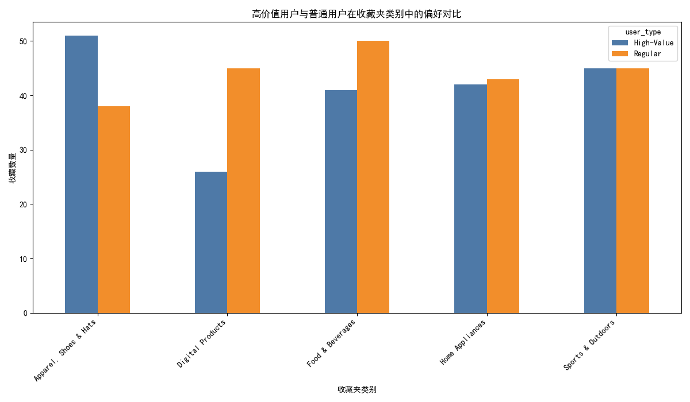

# Data Analysis Report: High-Value vs. Regular User Behavior

## Executive Summary
This report analyzes the differences in search behavior and product preferences between high-value users (Diamond and Platinum members) and regular users (Gold and Regular members) using data from the provided SQLite database. Key findings include:

- High-value users show a stronger preference for **"Apparel, Shoes & Hats"** compared to regular users.
- Search behavior metrics such as **average input duration**, **search conversion rate**, **viewed result count**, and **clicked result count** are relatively similar between the two user groups.

---

## Membership Distribution
The user distribution across membership levels is as follows:
- **Diamond**: 125 users
- **Gold**: 126 users
- **Platinum**: 108 users
- **Regular**: 132 users

High-value users (Diamond + Platinum) total **233**, while the rest (Gold + Regular) total **258**.

---

## Search Behavior Comparison

### Key Metrics
| Metric                     | High-Value Users | Regular Users |
|---------------------------|------------------|---------------|
| Average Input Duration    | 15.00            | 15.22         |
| Average Search Conversion Rate | 0.48         | 0.48          |
| Average Viewed Result Count | 28.40           | 29.28         |
| Average Clicked Result Count | 14.44           | 15.14         |

**Insights:**
- High-value users spend slightly less time inputting search queries but have a comparable search conversion rate.
- Regular users view and click on more results, suggesting potentially more exploratory behavior.

**Recommendation:**
- Optimize search results for high-value users by prioritizing relevance and reducing unnecessary exploration.
- Encourage high-value users to engage more with search results through personalized recommendations.

---

## Product Favorites Comparison

### Top Favorite Categories
| Favorites Folder Name     | High-Value Users | Regular Users |
|----------------------------|------------------|---------------|
| Apparel, Shoes & Hats      | 51               | 38            |
| Sports & Outdoors          | 45               | 45            |
| Home Appliances            | 42               | 43            |
| Food & Beverages           | 41               | 50            |
| Digital Products           | 26               | 45            |

**Insights:**
- High-value users show a stronger preference for **"Apparel, Shoes & Hats"** (51 favorites) compared to regular users (38 favorites).
- Regular users have a higher interest in **"Food & Beverages"** and **"Digital Products"**.

**Recommendation:**
- Tailor marketing campaigns and promotions for high-value users around **"Apparel, Shoes & Hats"**.
- For regular users, focus on **"Food & Beverages"** and **"Digital Products"** to increase engagement and conversion.

---

## Conclusion
The analysis reveals distinct preferences between high-value and regular users in terms of product favorites, particularly in the **"Apparel, Shoes & Hats"** category. While search behavior metrics are largely similar, slight differences suggest opportunities for targeted engagement strategies.

**Final Recommendations:**
1. **Personalized Recommendations:** Offer high-value users more options in **"Apparel, Shoes & Hats"** while regular users should be shown more **"Food & Beverages"** and **"Digital Products"**.
2. **Search Optimization:** Improve search relevance for high-value users to reduce input time and increase conversion rates.
3. **Targeted Marketing:** Use the insights to create tiered marketing strategies that cater to the specific preferences of each user group.

By implementing these strategies, the platform can enhance user stickiness and drive revenue growth.
