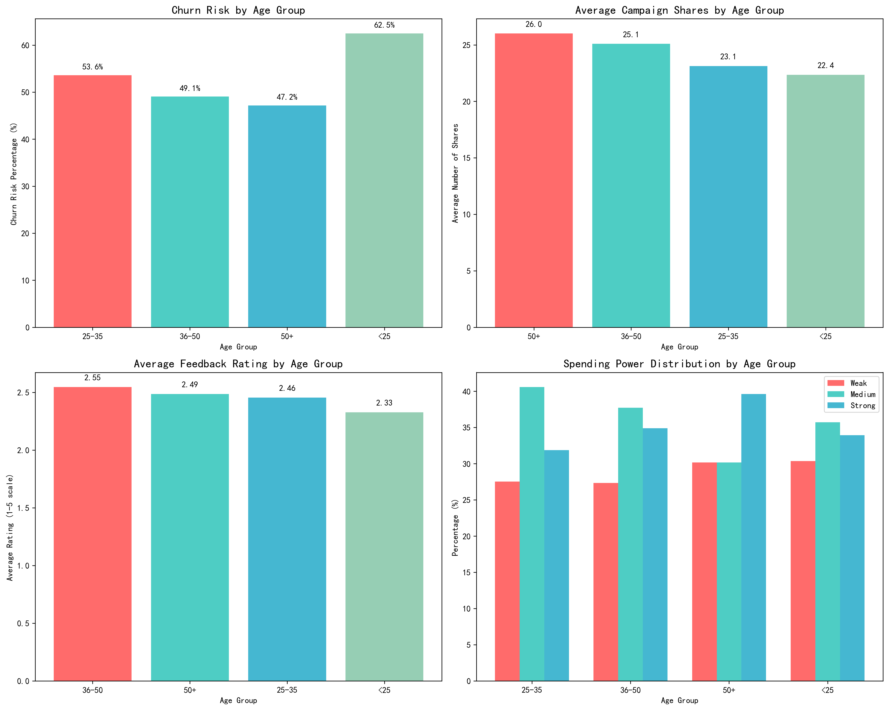

# Age Segment Marketing Analysis Report

## Executive Summary

Our analysis of 337 users across four age segments reveals distinct behavioral patterns that require tailored marketing strategies. The data shows significant variations in churn risk, engagement levels, and spending behaviors across different age groups, providing clear opportunities for targeted marketing campaigns.

## Key Findings by Age Segment

### 1. Under 25 Age Group (56 users - 16.6% of total)
**Churn Risk**: 62.5% - Highest risk segment  
**Engagement**: 22.4 average shares - Lowest sharing rate  
**Satisfaction**: 2.33 average rating - Second lowest satisfaction  
**Spending Power**: Mixed distribution with 35.7% weak spenders

**Analysis**: This segment shows the highest churn risk, indicating potential issues with product-market fit or onboarding experience. Their lower sharing rates suggest they may not find content as share-worthy as older segments.

### 2. 25-35 Age Group (69 users - 20.5% of total)
**Churn Risk**: 53.6% - Second highest risk  
**Engagement**: 23.1 average shares - Third in sharing  
**Satisfaction**: 2.46 average rating - Third in satisfaction  
**Spending Power**: Balanced with 27.5% strong spenders

**Analysis**: Young professionals show moderate engagement but still face high churn risk. Their spending power distribution suggests they are in early career stages with growing purchasing power.

### 3. 36-50 Age Group (106 users - 31.5% of total)
**Churn Risk**: 49.1% - Moderate risk level  
**Engagement**: 25.1 average shares - Second in sharing  
**Satisfaction**: 2.55 average rating - Highest satisfaction  
**Spending Power**: Strong representation with 34.9% strong spenders

**Analysis**: This is our most valuable segment with the highest satisfaction and strong engagement. They represent prime targets for premium offerings and loyalty programs.

### 4. 50+ Age Group (106 users - 31.5% of total)
**Churn Risk**: 47.2% - Lowest risk among segments  
**Engagement**: 26.0 average shares - Highest sharing rate  
**Satisfaction**: 2.49 average rating - Second highest satisfaction  
**Spending Power**: Excellent with 39.6% strong spenders

**Analysis**: The most engaged and loyal segment with the highest sharing behavior. Their strong spending power makes them ideal for high-value product recommendations.

## Strategic Recommendations

### For Under 25 Segment:
1. **Churn Reduction Program**: Implement personalized onboarding and mentorship programs
2. **Gamification**: Introduce reward systems for engagement and sharing
3. **Budget-Friendly Options**: Focus on affordable product tiers and student discounts
4. **Social Integration**: Enhance social features to increase sharing motivation

### For 25-35 Segment:
1. **Career-Focused Content**: Develop professional development and lifestyle content
2. **Flexible Subscription Models**: Offer tiered pricing with upgrade paths
3. **Community Building**: Create peer networking opportunities
4. **Mobile-First Approach**: Optimize for mobile engagement during commute times

### For 36-50 Segment:
1. **Premium Loyalty Program**: Launch exclusive benefits for high-value users
2. **Family-Oriented Campaigns**: Develop family bundle offerings
3. **Convenience Features**: Focus on time-saving solutions and premium support
4. **Referral Programs**: Leverage their high satisfaction for word-of-mouth marketing

### For 50+ Segment:
1. **Senior-Focused Content**: Create age-appropriate content and features
2. **High-Value Product Recommendations**: Target with premium and luxury offerings
3. **Social Sharing Incentives**: Capitalize on their high sharing behavior with referral bonuses
4. **Accessibility Features**: Ensure user-friendly interface and customer support

## Implementation Timeline

**Phase 1 (Next 30 days)**: Launch churn reduction program for under-25 segment and premium loyalty program for 36-50 segment
**Phase 2 (60-90 days)**: Develop age-specific content and campaign templates
**Phase 3 (90-120 days)**: Implement advanced segmentation in marketing automation

## Expected Outcomes

- **15-20% reduction in overall churn rate**
- **25% increase in campaign sharing rates**
- **30% improvement in customer lifetime value from targeted segments**
- **Enhanced customer satisfaction across all age groups**

This targeted approach will maximize marketing ROI by addressing the unique needs and behaviors of each age segment while leveraging their distinct strengths and opportunities.
