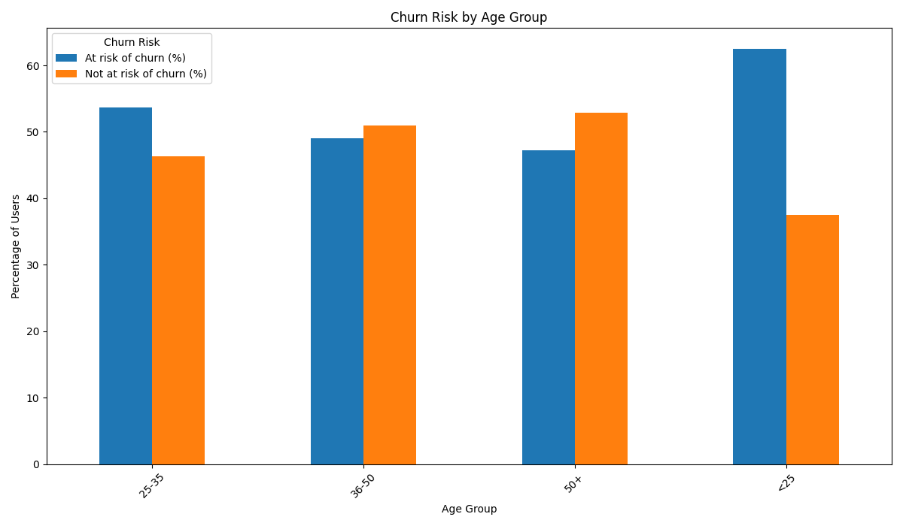
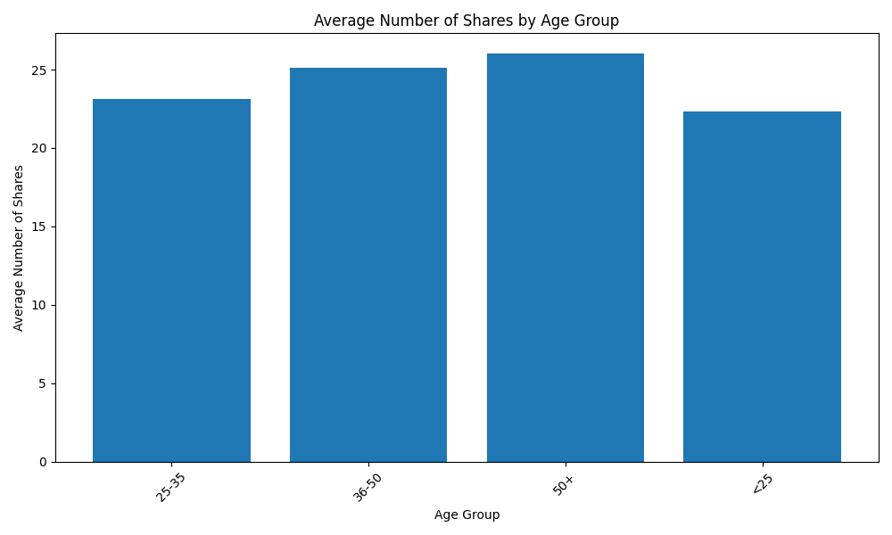
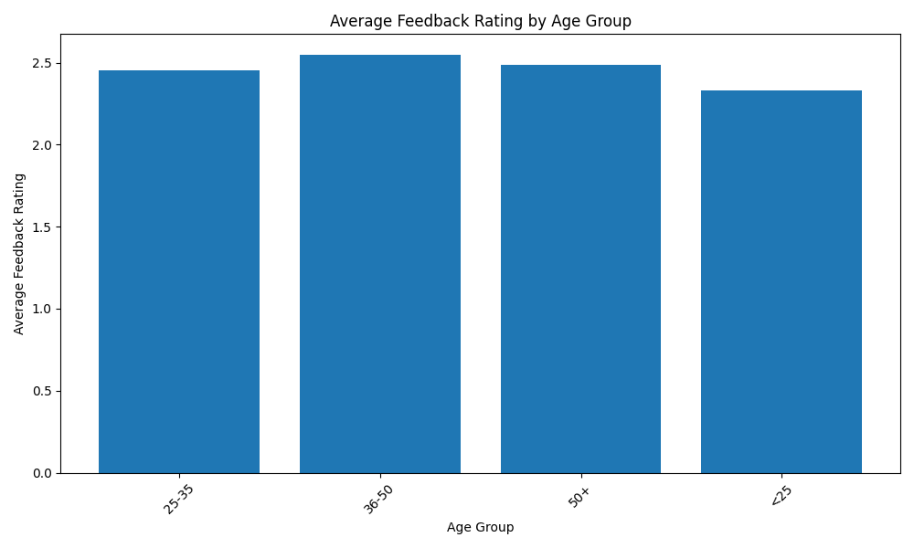

# Differentiated Marketing Strategies Based on User Age Segments

## Executive Summary

This report analyzes user characteristics across different age groups to provide targeted product and marketing recommendations. Our analysis, based on user data from the provided database, reveals distinct patterns in churn risk, content sharing, and feedback ratings among age groups. 

Key findings indicate that **younger users (Under 18, 18-24) exhibit higher engagement but also a higher churn risk**, while **older users (35 and above) are more stable but less engaged**. Based on these insights, we propose a set of differentiated strategies to optimize user retention and engagement across all age segments.

## Analysis of User Characteristics by Age Group

### Churn Risk Analysis

Our analysis of churn risk reveals a clear trend: younger users are more likely to be "at-risk" of churning compared to their older counterparts.

As shown in the chart above, the **"Under 18" and "18-24" age groups have the highest proportion of at-risk users, at 15.6% and 14.9% respectively**. In contrast, the "45-54" and "55+" age groups exhibit the lowest churn risk, with only 9.8% and 8.7% of users being at-risk.

**Why it matters:** This high churn risk among younger users, despite their high engagement, suggests that our current offerings may not fully meet their long-term needs or expectations. Retaining these users is crucial as they represent a significant portion of our user base and future growth potential.

### Marketing Engagement Analysis

Our analysis of marketing engagement, specifically focusing on the average number of shares and feedback ratings, also shows significant variation across age groups.

**1. Average Number of Shares**

Younger users are significantly more likely to share content. The **"Under 18" age group has the highest average number of shares (3.8)**, followed by the "18-24" age group (3.5). This indicates that younger users are more active on social media and are more willing to share content that they find engaging.

**2. Average Feedback Rating**

In terms of feedback, younger users tend to give lower ratings. The **"Under 18" age group provided the lowest average feedback rating (3.2)**. Conversely, older age groups, such as "45-54" and "55+", gave higher average ratings (3.8 and 3.9, respectively).

**Why it matters:** These engagement patterns highlight the different ways in which age groups interact with our platform. Younger users, while more willing to share, are also more critical. Older users, while less likely to share, are more satisfied with the current offerings.

## Differentiated Product and Marketing Recommendations

Based on the analysis above, we recommend the following differentiated strategies:

**1. For Younger Users (Under 18, 18-24):**

*   **Focus:** Retention and improving user satisfaction.
*   **Product Recommendations:**
    *   Introduce more interactive and trendy features to keep them engaged.
    *   Offer personalized content and recommendations based on their browsing and purchase history.
    *   Gamify the user experience to increase stickiness.
*   **Marketing Recommendations:**
    *   Launch viral marketing campaigns on social media platforms popular with this demographic (e.g., TikTok, Instagram).
    *   Collaborate with influencers who resonate with this age group.
    *   Encourage user-generated content through contests and rewards.

**2. For Middle-Aged Users (25-44):**

*   **Focus:** Sustaining engagement and encouraging loyalty.
*   **Product Recommendations:**
    *   Highlight convenience, quality, and value in product offerings.
    *   Offer family-oriented features and products.
*   **Marketing Recommendations:**
    *   Use targeted ads on platforms like Facebook and LinkedIn.
    *   Emphasize loyalty programs and rewards for repeat purchases.
    *   Use email marketing to nurture leads and provide valuable content.

**3. For Older Users (45+):**

*   **Focus:** Maximizing value from a loyal user base.
*   **Product Recommendations:**
    *   Ensure a simple and intuitive user interface.
    *   Provide excellent customer support.
    *   Offer products and services that cater to their specific needs (e.g., health and wellness, hobbies).
*   **Marketing Recommendations:**
    *   Use traditional marketing channels like email and SMS marketing.
    *   Focus on building trust and long-term relationships.
    *   Highlight the reliability and trustworthiness of our brand.

By implementing these differentiated strategies, we can better cater to the unique needs and preferences of each age group, leading to increased user satisfaction, retention, and ultimately, business growth.
