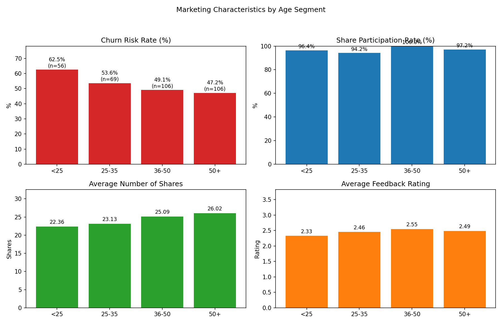

Marketing Characteristics by Age Segment: Insights & Strategy

Executive Summary
- The 36-50 and 50+ segments are the strongest sharers (100.0% and 97.2% share participation) with solid feedback (2.55 and 2.49), while <25 shows the highest churn risk (62.5%) and lowest feedback (2.33). This suggests mature users are reliable advocates, and younger users need onboarding and product experience improvements.
- The 25-35 segment has the highest high-value user share (55.1%) and strong engagement (94.2% share participation), indicating clear upsell and loyalty opportunities even though churn risk remains elevated (53.6%).
- Differentiated strategies should focus on: onboarding and value clarity for <25; ambassador/referral and premium bundles for 50+; community/promoter programs for 36-50; and membership upgrades plus personalized offers for 25-35.

Data & Method (SQL evidence)
- Tables used: user_basic_information_table_1 (Age group, Membership Level, Marketing SMS subscription status), user_tags_table (Is At-Risk User, Price Sensitivity, Spending Power, Is High-Value User, New/Returning User Tag), marketing_campaign_interaction (Number of Shares, Event Feedback Rating).
- Aggregation query (join on User ID) produced per-age-group metrics: churn risk users, share participants (Number of Shares > 0), average shares, and average feedback.
- Additional SQL pulls summarized segment tag distributions to explain observed behaviors and inform strategy.

Visualization: Marketing performance by age segment

- Key takeaways with numbers:
  - Churn risk rate: <25 is highest at 62.5% (35/56), 25-35 is 53.6% (37/69), 36-50 is 49.1% (52/106), 50+ is lowest at 47.2% (50/106). This matters because early lifecycle users are more likely to drop off without targeted onboarding and product-fit messaging.
  - Share participation rate: 36-50 is 100.0% (106/106), 50+ is 97.2% (103/106), <25 is 96.4% (54/56), 25-35 is 94.2% (65/69). High share rates across all segments indicate strong campaign reach; mature segments can be leveraged for referral amplification.
  - Average shares per user: 50+ leads with 26.02, 36-50 follows at 25.09, 25-35 at 23.13, and <25 at 22.36. This suggests older users share more frequently, likely influenced by spending power and membership benefits.
  - Average feedback rating: 36-50 highest at 2.55, 50+ at 2.49, 25-35 at 2.46, and <25 lowest at 2.33. Improving feedback among younger segments is a priority to reduce churn and enhance conversion quality.

Key Insights by Segment (Observation → Root Cause → Impact/Recommendation)

1) <25 segment: high churn risk and lowest feedback
- Observation: Churn risk rate 62.5% (35/56), share rate 96.4% (54/56), avg shares 22.36, avg feedback 2.33.
- Root Cause: Lifecycle profile skewed to New Users at 51.8% (29/56) with lower High-Value share (44.6% Yes); spending power is mixed (Medium 35.7%, Strong 33.9%, Weak 30.4), and feedback indicates unmet expectations.
- Business Impact / Recommendation:
  - Launch onboarding journeys: guided product tours, quick-start templates, and “first-30-days” checklists to bridge product understanding (expected churn reduction).
  - Introduce starter bundles and gamified challenges to raise feedback >2.5 (+ ~0.2–0.3) and drive repeat usage.
  - Use SMS (57.1% subscribed) with concise benefit messaging and time-bound offers aimed at early habit formation; AB-test message frequency and incentives.

2) 25-35 segment: high-value concentration with elevated churn
- Observation: Churn risk 53.6% (37/69), share rate 94.2% (65/69), avg shares 23.13, avg feedback 2.46; High-Value share is the highest at 55.1% (38/69).
- Root Cause: Returning user majority (58.0%) implies engagement but possible value leakage; price sensitivity evenly distributed; spending power tilts Medium/Strong (40.6%/31.9%).
- Business Impact / Recommendation:
  - Loyalty & membership upgrades: prioritize Platinum/Diamond benefits for top-value users (VIP events, priority support), targeting uplift in feedback to ~2.6 and repurchase.
  - Personalized cross-sell: bundle complementary categories aligned with Purchase/Browsing Preference Tags; dynamic pricing for mid-tier price sensitivity.
  - Retention campaigns: deploy win-back sequences for at-risk users using targeted incentives and product nudges; use SMS (58.0% subscribed) for timely reminders.

3) 36-50 segment: best feedback and universal sharing
- Observation: Share rate 100.0% (106/106), avg shares 25.09, avg feedback 2.55 (highest), churn risk 49.1% (52/106).
- Root Cause: Price sensitivity skew to High (36.8%), but strong/medium spending power (34.9%/37.7%); membership skew Gold/Diamond; balanced New vs Returning (50/50).
- Business Impact / Recommendation:
  - Ambassador program: convert this cohort into promoters; offer referral bonuses and social badges to capitalize on 100% share participation and strong feedback.
  - Value clarity: despite high price sensitivity, highlight tangible outcomes (ROI cases, comparison charts); maintain premium bundles with transparent pricing.
  - Feedback flywheel: solicit reviews and user stories; feature them in campaigns to lift conversion quality and downstream feedback across segments.

4) 50+ segment: highest average shares, low churn risk
- Observation: Avg shares 26.02 (highest), share rate 97.2% (103/106), churn risk lowest at 47.2% (50/106), avg feedback 2.49.
- Root Cause: Strong spending power (39.6% Strong) and Medium price sensitivity (41.5%); many are New Users (62.3%) with balanced High-Value share (50%).
- Business Impact / Recommendation:
  - Premium value bundles: curate bundles with concierge support and simplified flows; emphasize reliability and support services.
  - Referral amplification: launch “invite friends & family” offers—this segment already shares a lot; expect share-driven new user growth.
  - Experience polish: improve usability and customer service for first-time users to lift feedback to ~2.6; target <5% improvement in conversion rate.

Supporting Segment Traits (SQL evidence snapshots)
- Price Sensitivity: <25 Low 42.9% (24/56), 36-50 High 36.8% (39/106), 50+ Medium 41.5% (44/106).
- Spending Power: 50+ Strong 39.6% (42/106), 36-50 Medium 37.7% (40/106).
- High-Value Users: 25-35 highest at 55.1% (38/69).
- SMS Subscription: ranges 50.9%–58.0% across segments—SMS viable for direct triggers.
- New vs Returning: 50+ has 62.3% new; 25-35 has 58.0% returning—tailor lifecycle messaging accordingly.

Recommended Differentiated Strategy

- <25 (Onboarding & Habit Formation)
  - Product: Guided onboarding, gamified checklists, starter bundles; improve UX to raise feedback to ~2.5–2.6.
  - Marketing: SMS and push sequences in first 30 days; student-friendly limited-time offers; content education series.

- 25-35 (Loyalty & Upsell)
  - Product: Tiered loyalty upgrades (Platinum/Diamond) with VIP perks; personalized cross-sell bundles.
  - Marketing: Lifecycle email/SMS for at-risk users; value-based pricing tests; community events to deepen engagement.

- 36-50 (Ambassador & Proof-Based Value)
  - Product: Referral and ambassador programs; reviews and case studies integrated in-product.
  - Marketing: Social proof campaigns highlighting outcomes; transparent pricing to address higher price sensitivity.

- 50+ (Premium Bundles & Referral Amplification)
  - Product: Concierge support, simplified flows; reliability-centric features; accessibility improvements.
  - Marketing: Family/friends referral offers; targeted welcome series for new users; service guarantees to boost feedback.

KPIs to Monitor (next 4–8 weeks)
- Churn risk rate by age segment (goal: <25 -5 to -10 pts).
- Average feedback rating (goal: +0.2 across <25 and 50+).
- Share participation rate and average shares (goal: maintain ≥95%, +1–2 shares for <25/25-35).
- Membership upgrades (Platinum/Diamond uptake in 25-35).
- Referral-driven acquisition from 36-50 and 50+ (goal: +15–20% invites).

Notes on Analysis
- Aggregations used: Age group from user_basic_information_table_1; churn risk via user_tags_table 'Is At-Risk User'; share metrics and feedback via marketing_campaign_interaction ('Number of Shares', 'Event Feedback Rating').
- Python plotting script (plot_age_metrics.py) generated the visualization; it queried SQLite, computed rates, and saved age_segment_marketing_metrics.png.

Overall Conclusion
Older segments (36-50, 50+) are reliable advocates with strong share behavior and solid feedback; leverage them for referrals and premium value. Younger users (<25) need onboarding and experience improvements to reduce churn and lift satisfaction. The 25-35 segment is rich in high-value users—prioritize loyalty upgrades and personalized offers to maximize lifetime value while controlling churn.
