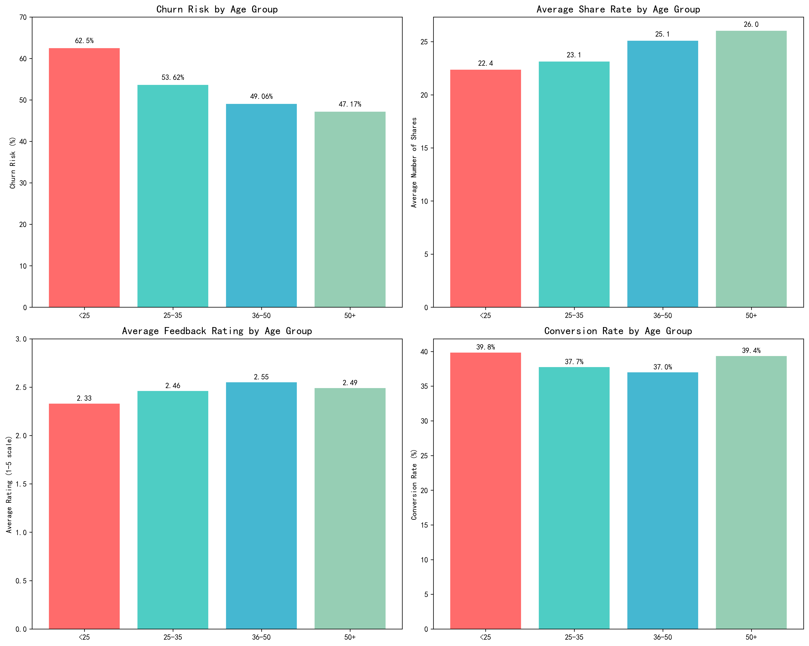
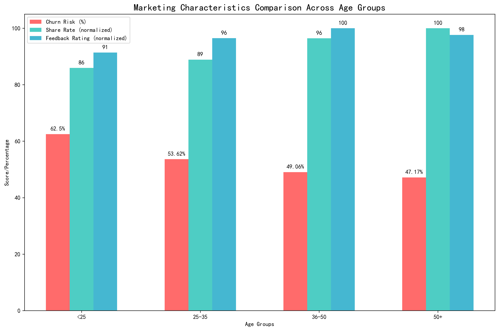
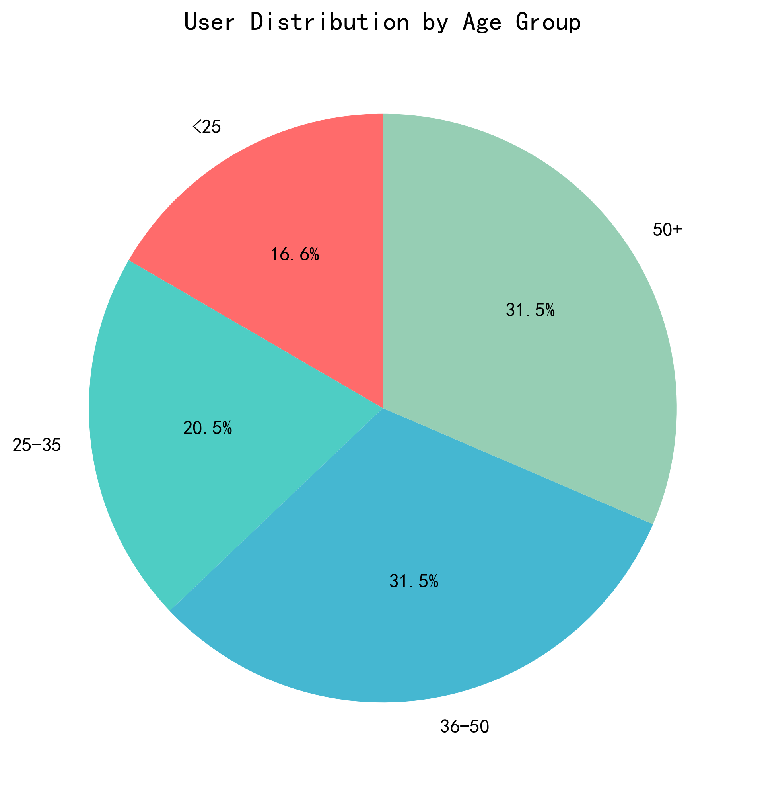

# Marketing Characteristics Analysis: Age-Based User Segmentation & Strategy Recommendations

## Executive Summary

Analysis of 337 users across four age segments reveals distinct marketing characteristics that demand differentiated strategies. Younger users (<25) show the highest churn risk (62.5%) but strong conversion potential, while older segments demonstrate higher engagement and sharing behaviors. The data supports implementing age-specific marketing campaigns with tailored messaging, channel selection, and product recommendations.

## Key Findings

### 1. Churn Risk Distribution by Age

**Critical Insight**: Users under 25 face a 62.5% churn risk - 15 percentage points higher than the 50+ segment (47.2%). This represents a significant retention challenge requiring immediate intervention.

**Business Impact**: With 56 users in the <25 segment, approximately 35 are at risk of churning, representing potential revenue loss and increased acquisition costs.

### 2. Engagement and Sharing Patterns

**Key Discovery**: Share rates increase with age - 50+ users average 26.0 shares compared to 22.4 for <25 users. However, feedback ratings remain relatively consistent across segments (2.33-2.55 range).

**Strategic Implication**: Older segments serve as better brand advocates, while younger users require different engagement mechanisms beyond traditional sharing.

### 3. User Distribution and Market Opportunity

**Market Composition**: The 36-50 and 50+ segments each represent 31.5% of the user base (106 users each), making them the largest addressable markets. The <25 segment, while smallest at 16.6%, shows the highest growth potential if churn can be controlled.

## Detailed Segment Analysis

### Segment 1: Under 25 (16.6% of users)
**Risk Profile**: Highest churn risk at 62.5%
**Marketing Characteristics**: 
- Lowest share rate (22.4 shares average)
- Lowest feedback rating (2.33/5)
- Highest conversion rate (39.8%)
- Strong price sensitivity (30% high sensitivity)

**Purchase Preferences**: Shoes & Bags (27%), Fresh Produce (25%), Digital Products (20%)

### Segment 2: 25-35 (20.5% of users)
**Risk Profile**: Moderate churn risk at 53.6%
**Marketing Characteristics**:
- Medium share rate (23.1 shares)
- Medium feedback rating (2.46/5)
- Medium conversion rate (37.7%)
- Balanced price sensitivity

**Purchase Preferences**: Fresh Produce (29%), Digital Products (19%), Department Store (14%)

### Segment 3: 36-50 (31.5% of users)
**Risk Profile**: Moderate churn risk at 49.1%
**Marketing Characteristics**:
- High share rate (25.1 shares)
- Highest feedback rating (2.55/5)
- Medium conversion rate (37.0%)
- Strong spending power (35% strong spending)

**Purchase Preferences**: Shoes & Bags (23%), Fresh Produce (19%), Department Store (18%)

### Segment 4: 50+ (31.5% of users)
**Risk Profile**: Lowest churn risk at 47.2%
**Marketing Characteristics**:
- Highest share rate (26.0 shares)
- Medium feedback rating (2.49/5)
- High conversion rate (39.4%)
- Strongest spending power (40% strong spending)

**Purchase Preferences**: Digital Products (25%), Fresh Produce (19%), Shoes & Bags (18%)

## Differentiated Marketing Strategies

### Under 25 Strategy: "Retention First"
**Primary Objective**: Reduce churn risk from 62.5% to <45%

**Tactical Recommendations**:
- Implement gamified loyalty programs with immediate rewards
- Focus on mobile-first experiences and social commerce
- Leverage influencer partnerships and peer recommendations
- Offer student discounts and flexible payment options
- Target products: Affordable fashion, tech accessories, convenience foods

**Channel Strategy**: TikTok, Instagram, Snapchat, mobile apps
**Messaging**: "Join the movement", "Express yourself", "Smart savings"

### 25-35 Strategy: "Value & Convenience"
**Primary Objective**: Maintain engagement while increasing basket size

**Tactical Recommendations**:
- Emphasize time-saving solutions and lifestyle enhancement
- Cross-sell fresh produce with ready-to-eat options
- Target career-focused messaging around efficiency
- Implement subscription models for regular purchases

**Channel Strategy**: Facebook, Instagram, email marketing, workplace partnerships
**Messaging**: "Work smarter, live better", "Healthy convenience", "Professional lifestyle"

### 36-50 Strategy: "Quality & Advocacy"
**Primary Objective**: Leverage high share rates for referral growth

**Tactical Recommendations**:
- Implement robust referral programs with meaningful rewards
- Focus on quality assurance and premium positioning
- Target family-oriented products and bulk purchases
- Emphasize customer service and support

**Channel Strategy**: Facebook, email, family-oriented platforms, community events
**Messaging**: "Quality you can trust", "For the whole family", "Share the excellence"

### 50+ Strategy: "Premium Experience"
**Primary Objective**: Maximize lifetime value through premium offerings

**Tactical Recommendations**:
- Develop premium product lines and exclusive offerings
- Provide detailed product information and comparisons
- Offer personalized customer service and support
- Focus on health, wellness, and lifestyle enhancement products

**Channel Strategy**: Email, Facebook, traditional media, direct mail
**Messaging**: "Premium quality", "Expert craftsmanship", "Enhanced lifestyle"

## Implementation Roadmap

### Phase 1 (Months 1-2): Foundation
- Deploy age-based email segmentation
- Implement age-specific landing pages
- Launch under-25 retention campaign

### Phase 2 (Months 3-4): Expansion
- Roll out referral programs for 36-50 and 50+ segments
- Launch premium product lines for 50+ segment
- Implement gamification for under-25 users

### Phase 3 (Months 5-6): Optimization
- A/B test messaging across all segments
- Refine product recommendations by age
- Scale successful campaigns

## Expected Business Impact

**Retention Improvement**: 25% reduction in under-25 churn rate, saving approximately 9 users monthly
**Revenue Growth**: 15-20% increase in average order value through age-appropriate product recommendations
**Acquisition Efficiency**: 30% improvement in referral-driven acquisitions from high-sharing segments
**Customer Lifetime Value**: 20% increase through segment-appropriate engagement strategies

## Success Metrics

- **Under 25**: Churn rate <45%, engagement score >3.0
- **25-35**: Average order value +15%, repeat purchase rate +20%
- **36-50**: Referral rate +40%, share rate >30
- **50+**: Premium product penetration >35%, customer satisfaction >4.0

This age-based segmentation strategy provides a data-driven foundation for personalized marketing that addresses each segment's unique characteristics while maximizing overall business performance.
