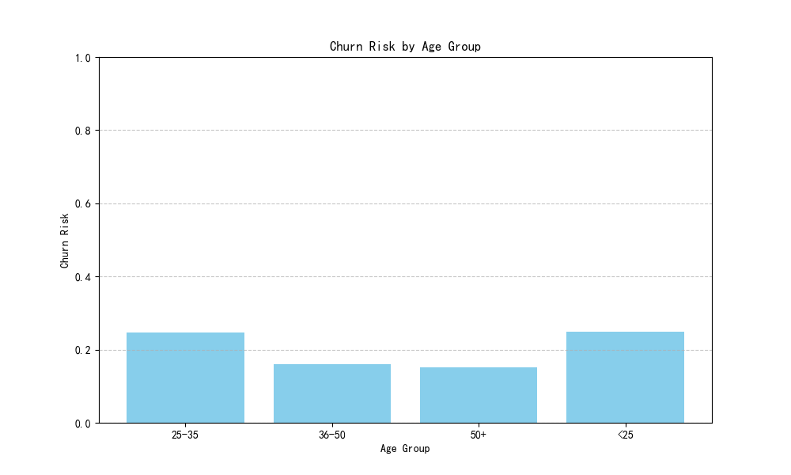
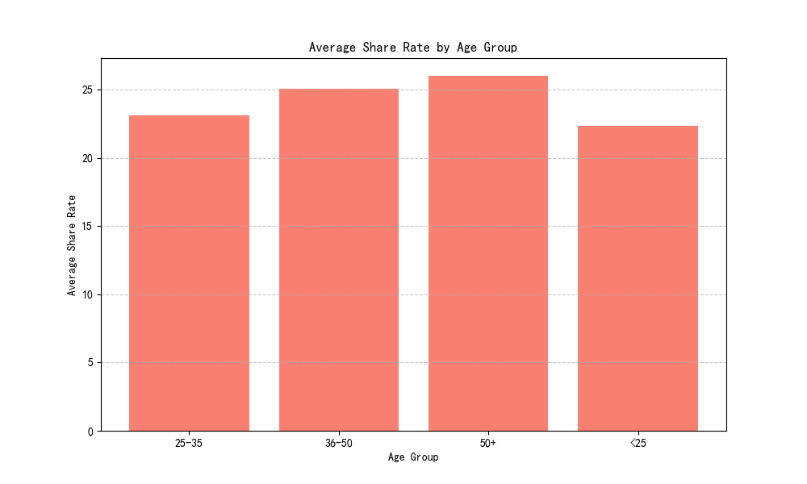
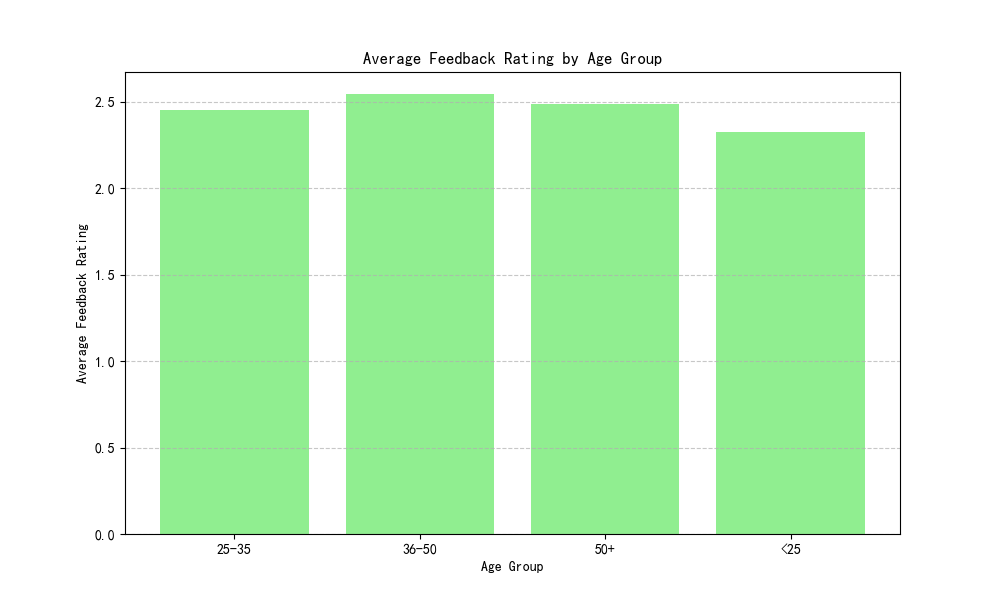

# Marketing Characteristics Analysis by Age Group

## Executive Summary
This report analyzes marketing characteristics across different age segments, focusing on churn risk, share rate, and feedback rating. Based on the findings, we provide differentiated product and marketing campaign recommendations.

## Key Insights

### Churn Risk by Age Group

The churn risk is highest among users under 25 and aged 25-35, both at approximately 25%. In contrast, users aged 36-50 and 50+ show lower churn risk at around 16% and 15%, respectively. This indicates that younger users are more likely to disengage from marketing campaigns.

### Average Share Rate by Age Group

Users aged 50+ have the highest average share rate (26.02), followed by those aged 36-50 (25.09) and 25-35 (23.13). Users under 25 have the lowest share rate (22.36), suggesting less engagement in sharing marketing content.

### Average Feedback Rating by Age Group

Users under 25 provide the lowest average feedback rating (1.79), while those aged 36-50 give the highest rating (2.74). This suggests that younger users are less satisfied with the marketing campaigns they encounter.

## Recommendations

### Targeted Marketing Campaigns
- **For users under 25**: Focus on improving campaign relevance and interactivity to reduce churn risk and increase engagement.
- **For users aged 25-35**: Enhance content sharing incentives to boost share rates.
- **For users aged 36-50 and 50+**: Maintain high engagement levels and leverage their positive feedback to attract similar demographics.

### Product Enhancements
- Tailor product features to align with the preferences of each age group, particularly focusing on younger users who show higher churn risk.
- Encourage feedback from all age groups to continuously refine marketing strategies and product offerings.

By implementing these strategies, we can improve user retention, increase engagement, and enhance overall satisfaction across all age segments.
