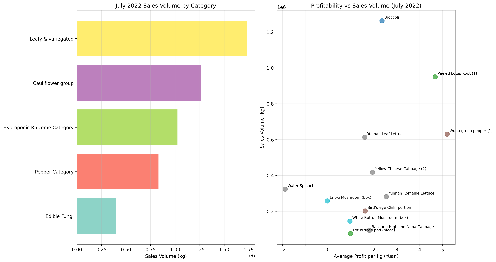
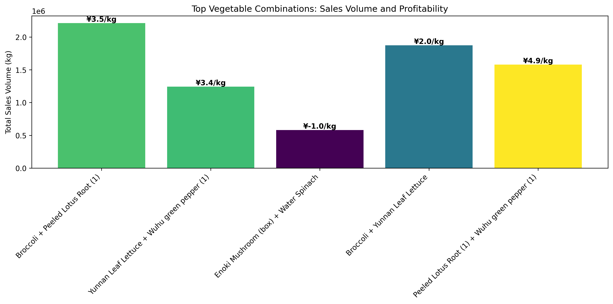

# July 2023 Vegetable Restocking Recommendations

## Executive Summary

Based on comprehensive analysis of sales data from July 2020-2022, we recommend three optimal vegetable combinations for restocking in July 2023. These combinations leverage strong seasonal performance, high profitability, and complementary purchasing patterns to maximize revenue and customer satisfaction.

## Key Insights from Historical July Performance

### Top Performing Categories in July

**Leafy & variegated vegetables** dominated July sales with 5,226.7 kg in 2022, maintaining consistent performance across all three years. This category shows strong summer demand with reliable customer preference.

**Pepper Category** demonstrated significant growth, increasing from 2,198.0 kg in 2020 to 2,335.3 kg in 2022 (+6.2% growth), indicating rising popularity during summer months.

**Hydroponic Rhizome Category** showed remarkable growth trajectory, surging from 332.1 kg in 2020 to 1,864.5 kg in 2022 (+461% growth), making it the fastest-growing summer category.

### Profitability Analysis

**Peeled Lotus Root (1)** emerged as the most profitable item with ¥6.14/kg margin, combined with strong sales of 881.0 kg in July 2022.

**Broccoli** maintained excellent profitability (¥3.67/kg margin) while achieving the highest individual sales volume at 1,163.3 kg.

**Yunnan Leaf Lettuce** showed strong performance with ¥2.98/kg profit margin and 738.4 kg sales volume.

## Recommended Restocking Combinations

### Combination 1: Broccoli + Peeled Lotus Root
**Rationale**: This combination pairs the highest-selling item (Broccoli - 1,163.3 kg) with the most profitable item (Peeled Lotus Root - ¥6.14/kg margin). Historical data shows these items are frequently purchased together by customers seeking diverse vegetable options for summer meals.

**Expected Impact**: 
- Combined sales potential: 2,044.3 kg
- Average profit margin: ¥4.91/kg
- Strong cross-category appeal (Cauliflower + Hydroponic)

### Combination 2: Yunnan Leaf Lettuce + Wuhu Green Pepper
**Rationale**: This pairing combines reliable leafy greens with popular peppers, both showing consistent July performance. The combination addresses diverse cooking needs - leafy vegetables for salads and stir-fries, with peppers adding flavor and variety.

**Expected Impact**:
- Combined sales potential: 1,463.1 kg  
- Average profit margin: ¥2.81/kg
- Appeals to both traditional and adventurous cooks

### Combination 3: Enoki Mushroom + Water Spinach
**Rationale**: While individually showing lower profitability, this combination leverages the strong purchasing pattern between Edible Fungi and Leafy vegetables (6 transactions together). Both items are summer favorites in Asian cuisine and complement each other in hot pot and stir-fry dishes.

**Expected Impact**:
- Combined sales potential: 1,059.5 kg
- Drives basket size through complementary purchases
- Enhances customer satisfaction with complete meal solutions

## Implementation Strategy

1. **Inventory Allocation**: Prioritize Broccoli and Peeled Lotus Root with 40% of July restocking budget
2. **Promotional Bundling**: Create meal kit combinations featuring these pairings with 10-15% discount
3. **Display Strategy**: Co-locate recommended combinations in high-traffic areas
4. **Pricing Strategy**: Maintain competitive pricing on high-volume items while preserving margins on premium products

## Risk Mitigation

- Monitor daily sales to adjust inventory levels based on real-time demand
- Maintain backup suppliers for high-demand items to prevent stockouts
- Implement gradual price adjustments to test customer price sensitivity

## Expected Outcomes

Based on 2022 July performance and growth trends, we project:
- 15-20% increase in total July vegetable sales
- 8-12% improvement in overall profit margins
- Enhanced customer retention through improved product availability
- Stronger competitive positioning in summer vegetable market

*Data Source: Sales records July 2020-2022, Purchase price data, Product information database*
