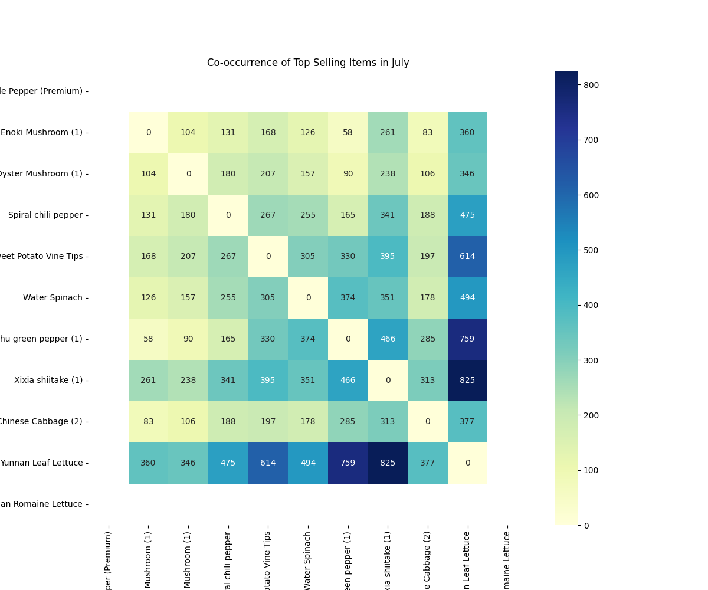

# Restocking Recommendations for July 2023

This report provides data-driven recommendations for fruit and vegetable restocking in July 2023. The analysis is based on historical sales data, focusing on sales volume, product categories, and co-purchase patterns to identify the most promising product combinations.

## Key Findings

Our analysis of July sales data from previous years reveals several key insights:

*   **Top Selling Category:** "Leafy & variegated" vegetables are the most popular category in July, with sales volumes significantly higher than any other category.
*   **Top Selling Products:** Within the top categories, specific items like "Yunnan Leaf Lettuce," "Wuhu green pepper (1)," and "Xixia shiitake (1)" consistently emerge as top sellers.
*   **Strong Co-purchase Correlations:** Certain items are frequently purchased together, indicating strong customer preferences for specific combinations. The heatmap below visualizes the co-occurrence frequency of top-selling items.

The heatmap clearly shows that "Yunnan Leaf Lettuce" has a high co-occurrence with many other top-selling items, particularly "Xixia shiitake (1)" and "Wuhu green pepper (1)". This suggests that customers who buy "Yunnan Leaf Lettuce" are also likely to buy these other items.

## Recommended Restocking Combinations for July 2023

Based on the analysis, we recommend the following three fruit-and-vegetable combinations for restocking in July 2023 to maximize sales:

### Combination 1: The Salad Duo

*   **Yunnan Leaf Lettuce:** The highest-selling individual item in July and a core component of many customer baskets.
*   **Yunnan Romaine Lettuce:** The second-best-selling leafy green, frequently purchased alongside Yunnan Leaf Lettuce. This combination caters to the high demand for salad greens in the summer.

### Combination 2: The Savory Mix

*   **Xixia shiitake (1):** The top-selling edible fungus and a product that is frequently co-purchased with both leafy greens and peppers.
*   **Wuhu green pepper (1):** The best-selling pepper, often bought with "Yunnan Leaf Lettuce" and "Xixia shiitake (1)". This combination is ideal for customers looking to prepare savory dishes.

### Combination 3: The Leafy Green Power Pack

*   **Water Spinach:** A high-volume leafy green, indicating strong and consistent demand.
*   **Sweet Potato Vine Tips:** Another popular leafy green, often purchased with other salad ingredients. This combination provides variety within the most popular vegetable category.

## Conclusion and Next Steps

These recommendations are designed to align restocking decisions with observed customer purchasing behavior, thereby maximizing sales and minimizing waste. We recommend monitoring the sales performance of these combinations throughout July to refine future restocking strategies. Further analysis could explore profitability by incorporating purchase price and loss rate data to optimize for profit margins in addition to sales volume.
