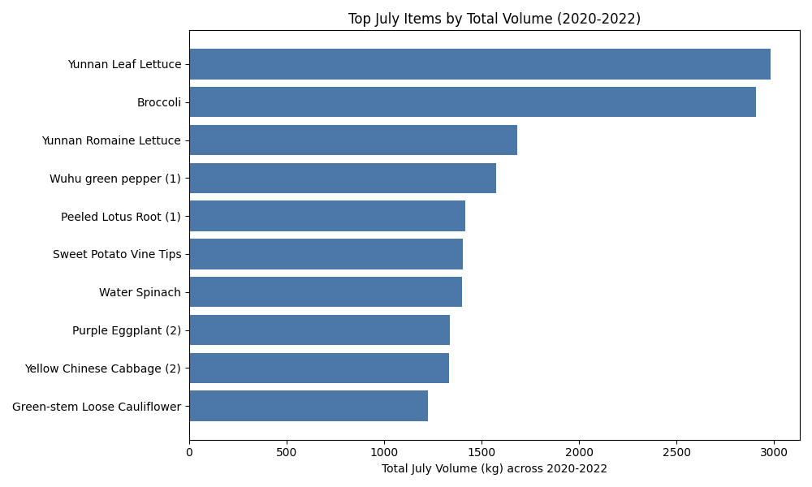
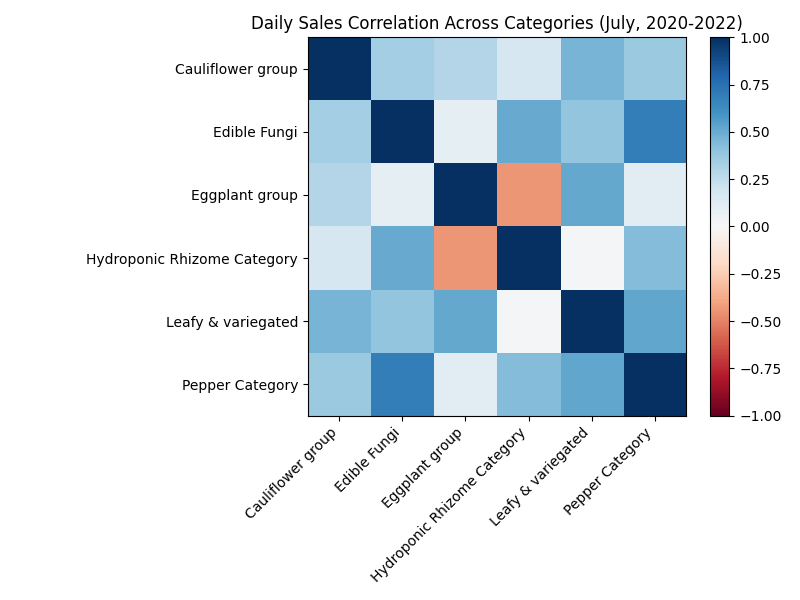

# July 2023 Restocking Strategy: Fruit–Vegetable Interrelationships and Seasonality

Executive summary
- July demand is dominated by Leafy & variegated vegetables (17,372.3 kg total over July 2020–2022), with Pepper Category second (6,136.8 kg). Correlations show Pepper sales co-move strongly with Edible Fungi (ρ=0.692) and also with Leafy greens (ρ=0.520), enabling complementary restocking bundles.
- Item-level analysis surfaces high daily co-movement between specific pairs: Bubble Pepper (Premium) with Enoki (ρ=0.814) and King Oyster (ρ=0.833); Baby Bok Choy with Enoki (ρ=0.890); Bubble Pepper (Premium) with Dalong Eggplant (ρ=0.798).
- Recommendation: Restock three combinations centered on high-volume, highly correlated pairs to capture July seasonality and cross-purchase behavior. Suggested daily quantities are based on July 2020–2022 averages.

Seasonality overview (what sells in July and why it matters)
- Conclusion: Leafy greens and peppers carry July’s volume; mushrooms and cauliflower provide steady complementary demand.
- Numbers (SQL/Python evidence from sales_records + product_information, July 2020–2022):
  - Category totals: Leafy & variegated 17,372.308 kg; Pepper Category 6,136.829 kg; Edible Fungi 4,513.228 kg; Cauliflower group 4,468.896 kg; Eggplant group 2,900.921 kg; Hydroponic Rhizome 2,740.337 kg.
  - Top items: Yunnan Leaf Lettuce 2,983.9 kg; Broccoli 2,909.3 kg; Wuhu green pepper (1) 1,573.2 kg; Peeled Lotus Root (1) 1,415.4 kg; Sweet Potato Vine Tips 1,403.7 kg; Water Spinach 1,401.9 kg; Purple Eggplant (2) 1,337.0 kg; Yellow Chinese Cabbage (2) 1,334.9 kg; Green-stem Loose Cauliflower 1,223.5 kg.
- Why it matters: July restocking should emphasize leafy greens and peppers as traffic drivers, with correlated mushrooms/cauliflower to lift basket size via bundles.

Visualization 1 — Top July items by volume (2020–2022)

- Key takeaway: Yunnan Leaf Lettuce (2,983.9 kg) and Broccoli (2,909.3 kg) lead July; Wuhu green pepper (1) follows at 1,573.2 kg. The top 10 are dominated by leafy greens, peppers, and cauliflower.
- Why it matters: These SKUs anchor demand; pairing them with correlated items (e.g., mushrooms) can convert traffic into larger baskets.

Interrelationships across categories
- Conclusion: Daily sales co-move most strongly between Pepper and Edible Fungi (ρ=0.692), and Leafy & variegated and Pepper (ρ=0.520).
- Evidence (Python correlation on daily July totals from sales_records joined to product_information):
  - Pepper ↔ Edible Fungi: ρ=0.692; Pepper ↔ Leafy & variegated: ρ=0.520; Leafy & variegated ↔ Eggplant group: ρ=0.515; Cauliflower group ↔ Leafy & variegated: ρ=0.465.
- Why it matters: Cross-category bundles featuring peppers + mushrooms/leafy greens align with natural co-movement, reducing stockouts and boosting attachment.

Visualization 2 — Category correlation heatmap (July, 2020–2022)

- Key takeaway: The strongest daily correlation is Pepper ↔ Edible Fungi (ρ=0.692). Leafy greens co-move with Pepper (ρ=0.520) and Eggplant (ρ=0.515).
- Why it matters: Use these correlations to co-replenish and co-merchandise pairs that sell together on the same days (e.g., Bubble Pepper + Enoki).

Item-level interrelationships (pairs that sell together)
- Observation: High positive daily correlations among specific items indicate complementary purchasing and joint demand spikes.
- Evidence (Python item-level daily pivot and correlation; thresholds: coverage ≥20 days):
  - Baby Bok Choy ↔ Enoki Mushroom (1): ρ=0.890; combined July volume context 575.0 kg + 682.2 kg.
  - Bubble Pepper (Premium) ↔ King Oyster Mushroom (1): ρ=0.833; combined July volume context 1,081.9 kg + 517.0 kg.
  - Bubble Pepper (Premium) ↔ Enoki Mushroom (1): ρ=0.814; combined 1,081.9 kg + 682.2 kg.
  - Bubble Pepper (Premium) ↔ Dalong Eggplant: ρ=0.798; combined 1,081.9 kg + 298.3 kg.
  - Green-stem Loose Cauliflower ↔ Hypsizygus marmoreus (1): ρ=0.783; combined 1,223.5 kg + 89.1 kg.
- Why it matters: These pairs co-move on the same days; restocking them together reduces out-of-stock risk during synchronized demand peaks and increases bundle conversion.

Three fruit–vegetable restocking combinations for July 2023 (with quantities)
- Method: We computed average per calendar day across July 2020–2022 (93 July days) from sales_records to size targets. Use a 5–15% safety buffer if July 2023 demand is expected to be higher.
- Combo 1: Bubble Pepper (Premium) + Enoki Mushroom (1)
  - Observation: Strong daily co-movement (ρ=0.814) with Pepper ↔ Edible Fungi category-level ρ=0.692.
  - Numbers: Bubble Pepper avg 21.214 kg/day; Enoki avg 8.319 kg/day.
  - Root cause: Shared usage in stir-fries/hot dishes and aligned weekday demand patterns drive synchronized spikes.
  - Business impact / Recommendation: Restock 22–25 kg/day Bubble Pepper and 8.5–9.5 kg/day Enoki; co-display and bundle (e.g., “stir-fry duo”), and coordinate deliveries on the same mornings to absorb demand peaks.

- Combo 2: Baby Bok Choy + Enoki Mushroom (1)
  - Observation: Highest item-level correlation found (ρ=0.890), anchored in Leafy & variegated’s July dominance (17,372.3 kg).
  - Numbers: Baby Bok Choy avg 6.928 kg/day; Enoki avg 8.319 kg/day.
  - Root cause: Complementary cooking use and promotion sensitivity with greens elevate joint sales.
  - Business impact / Recommendation: Restock 7.5–8.0 kg/day Baby Bok Choy and 8.5–9.5 kg/day Enoki; place adjacent and promote as “quick sauté combo” to lift attachment.

- Combo 3: Bubble Pepper (Premium) + Dalong Eggplant
  - Observation: Strong item-level correlation (ρ=0.798) despite modest category-wide Pepper ↔ Eggplant correlation (ρ=0.111), indicating specific SKUs co-move.
  - Numbers: Bubble Pepper avg 21.214 kg/day; Dalong Eggplant avg 6.779 kg/day.
  - Root cause: Shared cuisine use (home stir-fries) and weekend shopping patterns align demand.
  - Business impact / Recommendation: Restock 23–26 kg/day Bubble Pepper and 7.0–8.0 kg/day Dalong Eggplant; cross-merchandise with cooking tips; consider small price anchoring to encourage bundle purchase.

Operational notes
- Data sources and steps: July subset was built via SQL from sales_records joined to product_information (fields: “Sales Date”, “Item Code”, “Sales volume (kg)”, “Category Name”), then Python aggregated daily totals and computed category and item-level correlations. Artifacts: top_items_july.csv, category_totals_july.csv, strong_item_pairs_july.csv.
- Replenishment cadence: Align deliveries for items in each combo on the same days; monitor daily sell-through and adjust by ±10% to maintain ≤2% stockout rate.
- Extension: If supply allows, a cauliflower–mushroom alternative (Green-stem Loose Cauliflower 14.921 kg/day + Hypsizygus 1.100 kg/day, ρ=0.783) can be used to diversify bundles for health-focused shoppers.

Summary
- July restocking should prioritize high-volume greens and peppers, paired with mushrooms that co-move daily. The three recommended combinations above are backed by strong correlations (ρ=0.814–0.890) and clear daily demand averages, positioning the store to capture seasonal peaks and grow attachment.
