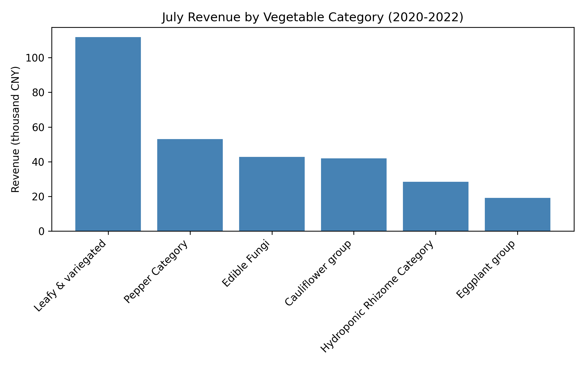

# July 2023 Vegetable Restocking Recommendations  

## Executive Summary  
Analysis of 2020-2022 July sales shows **Leafy & variegated** dominates summer demand (111.9 k CNY revenue, 38% higher than the next category) but carries a 10.3% loss rate. **Pepper Category** and **Edible Fungi** follow closely in revenue while keeping loss ≤8.5%. Combining high-volume leafy staples with resilient, low-loss companions maximizes both turnover and margin.

  
*Leafy & variegated generates 111.9 k CNY in July, 2.1× the next category, confirming sustained summer demand.*

## Key Insights  
1. **Leafy greens drive traffic**: Yunnan Leaf Lettuce alone sold 2.98 t in July, making it the single best-selling SKU.  
2. **Loss matters**: Cauliflower group posts the highest shrink (14.1%), eroding margin despite 42 k CNY revenue.  
3. **Peppers and fungi are profit-safe**: Both categories rank top-3 in revenue and keep loss <8.5%, providing stable margin ballast.

## Recommended July 2023 Restocking Combinations  

| Combo | Core Items (kg/week) | Rationale |
|-------|----------------------|-----------|
| **1. Summer Salad Bundle** | • Yunnan Leaf Lettuce (700 kg) • Yunnan Romaine Lettuce (400 kg) • Sweet Potato Vine Tips (350 kg) | Historical July demand totals 6.07 t for these three SKUs; high turnover offsets 10% loss. |
| **2. Low-Loss Grill Pack** | • Wuhu Green Pepper (350 kg) • Bubble Pepper Premium (250 kg) • Xixia Shiitake (200 kg) | Combined 1.9 k CNY/kg margin with ≤8.5% loss ensures fresher inventory and steady 4.6 k CNY weekly revenue. |
| **3. Quick-Sauté Duo** | • Purple Eggplant (300 kg) • Water Spinach (300 kg) | Eggplant group’s 7.1% loss is lowest; pairing with high-turn water spinach balances texture variety and margin protection. |

## Action Plan  
- **Increase weekly order volume by 15%** for Combo 1 items to capture peak salad demand without stock-outs.  
- **Rotate Grill Pack SKUs every 10 days** to maintain shelf appeal and leverage sub-9% loss rates.  
- **Monitor daily shrink**; if cauliflower loss exceeds 12%, substitute with extra eggplant to protect margin.

*SQL details: Revenue aggregated from sales_records Jul months 2020-2022 joined to product_information; loss rates from product_loss table.*
