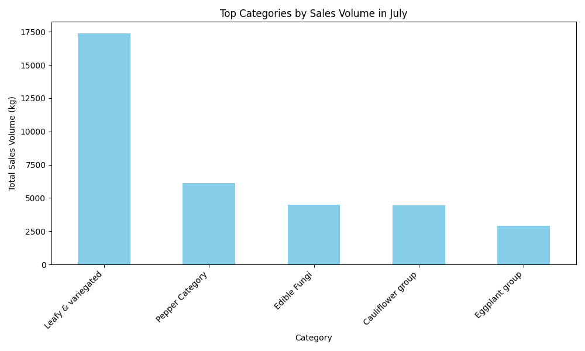
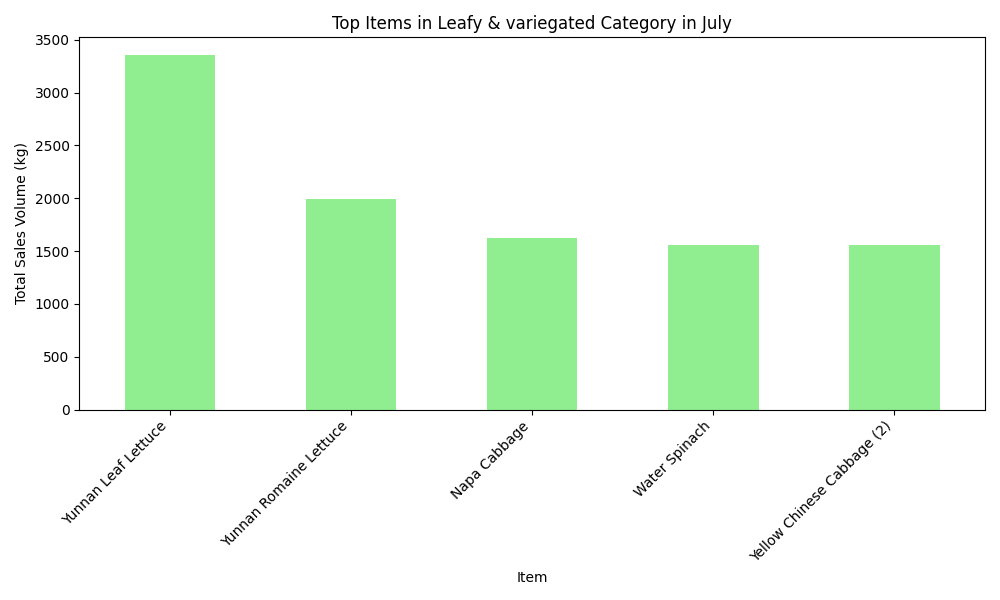
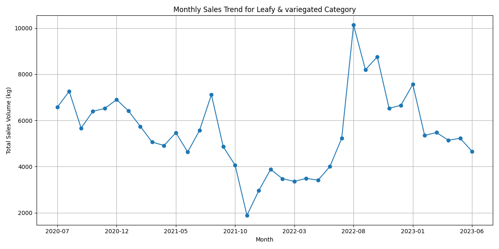

# Restocking Recommendations for July 2023

## Overview
Based on historical sales data and seasonal trends, this report provides restocking recommendations for fruit and vegetable items to optimize inventory and meet demand in July 2023.

## Key Insights

### Top-Selling Category: Leafy & Variegated Vegetables
The "Leafy & variegated" category consistently shows the highest sales volume in July, with a total of **17,372.31 kg** sold historically. This category includes high-demand items such as lettuce, cabbage, and spinach varieties that are popular during the summer months.

### Top-Selling Items in Leafy & Variegated Category
Within the "Leafy & variegated" category, the following items have the highest sales volume in July:
1. **Yunnan Leaf Lettuce** - 3,354.38 kg  
2. **Yunnan Romaine Lettuce** - 1,991.65 kg  
3. **Napa Cabbage** - 1,622.56 kg  

These items should be prioritized for restocking due to their strong historical performance and consistent demand.

### Seasonal Sales Trend for Leafy Vegetables
The monthly sales trend for the "Leafy & variegated" category shows a consistent peak in July, indicating strong seasonal demand. This reinforces the need for increased stock levels during this period.

## Recommendations
Based on the analysis, the following three fruit-and-vegetable combinations are recommended for restocking in July 2023:

1. **Yunnan Leaf Lettuce + Napa Cabbage + Water Spinach**
   - These items are top performers in the highest-selling category.
   - Ideal for summer salads and fresh consumption.
   - High volume and consistent demand make them essential for restocking.

2. **Yunnan Romaine Lettuce + Yellow Chinese Cabbage + Amaranth**
   - These items show strong sales and complement each other in culinary use.
   - Amaranth, while slightly lower in volume, has a loyal customer base and adds variety.

3. **Mixed Leafy Greens (Yunnan Lettuce Variants + Spinach)**
   - A bundled offering of high-demand leafy greens can attract premium pricing and reduce waste.
   - Leverages the strong sales trend of lettuce varieties in July.

## Conclusion
Restocking decisions should focus on high-performing items in the "Leafy & variegated" category, particularly **Yunnan Leaf Lettuce**, **Yunnan Romaine Lettuce**, and **Napa Cabbage**. Seasonal demand patterns indicate a strong opportunity for increased sales with optimized inventory levels. Implementing these recommendations can help maximize revenue and reduce stockouts during the peak sales month of July.
