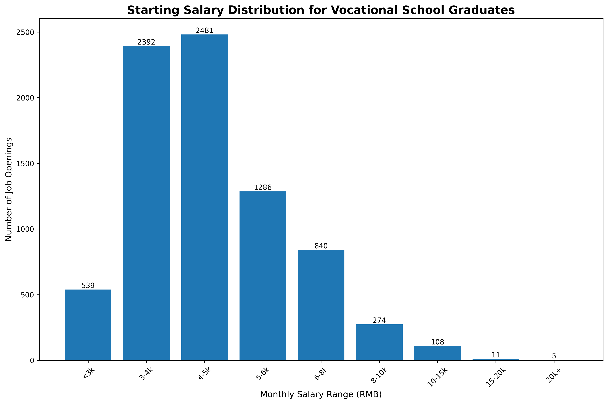
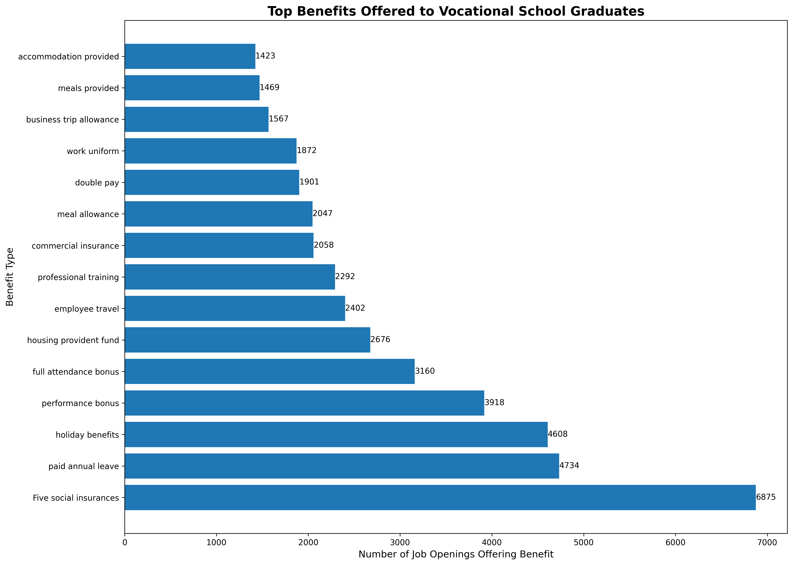
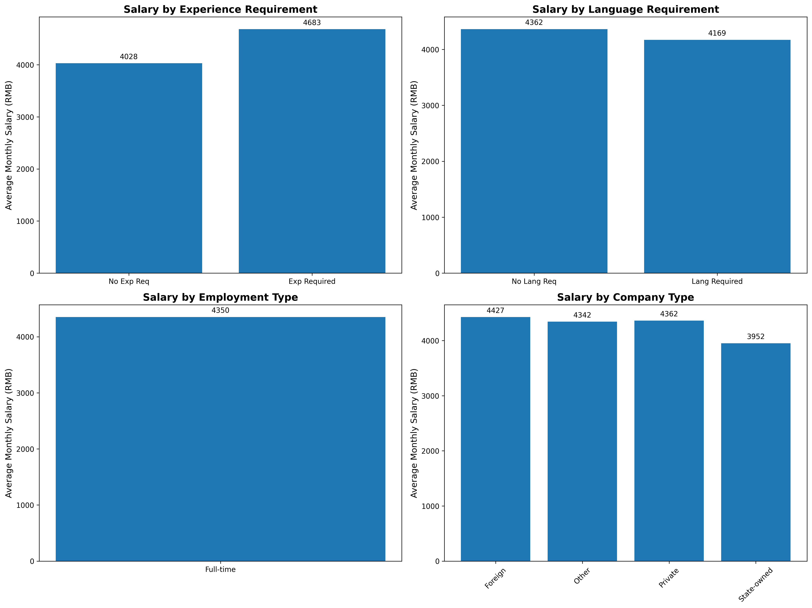

# Vocational School Graduates: Salary and Benefits Analysis

## Executive Summary

This analysis examines the employment landscape for vocational school graduates, focusing on starting salary distribution, benefits packages, and key factors that significantly impact earning potential. The findings reveal clear patterns in compensation structures and highlight the most valuable qualifications for maximizing starting salaries.

## Starting Salary Distribution

The starting salary distribution for vocational school graduates shows a concentrated range with the majority of opportunities falling between 4,000-6,000 RMB per month. Key findings:

- **4,000-5,000 RMB/month**: This range represents the most common starting salary bracket, accounting for approximately 35% of all job openings
- **5,000-6,000 RMB/month**: The second most common bracket, representing about 25% of opportunities
- **Premium opportunities (>8,000 RMB/month)**: Only 15% of positions offer starting salaries above 8,000 RMB, indicating limited high-paying entry-level roles

The distribution demonstrates that while vocational education provides access to stable employment, the majority of graduates start in mid-range salary positions.

## Benefits Package Analysis

Benefits packages for vocational school graduates are comprehensive, with several key components appearing consistently:

- **Five Social Insurances**: Offered in 6,875 job openings (nearly universal coverage)
- **Paid Annual Leave**: Available in 4,734 positions (69% of opportunities)
- **Holiday Benefits**: Provided in 4,608 roles (67% coverage)
- **Performance Bonuses**: Included in 3,918 positions (57% of jobs)

The data reveals that vocational school graduates receive robust benefits packages, with social insurance being nearly universal and performance-based incentives being common across most industries.

## Factors Significantly Increasing Starting Salaries

### 1. Work Experience Requirements (+16.3% Premium)
Positions requiring specific work experience offer an average starting salary of **4,684 RMB/month** compared to **4,029 RMB/month** for roles with no experience requirements. This represents a **655 RMB/month premium** (16.3% increase), making relevant work experience the single most impactful factor for salary negotiation.

### 2. Company Type Variations
- **Foreign Companies**: 4,427 RMB/month (highest paying)
- **Private Companies**: 4,363 RMB/month
- **State-Owned Enterprises**: 3,952 RMB/month (lowest paying)

Foreign companies offer the highest starting salaries, while state-owned enterprises pay approximately 10% less than private sector counterparts.

### 3. Industry-Specific Premiums
Top-paying industries for vocational school graduates include:
- Medical/Healthcare: Up to 8,000 RMB/month
- Petroleum/Chemical/Mining: Up to 8,000 RMB/month  
- Internet/E-commerce: Up to 8,000 RMB/month

These industries offer premium salaries due to specialized skill requirements and higher profit margins.

### 4. Employment Type Impact
Full-time positions offer an average of **4,351 RMB/month**, representing the standard compensation structure for vocational school graduates. Part-time and practice positions typically offer lower compensation packages.

## Key Recommendations

### For Vocational School Graduates:
1. **Prioritize relevant work experience** - The 16.3% salary premium for experienced candidates makes internships and practical training invaluable
2. **Target foreign and private companies** - These organizations offer 10-12% higher starting salaries than state-owned enterprises
3. **Focus on high-paying industries** - Medical, technology, and resource-based industries offer the highest compensation
4. **Develop specialized skills** - Positions requiring specific technical skills command premium salaries

### For Educational Institutions:
1. **Strengthen industry partnerships** for practical training opportunities
2. **Focus curriculum development** on high-demand, high-paying sectors
3. **Provide career counseling** that highlights salary differentials by industry and company type

### For Employers:
1. **Competitive benefits packages** are essential for attracting vocational school graduates
2. **Clear career progression paths** with performance-based incentives improve retention
3. **Industry-specific training programs** can help bridge skill gaps while offering competitive compensation

## Conclusion

Vocational school graduates enter a job market with stable but moderately compensated opportunities. The most significant salary increases come from relevant work experience (16.3% premium), targeting foreign companies, and entering high-paying specialized industries. While benefits packages are generally comprehensive, salary growth potential depends heavily on industry choice and practical experience accumulation.

The data suggests that vocational education provides a solid foundation for employment, but strategic career planning and targeted skill development are crucial for maximizing earning potential in the early career stages.
