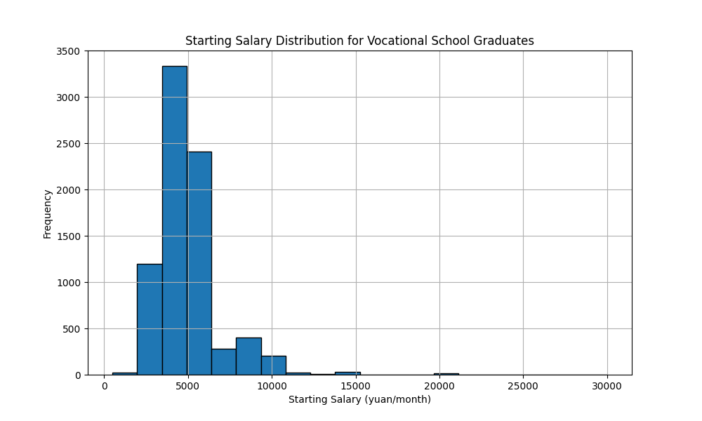
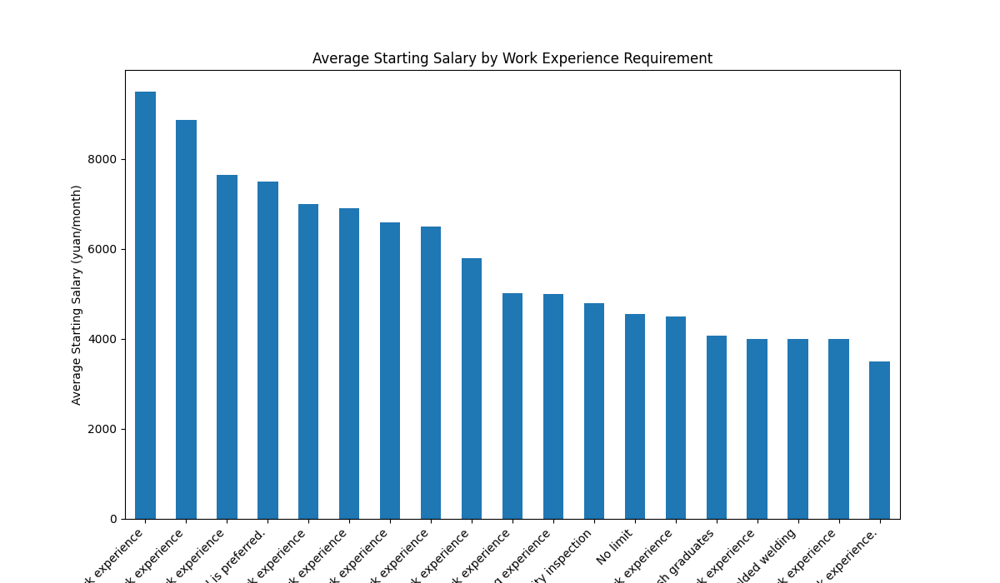
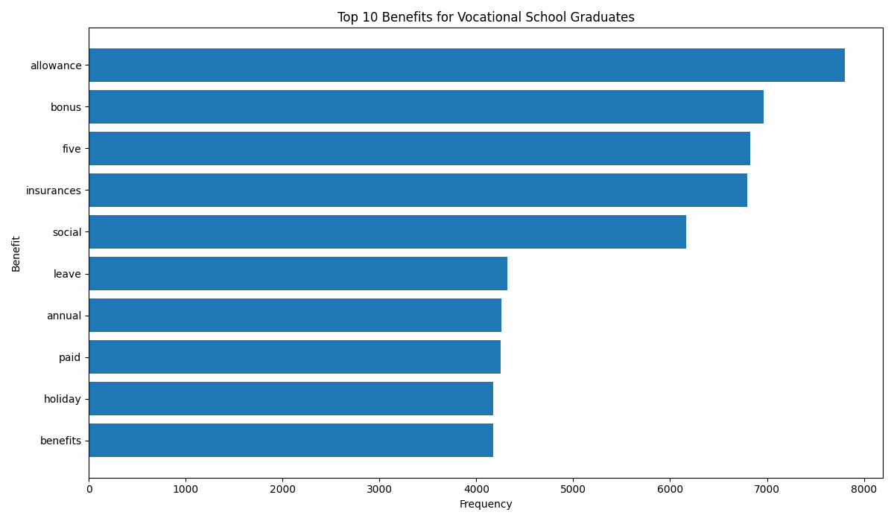

# Analysis of Starting Salaries for Vocational School Graduates

## Executive Summary

This report analyzes the starting salaries, benefits, and key salary-influencing factors for vocational school graduates. The average starting salary is approximately **4,815 yuan/month**, with most graduates earning between 3,500 and 5,500 yuan/month. 

Our analysis reveals that **work experience** and **foreign language proficiency** are the two most significant factors that can lead to a substantial increase in starting salary. Furthermore, the most common benefits offered to vocational school graduates include performance-based bonuses, allowances, and comprehensive social insurance plans.

We recommend that vocational school graduates seeking to maximize their earning potential should focus on gaining relevant work experience and developing proficiency in a foreign language.

## Starting Salary Landscape

The starting salary for vocational school graduates shows a right-skewed distribution, indicating that while the average is 4,815 yuan/month, most job openings offer salaries in the lower end of the range. The median salary is 4,500 yuan/month, which is a more representative figure for the typical graduate.

*Figure 1: The majority of starting salaries for vocational school graduates are concentrated between 3,500 and 5,500 yuan/month.*

## Key Drivers of Higher Salaries

Our analysis identified two primary drivers for higher starting salaries:

### Work Experience

There is a strong positive correlation between the required work experience and the offered starting salary. As shown in the chart below, positions requiring more than three years of experience offer significantly higher salaries than entry-level roles. For instance, jobs that require **six or more years of experience** offer an average starting salary of **9,500 yuan/month**, which is nearly double the average.

*Figure 2: Average starting salary increases consistently with the years of required work experience.*

### Foreign Language Proficiency

Proficiency in a foreign language is another key differentiator for higher pay. Positions that require English proficiency, for example, offer an average salary of **6,617 yuan/month**, approximately 37% higher than the overall average. This highlights the value that employers place on communication skills in a globalized job market.

## Common Benefits Offered

Beyond the base salary, benefits are a crucial part of the total compensation package. The most frequently offered benefits for vocational school graduates are:

*   **Allowances and Bonuses**: These performance-based incentives are a common way for employers to reward high-achieving employees.
*   **Five Social Insurances**: This is a standard benefit in China, covering pension, medical, unemployment, work-related injury, and maternity insurance.
*   **Paid Leave**: Includes annual leave and other forms of paid time off.

*Figure 3: Allowances, bonuses, and social insurances are the most commonly offered benefits.*

## Recommendations

Based on our findings, we offer the following recommendations for vocational school graduates aiming to enhance their career prospects:

1.  **Prioritize Gaining Work Experience**: Graduates should actively seek internships and entry-level positions to build a strong foundation of work experience. Even one to two years of experience can lead to a noticeable increase in earning potential.
2.  **Develop Foreign Language Skills**: Investing time in learning a foreign language, particularly English, can open doors to higher-paying jobs.
3.  **Target Industries with High Demand for Experience**: When job searching, graduates with some experience should target industries and roles where their experience is highly valued and compensated accordingly.

By focusing on these areas, vocational school graduates can significantly improve their earning potential and career trajectory.
