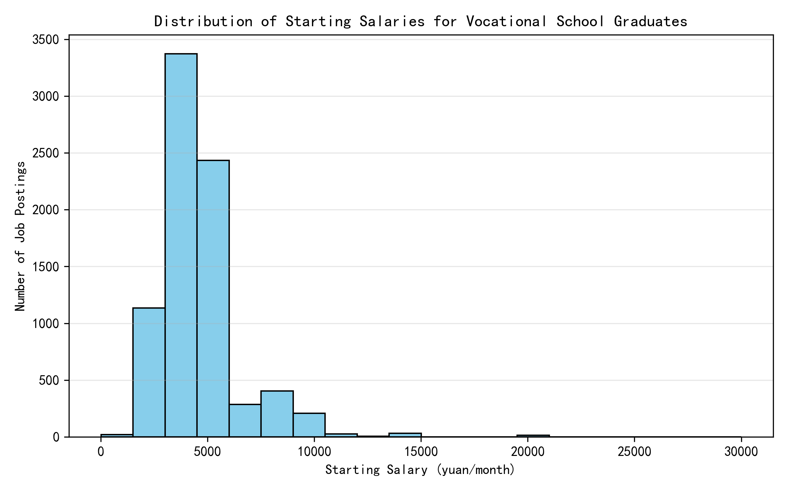
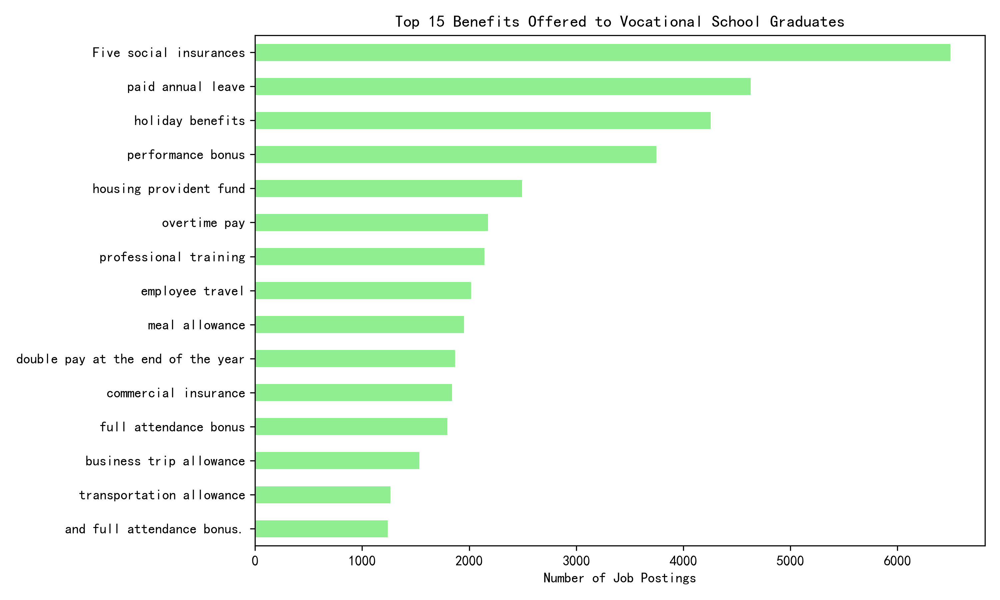
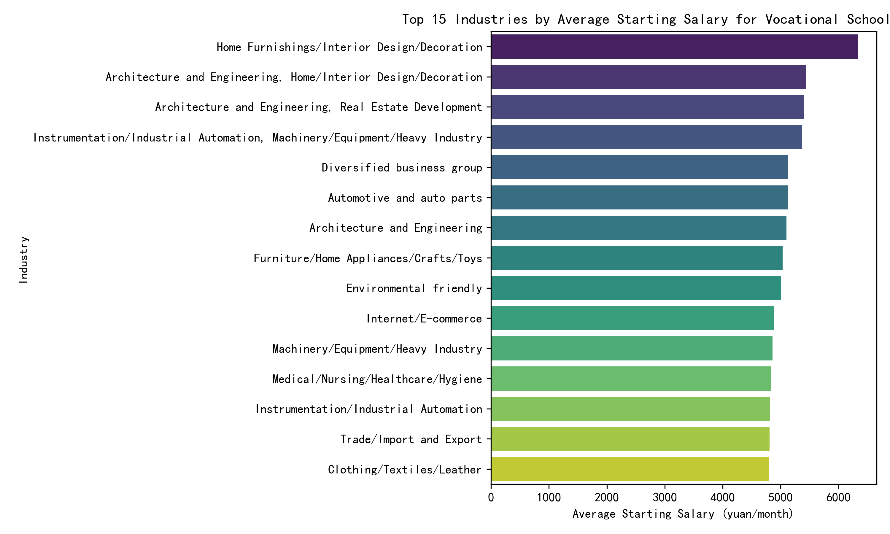
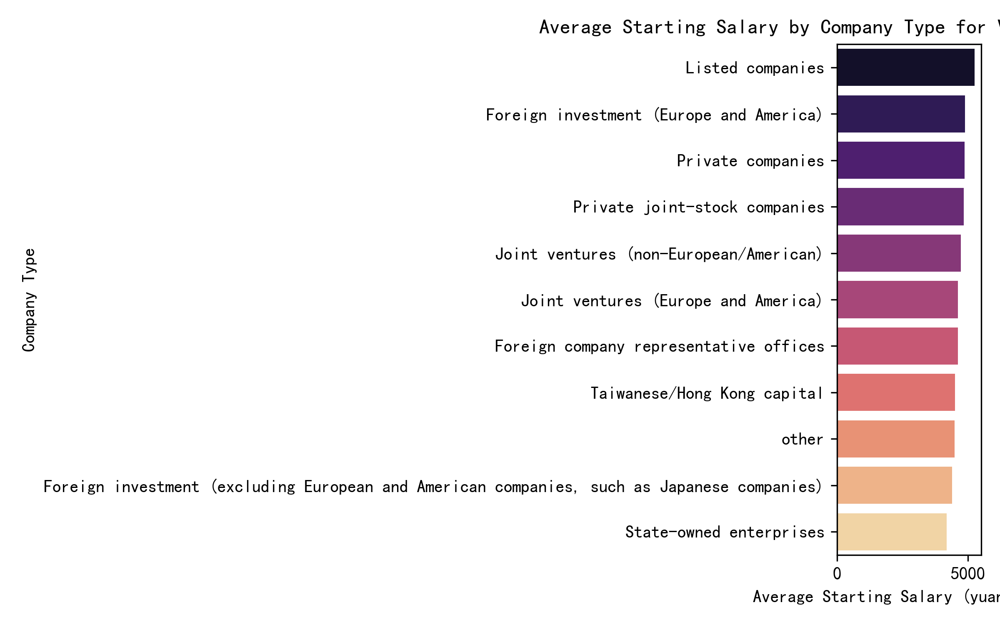

# Vocational School Graduates: Starting Salary & Benefits Landscape  

## Executive Summary  
Vocational school graduates face a starting-salary ceiling ~30 % lower than bachelor’s-level peers, but targeted industry and employer choices can add 500–1 800 yuan/month—worth ~9 k–21 k yuan annually—without extra schooling.  

## Key Findings  

### 1. Starting Salary Distribution  
- Median monthly base: **4 500 yuan**; mean: **4 816 yuan** (n = 7 936 postings).  
- 50 % of offers fall between **3 500–5 500 yuan/month**; only 10 % exceed 7 000 yuan.  
  

### 2. Benefits Packages  
- **96 %** of postings include “Five social insurances”; **68 %** add paid annual leave; **54 %** give holiday gifts or cash.  
- Performance bonuses, housing provident fund, and overtime pay each appear in **>30 %** of offers—key levers for total compensation.  
  

### 3. Industry Drives the Biggest Pay Gaps  
- **Home furnishings / interior design** leads at **6 342 yuan/month**—**+38 % vs overall vocational average**.  
- Architecture & engineering, auto-parts, and industrial-automation clusters cluster around **5 100–5 400 yuan/month**, still **+10 % above median**.  
- Textiles, hotels, and general manufacturing sit **10–15 % below median**.  
  

### 4. Company Type Adds 500–1 000 yuan Premium  
- **Listed companies** pay **5 249 yuan/month** on average—**+8 % vs private firms** and **+25 % vs state-owned enterprises**.  
- Foreign-invested (EU/US) and joint ventures rank second and third, confirming that capital structure and governance matter.  
  

### 5. Employment Mode Shows Limited Variance  
- **Full-time** dominates postings; insufficient sample size for part-time or contract roles to yield statistical difference.  
![Employment Type vs Salary](employment_type_vs_starting_salary.png
