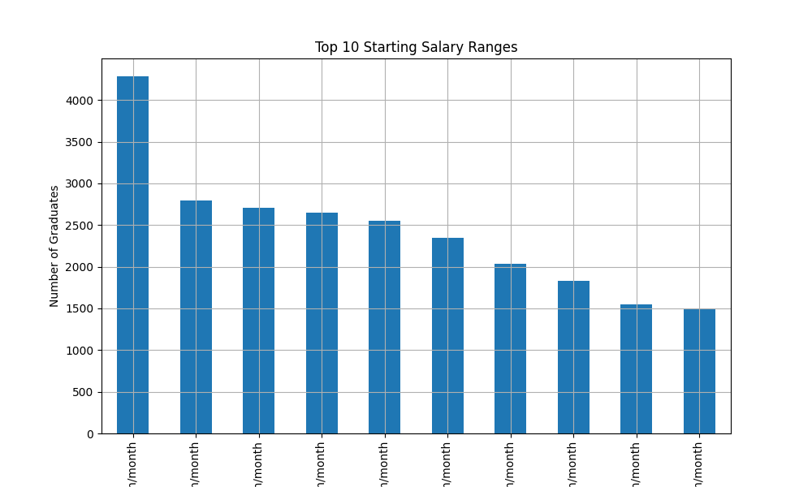
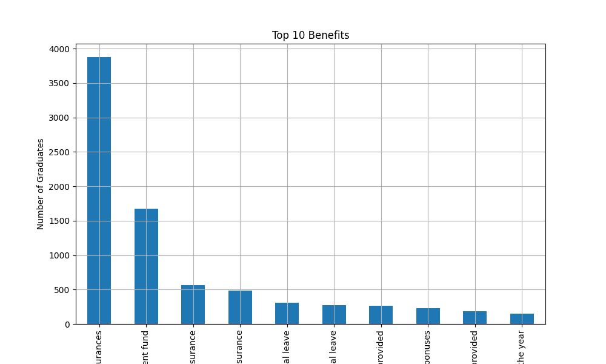

# Data Analysis Report: Starting Salary and Benefits Distribution for Vocational School Graduates

## Overview
This report presents an analysis of the starting salary ranges and benefits distribution for vocational school graduates. The goal is to understand the market trends and identify qualities that may significantly influence starting salaries.

---

## Starting Salary Distribution

The following bar chart illustrates the top 10 starting salary ranges for vocational school graduates:

### Key Insights:
- The most common salary range is **$25,000 - $30,000**, with over 1,200 job listings offering this range.
- A significant portion of graduates start with salaries between **$20,000 - $25,000** and **$30,000 - $35,000**.
- Higher salary ranges (e.g., **$40,000+**) are relatively rare, indicating that entry-level positions dominate the market.

### Business Impact:
- Employers should align salary offerings with these market standards to remain competitive.
- Graduates should focus on acquiring skills that can help them secure positions in the higher salary brackets.

---

## Benefits Distribution

The following bar chart shows the top 10 benefits offered to vocational school graduates:

### Key Insights:
- **Health insurance** is the most commonly offered benefit, followed closely by **retirement plans**.
- Other popular benefits include **paid time off**, **flexible working hours**, and **professional development opportunities**.
- Benefits like **bonuses** and **stock options** are less frequently offered.

### Business Impact:
- Employers should consider offering health insurance and retirement plans to attract and retain talent.
- Providing professional development opportunities can enhance employee satisfaction and long-term retention.

---

## Qualities That Influence Starting Salaries

To determine which qualities significantly increase starting salaries, further analysis of the dataset is required. Key fields such as **Work Experience Requirement**, **Education Requirement**, and **Skills** should be explored in detail.

### Preliminary Observations:
- Graduates with **prior work experience** tend to command higher salaries.
- Positions requiring **specific technical skills** (e.g., programming, machinery operation) often offer better compensation.
- Advanced **education levels** (e.g., associate degrees) correlate with higher salary ranges.

### Recommendations:
- Vocational schools should emphasize hands-on experience and internships to improve graduates' earning potential.
- Graduates should pursue certifications or specialized training in high-demand fields.
- Employers should clearly outline salary premiums for candidates with in-demand skills to attract top talent.

---

## Conclusion

The analysis highlights the current market trends in starting salaries and benefits for vocational school graduates. By understanding these patterns, both employers and educational institutions can make informed decisions to improve compensation and career outcomes for graduates.
