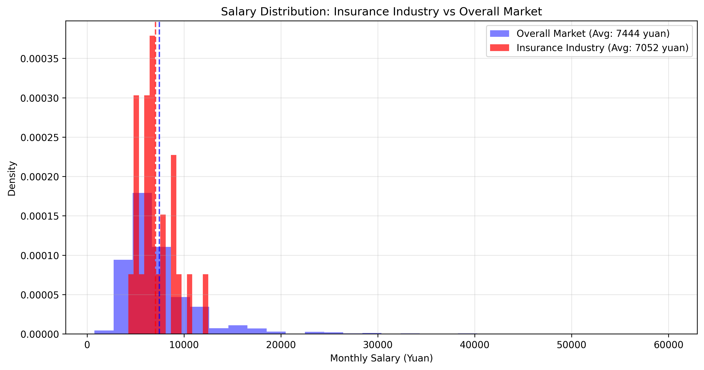
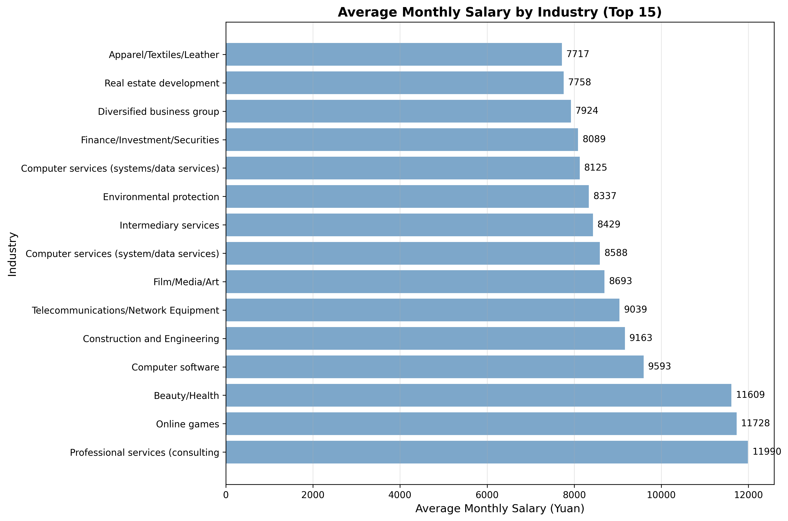
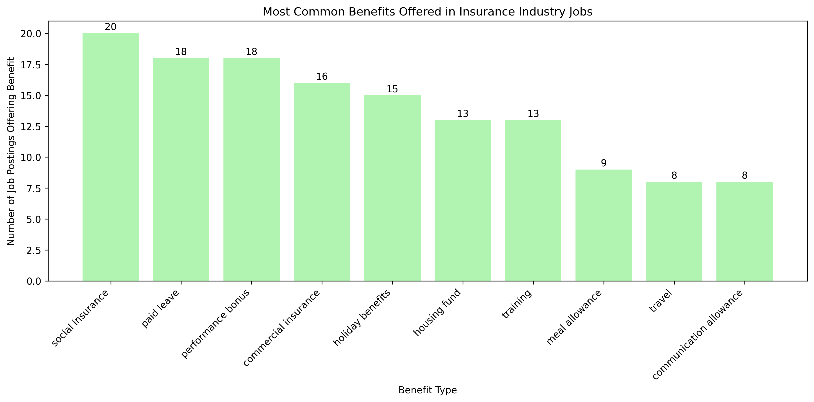

# Insurance Industry Compensation Competitiveness Analysis

## Executive Summary

Based on the analysis of 31 insurance industry job postings compared against the broader market of 4,119 jobs with valid salary data, the insurance sector shows a **mixed competitive position** with average monthly compensation of 7,052 yuan, slightly below the overall market average of 7,444 yuan.

## Key Findings

### Compensation Benchmarking

**Insurance Industry Compensation:**
- **Average Monthly Salary:** 7,052 yuan
- **Median Monthly Salary:** 6,500 yuan
- **Market Position:** 5.3% below overall market average

The insurance industry offers competitive entry-level positions but shows a **compensation gap** for experienced professionals compared to other sectors.

### Company Type Analysis

**Salary by Company Type in Insurance:**
- **Listed Companies:** 9,583 yuan/month (highest paying)
- **Private Joint-Stock:** 8,563 yuan/month
- **Private Companies:** 6,679 yuan/month
- **State-Owned Enterprises:** 5,875 yuan/month (lowest paying)

State-owned insurance companies show a significant compensation disadvantage, offering 38% less than listed insurance companies.

### Benefits Package Analysis

**Most Common Benefits in Insurance:**
1. Social Insurance (20 postings)
2. Paid Leave (18 postings)
3. Performance Bonus (18 postings)
4. Commercial Insurance (16 postings)
5. Holiday Benefits (15 postings)

The insurance industry offers **comprehensive benefits packages**, with 83% of positions including social insurance and 75% offering performance-based bonuses.

### Experience Requirements vs Compensation

**Experience Level Analysis:**
- **No experience required:** 7,383 yuan/month
- **1+ years experience:** 6,167 yuan/month
- **3+ years experience:** 7,167 yuan/month

Interestingly, entry-level positions (no experience required) command higher average salaries than positions requiring 1+ years of experience, suggesting **strong competition for talent at entry levels**.

### Education Requirements

**Insurance Industry Education Standards:**
- **Bachelor's degree or above:** 54.2% of positions
- **College degree or above:** 25.0% of positions
- **Vocational school or above:** 8.3% of positions

The insurance industry has **significantly higher education requirements** than the overall market, where only 17.7% of positions require bachelor's degrees.

## Competitive Advantages

1. **Strong Benefits Package:** Insurance companies offer comprehensive benefits including commercial insurance, performance bonuses, and professional training
2. **Entry-Level Opportunities:** Competitive compensation for entry-level positions with no experience requirements
3. **Professional Development:** Extensive training opportunities and career progression paths

## Competitive Disadvantages

1. **Compensation Gap:** 5.3% below market average, particularly noticeable in state-owned enterprises
2. **Experience Premium:** Lower salary growth with experience compared to other industries
3. **High Education Barriers:** Stricter educational requirements may limit candidate pool

## Recommendations

### For HR Professionals:

1. **Address Compensation Gap:** Review salary bands for experienced positions to remain competitive
2. **Leverage Benefits:** Emphasize comprehensive benefits package in recruitment marketing
3. **Targeted Recruitment:** Focus on entry-level talent where compensation is most competitive
4. **Differentiate State-Owned Enterprises:** Develop non-monetary incentives for state-owned insurance roles

### For Strategic Planning:

1. **Develop Specialization Paths:** Create specialized roles that can command premium compensation
2. **Enhance Training Programs:** Use extensive training as a key differentiator for career development
3. **Benchmark Against Top Performers:** Study compensation strategies of listed insurance companies

## Conclusion

The insurance industry offers a solid foundation for talent acquisition with competitive entry-level positions and comprehensive benefits. However, to attract and retain experienced professionals, companies must address the compensation gap and develop clearer career progression paths. The data suggests opportunities for strategic differentiation through specialized roles and enhanced professional development programs.

*Data Source: Analysis of 31 insurance industry job postings from comprehensive market data*
