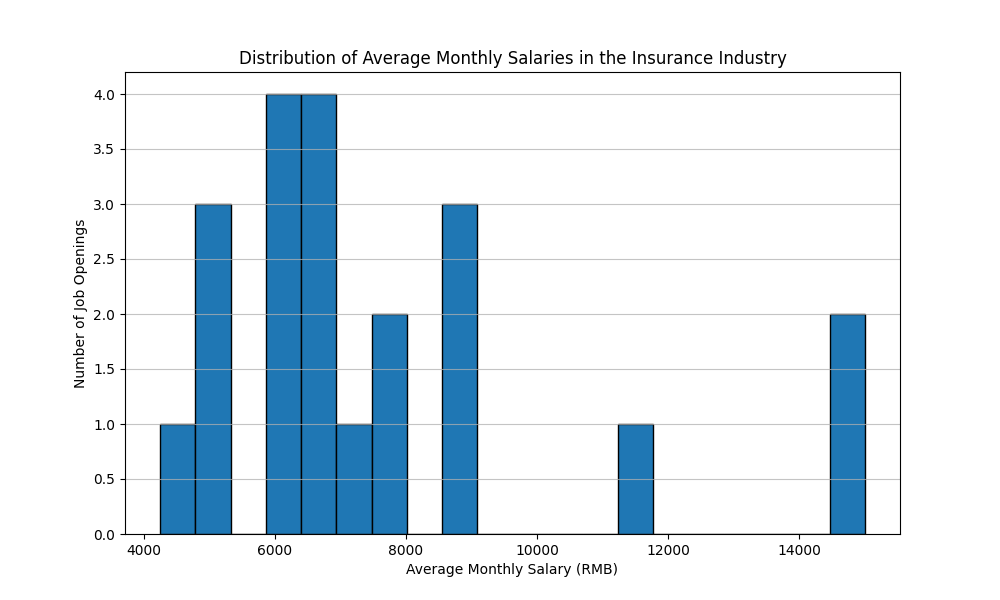
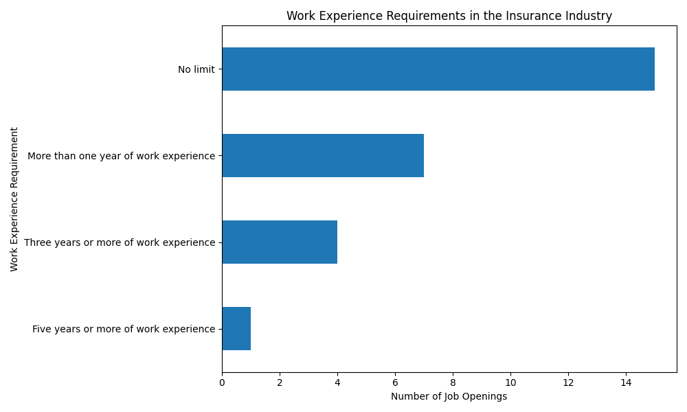
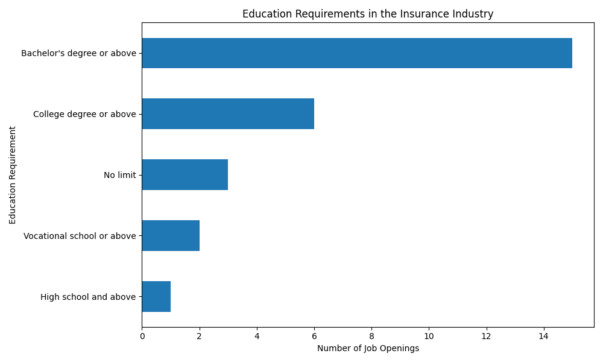
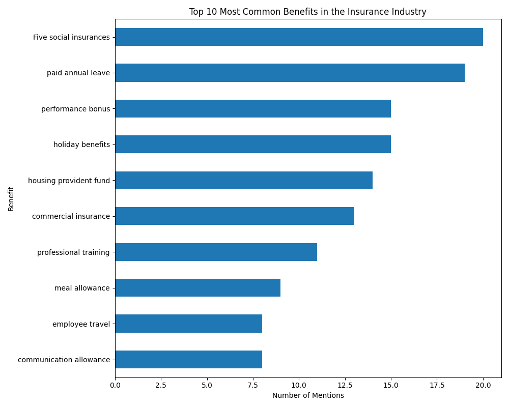

# Insurance Industry Job Market Analysis: A Competitive Benchmark

## Executive Summary

This report provides a comprehensive analysis of the competitive landscape for insurance industry job openings, based on a dataset of recent job postings. Key findings indicate that the average monthly salary centers around **7,667 RMB**, with a majority of roles requiring **one to three years of experience** and a **college degree or above**. The most common benefits offered are **five social insurances and a housing fund**. 

Our analysis reveals opportunities for a company to position itself competitively by offering salaries above the industry average for experienced candidates, and by highlighting comprehensive benefits packages that include paid annual leave and performance bonuses.

## Compensation Analysis: What's the Market Rate?

The average monthly salary in the insurance sector is approximately **7,667 RMB**. The salary distribution is concentrated in the 6,000 to 9,000 RMB range. This indicates a highly competitive market for talent within this salary band.

*Figure 1: Distribution of Average Monthly Salaries*

**Key Takeaway**: To attract top talent, our company should consider offering salaries in the upper quartile of this range (above 9,000 RMB/month), particularly for roles requiring specialized skills or extensive experience. For entry-level positions, a salary around the median of 6,500 RMB would be competitive.

## Job Requirements: The Profile of an Ideal Candidate

Our analysis of job requirements reveals a clear profile for candidates in the insurance industry.

**Work Experience:**
The demand for experienced professionals is high, with the majority of job openings requiring **at least one to three years of experience**.

*Figure 2: Work Experience Requirements*

**Education:**
A **college degree or above** is the standard educational requirement for most positions. This suggests a high value placed on formal education within the industry.

*Figure 3: Education Level Requirements*

**Key Takeaway**: Our recruitment efforts should target candidates with 1-3 years of relevant experience and a college degree. For senior roles, we should emphasize our commitment to career development and growth opportunities to attract candidates with more extensive experience.

## Competitive Benefits Landscape: Beyond the Paycheck

In a competitive market, benefits can be a key differentiator. Our analysis shows that the most frequently offered benefits are the "five social insurances and housing fund," which are standard in China. However, other benefits are also common and can help a company stand out.

*Figure 4: Top 10 Most Common Benefits*

**Key Takeaway**: While the "five social insurances and housing fund" are a must, our company can gain a competitive edge by offering and promoting benefits such as **paid annual leave, performance bonuses, and professional training**. These benefits are highly valued by employees and can significantly enhance our employer value proposition.

## Strategic Recommendations

Based on this analysis, we recommend the following actions to enhance our competitiveness in the insurance job market:

1.  **Benchmark and Adjust Salary Ranges**: For key roles, ensure our salary offerings are in the top quartile of the market to attract high-caliber candidates.
2.  **Highlight Growth Opportunities**: For experienced candidates, showcase career progression paths and opportunities for professional development.
3.  **Promote a Comprehensive Benefits Package**: Go beyond the standard benefits and actively market perks like paid time off, performance-based incentives, and training programs.
4.  **Refine Recruitment Targeting**: Focus our sourcing efforts on candidates with 1-3 years of experience and a college degree, as this represents the largest pool of qualified talent.

By implementing these strategies, we can strengthen our position as an employer of choice in the insurance industry and attract and retain the talent needed to drive our business forward.
