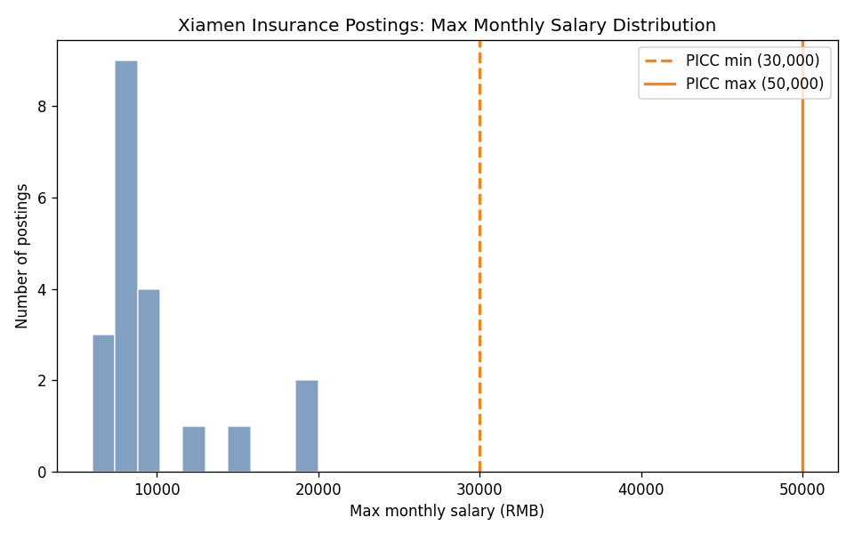
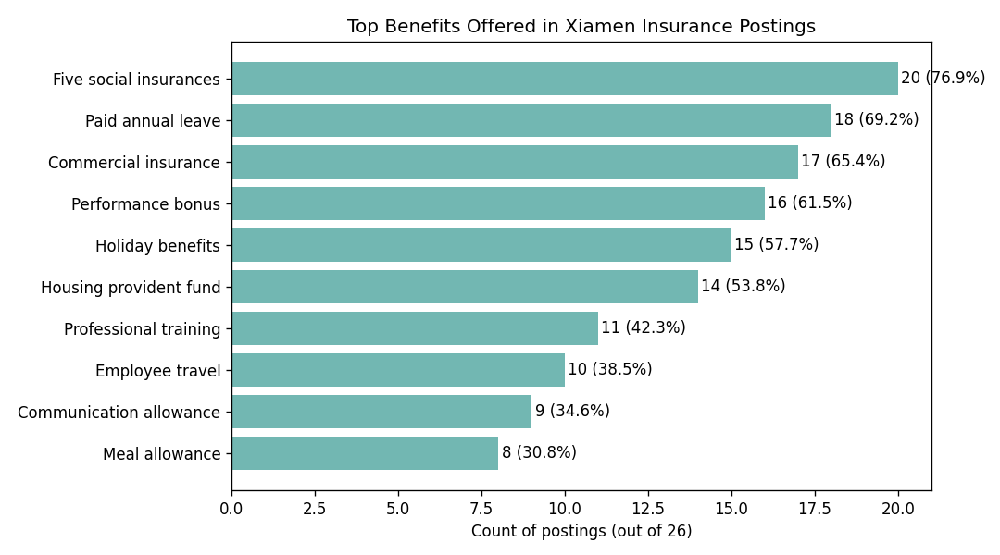

Market Benchmark: Xiamen Insurance Roles vs. PICC Preparation Manager

Executive Summary
- Compensation: PICC offers RMB 30,000–50,000 per month (base RMB 24,000–30,000 + commission), which is well above market. Among 26 postings, the median max salary is RMB 8000/month (IQR RMB 8000–10000), with p90 at RMB 15500 and the observed max at RMB 20000. Only 0 roles (out of 20 with salary data) advertise ≥ RMB 30,000 max.
- Benefits: The most frequent benefits are Housing provident fund (14/26, 53.8%), Five social insurances (20/26, 76.9%), Professional training (11/26, 42.3%), and Commercial insurance (17/26, 65.4%). PICC differentiates with No overtime (1/26, 3.8%), Overseas opportunities (2/26, 7.7%), and Travel allowance (0/26, 0.0%).
- Requirements: Market requirements are moderate—median experience ~0.0 years and 53.8% require Bachelor’s+. Age limits appear in 46.2% of roles (median range 21–39); 15.4% are female-only and 0.0% male-only. PICC’s role has stricter filters (industry tenure and prior income threshold), which narrows the funnel but helps target high performers.

Methodology & Sample
- Data source: Curated SQLite database (sheet1). SQL filter: Industry LIKE '%Insurance%' AND "Work Location" LIKE '%Xiamen%'. Resulting sample size N = 26.
- Parsing: Used Python regex to extract numeric salary ranges from "Salary Range" (n with salary=20); mapped "Work Experience Requirement" to years; normalized "Education Requirement"; counted benefit mentions via keyword matching; profiled age/gender constraints.
- Target role: PICC Xiamen Haicang & Jimei After-sales Department Preparation Manager — stated salary RMB 30,000–50,000 (base 24,000–30,000 + commission); benefits include commercial insurance, travel allowance, holiday benefits, professional training, flexible hours, employee travel, overseas opportunities, no overtime, no probation period.

Compensation Benchmark
- Observation: Market median max salary is RMB 8000/month (IQR 8000–10000); p90 is RMB 15500, and the highest listed max is RMB 20000. Only 0/20 roles list ≥ RMB 30,000 max.
- Root Cause: Most insurance postings in Xiamen are for frontline sales/support roles with lower guaranteed pay; higher earnings are often commission-heavy and not fully reflected in listed max salary.
- Business Impact / Recommendation: PICC’s 30,000–50,000 RMB headline band creates a clear premium of roughly 22000–42000 RMB above the median. Keep the 30–50k positioning and explicitly itemize base + realistic OTE scenarios to attract experienced managers who screen by guaranteed pay.

Key takeaway: The distribution skews well below 30,000 RMB; PICC’s min and max lines at 30k and 50k sit above most postings, visually confirming the premium.

Benefits Benchmark
- Observation: Most common benefits are Housing provident fund (14/26, 53.8%), Five social insurances (20/26, 76.9%), Professional training (11/26, 42.3%), and Commercial insurance (17/26, 65.4%).
- Root Cause: Employers compete primarily on statutory/social insurance, stability, and development pathways; distinctive perks (e.g., no overtime, overseas exposure) are rarer (No overtime 1/26, 3.8%; Overseas opportunities 2/26, 7.7%).
- Business Impact / Recommendation: PICC should spotlight its rarer perks (no overtime, overseas opportunities, travel allowance) and verify market-competitive coverage of social insurance. If feasible, upgrade/clarify to “five social insurances + housing fund” to align with the majority.

Key takeaway: Benefits cluster around social insurance and professional training; PICC’s “no overtime” and “overseas opportunities” stand out as differentiators.

Job Requirements Benchmark
- Observation: Median required experience is ~0.0 years, with 53.8% stating “no limit.” Education trends: 53.8% Bachelor’s+, 23.1% Associate+, and 7.7% Vocational. Age is specified in 46.2% of postings (median 21–39); gender-specific roles total 15.4% combined.
- Root Cause: Insurers broaden funnels for sales roles but add filters for managerial positions. PICC’s requirements (age 25–50, associate+ degree, ≥3 years industry or ≥1 year supervisory, and prior after-tax income > 50k) aim to pre-select productive, mature candidates.
- Business Impact / Recommendation: Maintain the industry-tenure screen to protect quality. To expand supply, consider: (1) allowing non-insurance leadership backgrounds with adjacent financial services success; (2) accepting equivalent income proof (e.g., OTE statements); and (3) keeping associate+ degree while notching up messaging on the four annual promotion cycles to appeal to career-driven candidates.

Competitive Positioning of PICC Role
Advantages
- Pay Premium: 30,000–50,000 RMB/month vs. market median max 8,000; clear lead for experienced talent.
- Differentiated Perks: No overtime, flexible hours, overseas opportunities, and travel allowance are less common locally.
- Career Velocity: Four promotion opportunities per year and full company resource support signal fast growth.

Watch-outs
- Funnel Narrowers: Prior after-tax income > 50k and specific industry tenure may constrain volume in a small local market.
- Social Insurance Perception: Many postings mention “five insurances + housing fund”; ensure internal policy matches or clarify equivalents to avoid perceived gaps.

Actionable Recommendations
- Lead with Guaranteed Pay: Publish base band (24k–30k) and realistic OTE ranges to maximize qualified applications.
- Promote Lifestyle Perks: Emphasize no-overtime and flexible hours prominently in job ads.
- Broaden Equivalency: Accept adjacent-sector leadership (bank/wealth/fintech) with comparable P&L or team metrics to widen the slate.
- Align Benefits Wording: Explicitly state “five insurances + housing fund” if applicable; if not, explain coverage to address candidate expectations.
- Pipeline Strategy: Run targeted sourcing for mid-senior managers from peer insurers; supplement with referral bonuses to surface high earners who meet the income screen.
