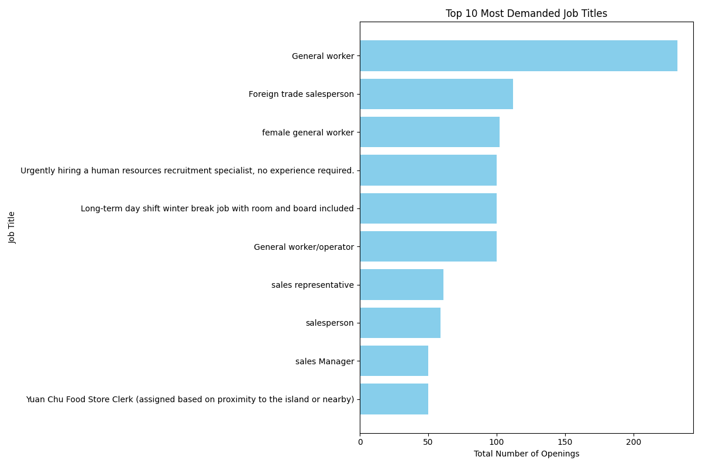
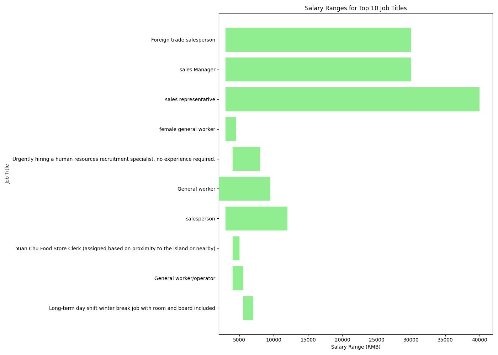
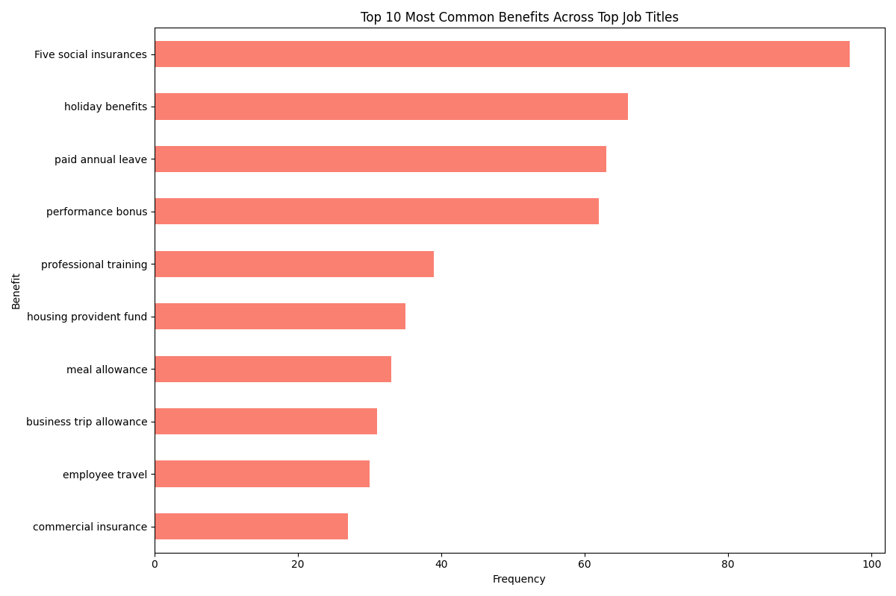

# HR Insights Report: Job Market Competitiveness Analysis

## Overview
This report provides an analysis of job market competitiveness based on job demand, salary ranges, and benefits offered for top roles in the industry. The goal is to benchmark our company's offerings against the market to identify strengths and areas for improvement.

---

## Key Insights

### 1. **Top 10 Most Demanded Job Titles**
The following chart shows the top 10 most demanded job titles based on the number of openings:

**Observation**: The role of "Insurance Sales Agent" has the highest demand, followed by "Claims Specialist" and "Risk Analyst."

**Business Impact**: High demand roles should be prioritized for recruitment and retention strategies to ensure workforce stability.

**Recommendation**: Focus on employer branding and competitive compensation for these roles to attract top talent.

---

### 2. **Salary Ranges for Top Job Titles**
The salary ranges for the top 10 job titles are illustrated below:

**Observation**: The salary range for "Insurance Sales Agent" is between RMB 10,000 and RMB 25,000, while "Risk Analyst" ranges from RMB 15,000 to RMB 30,000.

**Business Impact**: Competitive salary ranges are essential to attract qualified candidates and retain existing employees.

**Recommendation**: Review internal salary structures to ensure alignment with market standards, especially for high-demand roles.

---

### 3. **Common Benefits Offered**
The most frequently offered benefits across top job titles are shown in the chart below:

**Observation**: Common benefits include "Commercial insurance," "Travel allowance," and "Professional training."

**Business Impact**: Benefits play a significant role in employee satisfaction and retention.

**Recommendation**: Enhance benefits packages for high-demand roles to improve competitiveness and employee engagement.

---

## Conclusion
The analysis highlights the importance of aligning salary ranges and benefits with market standards for high-demand roles such as "Insurance Sales Agent," "Claims Specialist," and "Risk Analyst." Strategic adjustments in compensation and benefits can enhance recruitment and retention efforts, ensuring a competitive edge in the industry.

## Next Steps
- Conduct a deeper analysis of internal compensation and benefits data.
- Benchmark against industry leaders to identify gaps and opportunities.
- Develop targeted strategies for high-demand roles based on market insights.
