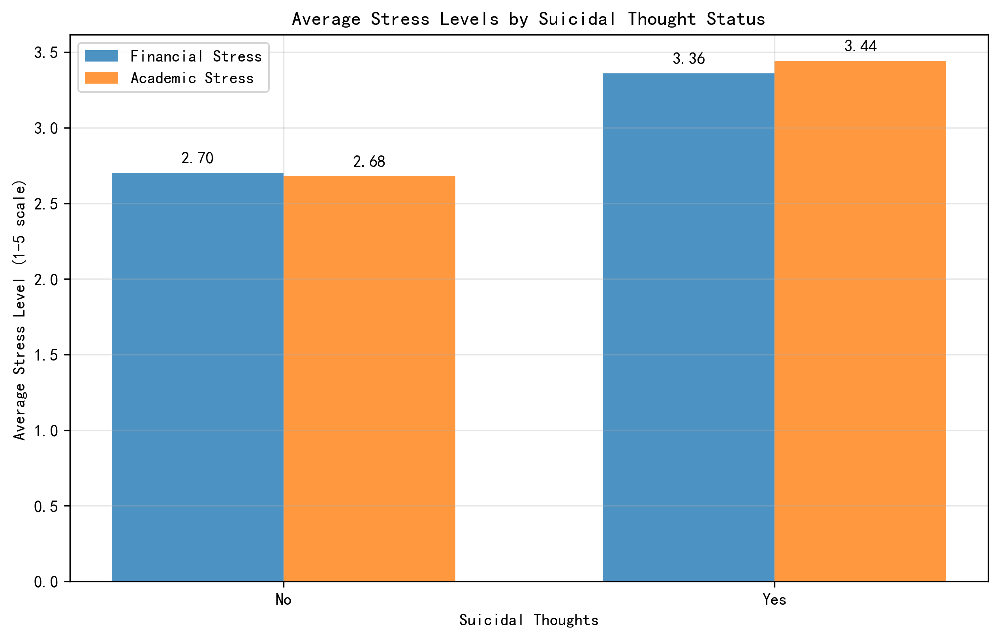
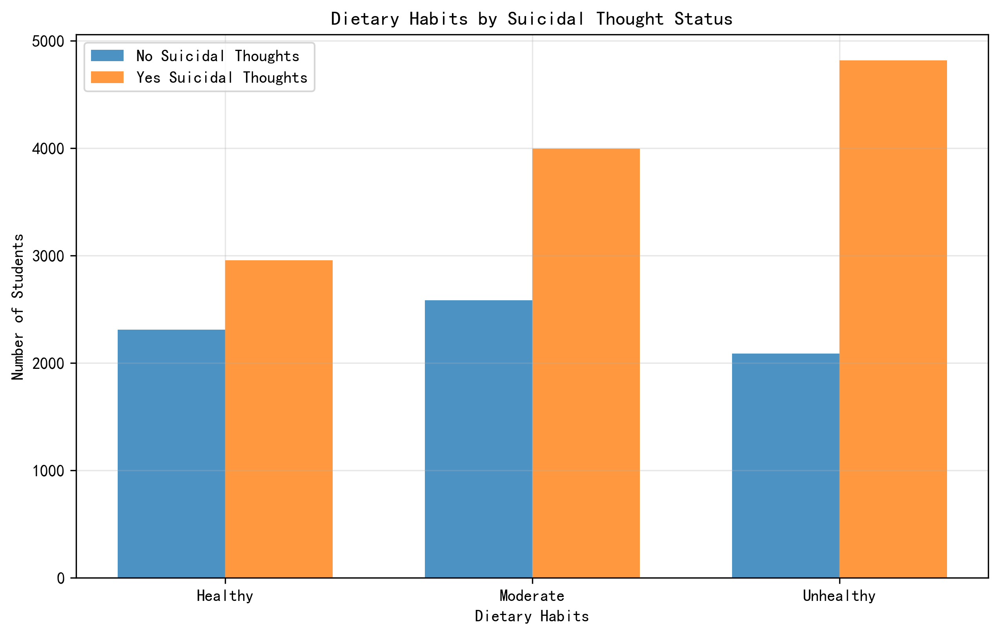
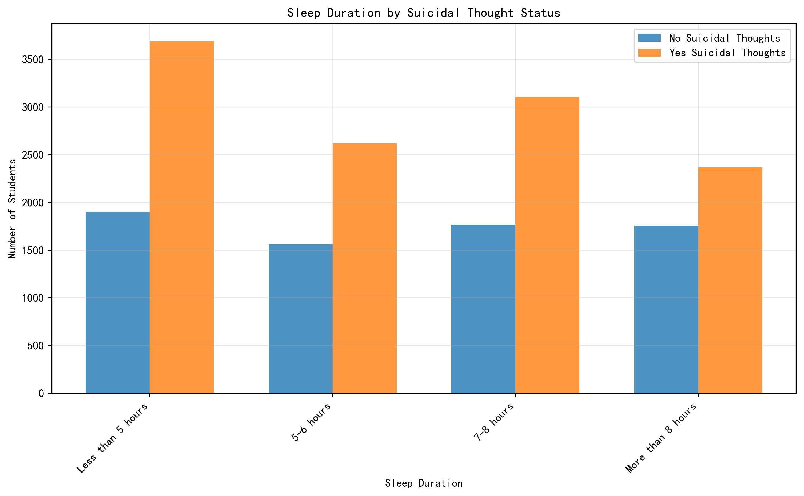
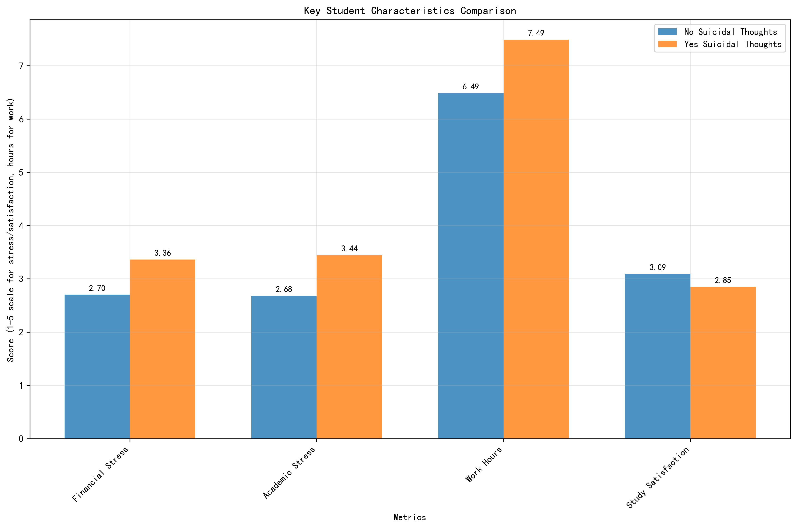
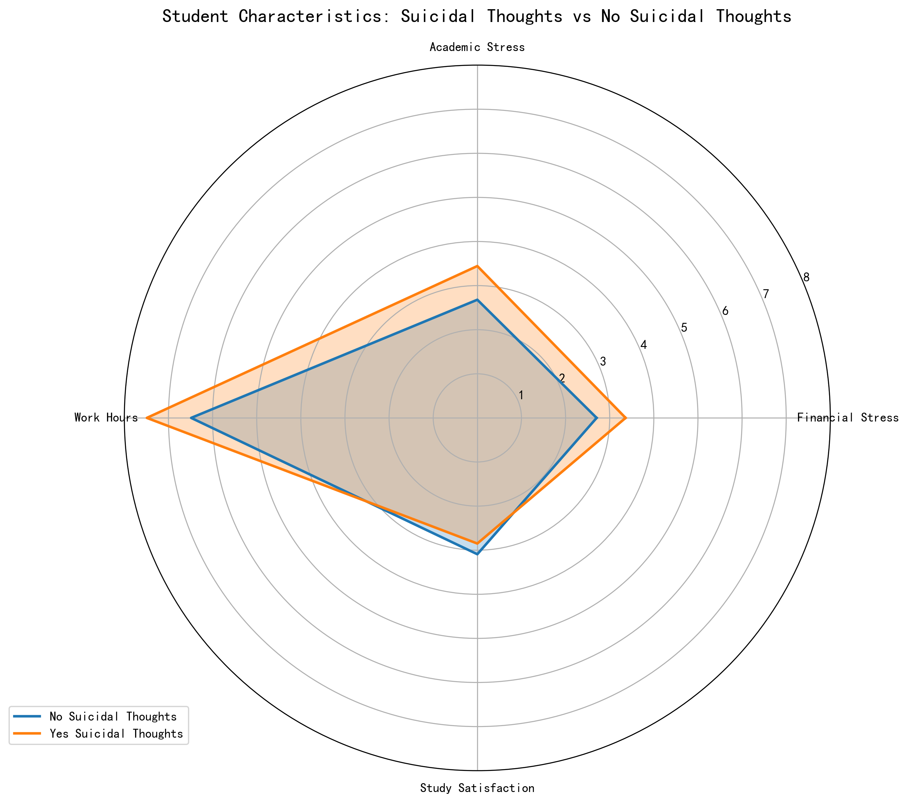

# Analysis of Student Suicidal Thoughts: Characteristics and Prevention Strategies

## Executive Summary

This analysis examines 18,762 students, revealing that **63% (11,778 students)** have experienced suicidal thoughts, highlighting a critical mental health concern. The data shows significant differences across economic, academic, and lifestyle dimensions between students with and without suicidal thoughts.

## Key Findings

### 1. Economic and Academic Stress Factors

Students with suicidal thoughts experience **24% higher financial stress** (3.36 vs 2.70 on 5-point scale) and **28% higher academic stress** (3.44 vs 2.68) compared to their peers without such thoughts. This indicates that financial pressures and academic demands are major contributing factors to mental health challenges.

### 2. Lifestyle and Behavioral Patterns

**Dietary Habits Analysis:**
- Students with suicidal thoughts are **63% more likely** to have unhealthy eating habits (4,818 vs 2,087 students)
- Only 25% of at-risk students maintain healthy diets compared to 33% of non-at-risk students
- Moderate dietary habits show similar patterns across both groups

**Sleep Duration Patterns:**
- **31% of at-risk students** sleep less than 5 hours (3,689 students) vs 27% of non-at-risk students
- Inadequate sleep correlates strongly with suicidal ideation
- Students with 7-8 hours of sleep show better mental health outcomes

### 3. Academic Performance and Time Commitment

Contrary to expectations, **academic performance (GPA) shows no significant difference** (7.68 vs 7.67) between the two groups. However, students with suicidal thoughts work/study **15% longer hours** (7.49 vs 6.49 hours daily) and report **8% lower study satisfaction** (2.85 vs 3.09).

### 4. Family History and Genetic Factors

Family history of mental illness shows a **near-even distribution**:
- 50% of at-risk students have family mental health history
- 46% of non-at-risk students have family mental health history

This suggests that while genetic predisposition exists, environmental and lifestyle factors play a more significant role in triggering suicidal thoughts.

## Comprehensive Risk Profile

The radar chart clearly demonstrates that students with suicidal thoughts consistently score higher on stress indicators and lower on satisfaction metrics across all measured dimensions.

## Relapse Prevention Strategies

### 1. Economic Support Interventions
- **Financial counseling programs** targeting at-risk students
- **Emergency fund access** for students experiencing acute financial stress
- **Work-study balance guidance** to prevent overcommitment

### 2. Academic Stress Management
- **Early warning systems** for academic stress detection
- **Flexible deadline policies** for students identified as at-risk
- **Peer mentoring programs** focusing on stress management

### 3. Lifestyle Modification Programs
- **Nutrition education** emphasizing mental health benefits of healthy eating
- **Sleep hygiene workshops** targeting at-risk student populations
- **Physical activity integration** into mental health support programs

### 4. Comprehensive Screening and Monitoring
- **Regular mental health assessments** incorporating stress, sleep, and diet metrics
- **Personalized intervention plans** based on individual risk profiles
- **Continuous monitoring** of at-risk students with multi-dimensional tracking

## Implementation Recommendations

1. **Tiered Intervention Approach**: Implement different support levels based on risk severity
2. **Cross-departmental collaboration**: Coordinate between academic, financial, and health services
3. **Data-driven early intervention**: Use predictive analytics to identify at-risk students before crisis
4. **Stigma reduction campaigns**: Normalize seeking help for mental health concerns

## Conclusion

The analysis reveals that suicidal thoughts among students are strongly associated with modifiable factors including financial stress, academic pressure, poor sleep, and unhealthy diets. By implementing targeted, multi-dimensional prevention strategies, educational institutions can significantly reduce suicide risk and support student mental health effectively.

**Key Metrics for Monitoring Success:**
- 25% reduction in financial stress among at-risk students
- 30% improvement in sleep duration metrics
- 20% increase in healthy dietary habits
- 15% improvement in study satisfaction scores
