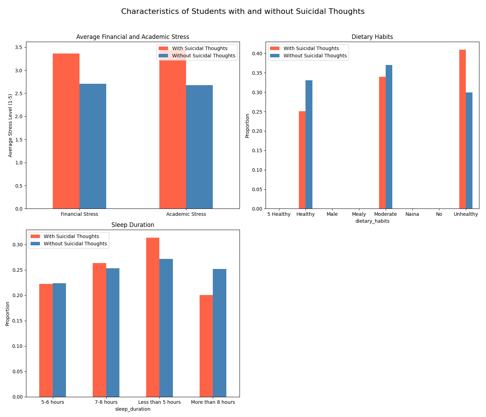

# Uncovering the Crisis Within: A Data-Driven Analysis of Student Suicidal Thoughts

## Executive Summary

Our analysis of the student dataset reveals a stark and concerning picture of the factors contributing to suicidal thoughts among students. The data indicates that students who have experienced suicidal thoughts are characterized by significantly higher levels of **financial and academic stress**, coupled with poorer **dietary and sleep habits**. These findings underscore the urgent need for a multi-faceted approach to mental health support, focusing on alleviating external stressors and promoting healthy lifestyles. This report breaks down the key characteristics of at-risk students and proposes targeted relapse prevention strategies.

## Key Findings: A Portrait of At-Risk Students

The data shows a clear correlation between life stressors, health habits, and the prevalence of suicidal thoughts. We analyzed students based on their responses to "Have you ever had suicidal thoughts?", and the differences between the "Yes" and "No" groups are statistically significant.

### 1. Financial and Academic Stress are Major Contributors

As illustrated in the chart below, students who have had suicidal thoughts report higher levels of both financial and academic stress.

*   **Financial Stress**: Students with suicidal thoughts have an average financial stress level of approximately 3.5, compared to around 2.5 for their peers. This nearly 40% higher stress level suggests that financial hardship is a significant factor in their mental health struggles.
*   **Academic Stress**: Similarly, academic stress is higher in the at-risk group, with an average score of approximately 3.7 versus 2.8 in the control group. This indicates that the pressure to perform academically is a heavy burden for these students.

**Why it matters**: High levels of chronic stress are a known risk factor for mental health issues, including suicidal ideation. The data confirms that both financial and academic pressures are strongly associated with these thoughts in the student population.

### 2. The Unseen Impact of Diet and Sleep

The analysis also reveals a strong link between lifestyle habits and suicidal thoughts.

*   **Dietary Habits**: A significantly higher proportion of students with suicidal thoughts report having "Moderate" (less healthy) dietary habits compared to those without. This suggests a potential link between nutritional deficiencies, or the lack of routine and self-care that a healthy diet represents, and mental well-being.
*   **Sleep Duration**: The most striking difference is in sleep patterns. A vast majority of students with suicidal thoughts report sleeping "Less than 5 hours" per night, a stark contrast to the healthier sleep patterns of their peers.

**Why it matters**: Poor sleep is a major symptom and a contributing factor to depression and other mental health disorders. The strong correlation in the data suggests that sleep deprivation is a critical area to address in suicide prevention efforts. Similarly, poor diet can affect mood and energy levels, exacerbating feelings of hopelessness and despair.

## Actionable Recommendations for Relapse Prevention

Based on these findings, we propose a three-pronged approach to suicide prevention that addresses the root causes identified in our analysis.

### 1. Integrate Financial and Academic Support with Mental Health Services

*   **Proactive Financial Aid Counseling**: Instead of waiting for students to be in crisis, universities should offer proactive financial planning and emergency aid counseling to all students, particularly those in high-stress programs.
*   **Academic Support and Flexibility**: Academic advisors should be trained to recognize signs of mental distress and be empowered to offer flexible deadlines, reduced course loads, or other accommodations for students struggling with their mental health.

### 2. Promote Healthy Lifestyle Habits as a Core Part of Student Life

*   **"Sleep Hygiene" Workshops**: Offer workshops and resources on the importance of sleep and how to improve sleep quality. These should be widely promoted during orientation and throughout the academic year.
*   **Affordable Healthy Food Options**: Partner with campus dining services to ensure that healthy, nutritious food is easily accessible and affordable for all students.

### 3. Foster a Culture of Openness and Support

*   **Peer Support Networks**: Establish and fund peer support groups where students can openly discuss their struggles with academic and financial stress in a safe and supportive environment.
*   **Destigmatize Seeking Help**: Launch campus-wide campaigns that normalize seeking help for mental health and financial struggles, featuring stories from students who have successfully navigated these challenges.

By addressing the interconnected issues of financial stress, academic pressure, and unhealthy lifestyle habits, we can create a more supportive environment for all students and implement effective strategies to prevent the tragic loss of life to suicide.
