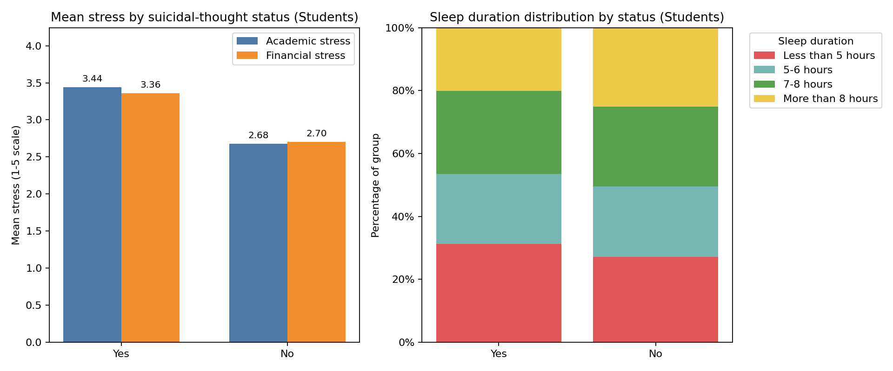

Student suicidal thoughts: characteristics and relapse-prevention strategy

Executive summary
- Suicidal ideation is prevalent: 11,778 of 18,762 students (62.8%) reported ever having suicidal thoughts (SQL: COUNT by 'Have you ever had suicidal thoughts?' in Student subset).
- Students with suicidal thoughts show higher academic and financial stress, longer study hours, shorter sleep, and poorer diet—while CGPA is nearly identical to those without, suggesting performance is not the main driver.
- Prevention should prioritize economic relief (financial stress reduction), academic workload and coping supports, and sleep/diet hygiene to lower relapse risk.

Data and method
- Source: SQLite table sheet1. Key fields used: 'Working professional or student', 'Have you ever had suicidal thoughts?', 'Academic stress', 'Financial stress', 'Sleep duration', 'Dietary habits', 'Cumulative GPA (CGPA)', 'Satisfaction with studies', 'Work/study hours'.
- Steps: SQL aggregations for prevalence and group means; SQL distributions for sleep and diet; Python (matplotlib) plot comparing stress means and sleep distributions saved as student_suicidal_factors.png. No cleaning performed (dataset is curated).

Visual evidence

- Key takeaway: Stress is materially higher among those with suicidal thoughts, and their sleep profile skews shorter.
- Exact numbers:
  - Mean academic stress: 3.44 (Yes) vs 2.68 (No) on a 1–5 scale (SQL AVG('Academic stress'); Python plotted).
  - Mean financial stress: 3.36 (Yes) vs 2.70 (No) (SQL AVG('Financial stress'); Python plotted).
  - Sleep distribution (% of group):
    - Less than 5 hours: 31.3% (Yes) vs 27.2% (No)
    - 5–6 hours: 22.2% (Yes) vs 22.4% (No)
    - 7–8 hours: 26.4% (Yes) vs 25.3% (No)
    - More than 8 hours: 20.1% (Yes) vs 25.2% (No)
- Why it matters: Elevated stress and insufficient sleep are strong correlates of suicidal ideation. Reducing stressors and improving sleep hygiene are actionable levers for relapse prevention.

Key insights by dimension (with supporting metrics)

Economic stress
- Observation: High financial stress is far more common in the suicidal-thought group.
  - High financial stress bucket: 51.5% (Yes) vs 31.8% (No); Low: 29.8% (Yes) vs 50.3% (No) (SQL CASE-binning on 'Financial stress').
  - Mean financial stress: 3.36 (Yes) vs 2.70 (No).
- Root cause: Financial insecurity likely exacerbates chronic stress load (fees, rent, food). This can sustain ideation even if academics are stable.
- Business impact: Students under high financial stress are at elevated relapse risk; financial barriers undermine retention and mental health.
- Recommendation:
  - Establish a rapid-response emergency grant fund and fee relief for students flagged high financial stress (>=4).
  - Offer budgeting and financial coaching; negotiate payment plans that cap monthly burden.
  - Integrate financial aid screening into counseling intake and academic advising; auto-referral for high stress + short sleep profile.
  - Track outcomes via monthly high-stress rates and counseling uptake.

Academic stress and workload
- Observation: Academic stress is substantially higher, with longer study hours and lower satisfaction among those with suicidal thoughts.
  - High academic stress: 50.0% (Yes) vs 28.4% (No); Low: 22.7% (Yes) vs 47.2% (No).
  - Mean academic stress: 3.44 (Yes) vs 2.68 (No).
  - Mean study hours/day: 7.49 (Yes) vs 6.49 (No).
  - Satisfaction with studies: 2.85 (Yes) vs 3.09 (No).
  - CGPA: 7.678 (Yes) vs 7.666 (No)—nearly identical (SQL AVG('Cumulative GPA (CGPA)')).
- Root cause: Overwork and perceived pressure—not actual performance—appear linked to ideation. Lower satisfaction signals burnout risk despite adequate grades.
- Business impact: Excessive workload and poor coping raise relapse risk and diminish persistence.
- Recommendation:
  - Workload and assessment audit: reduce clustering of deadlines and exam density; implement spaced assessments and flexible due-date windows.
  - Proactive advising: cap daily study targets (e.g., 6–7 hours max), introduce structured breaks, and teach evidence-based study methods to reduce time-on-task for same outcomes.
  - Stress-coping programs: peer support, time management workshops, CBT-based skills training; embed in first-year curriculum and high-intensity majors.
  - Early-alert rules: trigger outreach when 'Academic stress' >=4 or hours/day >7; schedule check-ins pre-exam periods.

Diet and sleep
- Observation: Short sleep and poorer diet are more common among the suicidal-thought group.
  - Sleep: Less than 5 hours is 31.3% (Yes) vs 27.2% (No), and >8 hours is lower in Yes (20.1%) vs No (25.2%).
  - Diet (restricted to clean labels Healthy/Moderate/Unhealthy):
    - Yes group (n=11,778): Healthy 25.1% (2,958), Moderate 33.9% (3,996), Unhealthy 40.9% (4,818).
    - No group (n=6,984): Healthy 33.1% (2,311), Moderate 37.0% (2,583), Unhealthy 29.9% (2,087). (SQL GROUP BY 'Dietary habits' with filter on Healthy/Moderate/Unhealthy.)
- Root cause: Sleep deprivation and low-quality nutrition impair mood regulation and stress resilience, reinforcing ideation.
- Business impact: Improving sleep and diet is a low-cost lever to reduce relapse risk and support academic performance.
- Recommendation:
  - Sleep hygiene campaign: quiet-hours policies, limit overnight library operations, offer nap/rest spaces, blue-light reduction and caffeine guidance; integrate sleep tracking challenges with incentives.
  - Scheduling: avoid 8am back-to-back classes for high-stress students; encourage consistent sleep schedules with academic planners.
  - Nutrition access: subsidized healthy meal plans, more fresh options, reduce ultra-processed late-night offerings, dietitian consults for high-risk students.
  - Bundle interventions: combine sleep, diet, and stress coaching for students flagged by high stress + short sleep + unhealthy diet.

Targeted relapse-prevention protocol (actionable playbook)
- Risk flagging (from the dataset fields):
  - Financial stress >=4 OR Academic stress >=4.
  - Sleep duration 'Less than 5 hours' or '5-6 hours'.
  - Dietary habits = 'Unhealthy'.
- Interventions within 2 weeks of flag:
  - Economic: emergency aid review + payment plan setup.
  - Academic: workload replan, set daily study cap ≤7 hours, schedule weekly advisor check-in, enroll in CBT/time-management sessions.
  - Lifestyle: sleep hygiene coaching and meal plan upgrade; track sleep >7 hours target.
  - Mental health: fast-track counseling intake; peer mentor assignment; crisis plan creation if ideation is active.
- Monitoring KPIs:
  - % students with high academic/financial stress (monthly).
  - Sleep distribution: share <5 hours reduced from 31.3% to <25% among flagged cohort in 8 weeks.
  - Diet: % unhealthy reduced by 10–15% within a term.
  - Retention and counseling utilization rates; anonymous PHQ-9/GAD-7 trend where appropriate.

Caveats
- Correlation, not causation: Findings are observational (SQL/Python summaries). CGPA parity suggests perceived pressure and conditions (sleep/diet/finances) are more influential than grades.
- Dietary labels include noisy categories; analysis restricted to Healthy/Moderate/Unhealthy for clarity.

Conclusion
- Students with suicidal thoughts are characterized by high economic and academic stress, longer study hours, shorter sleep, and poorer diet—despite similar grades. Prioritizing financial relief, workload and coping supports, and sleep/diet hygiene offers concrete, measurable paths to prevent relapse and improve wellbeing. Track the recommended KPIs to validate impact and iterate the program.
