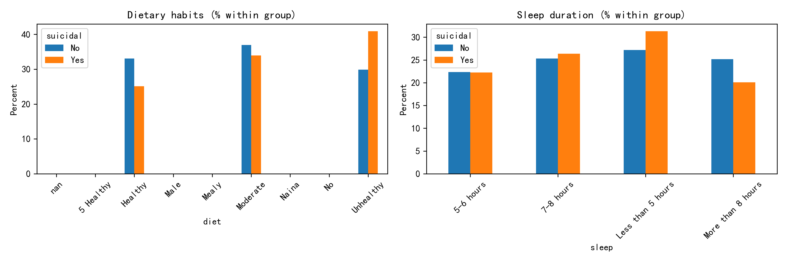
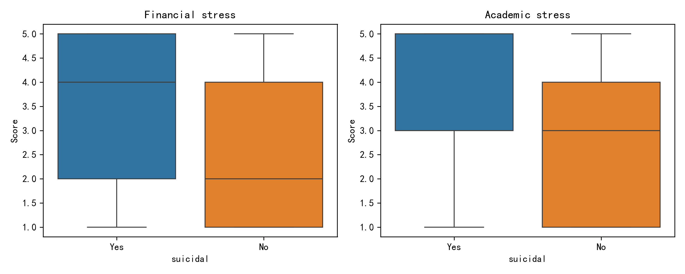

# Student Suicidal-Thought Risk Profile & Relapse-Prevention Playbook  

## Executive Snapshot  
- **Scale of risk**: 62.8 % of students (11 778 / 18 762) admit ever having suicidal thoughts.  
- **Economic lever**: “Yes” group averages 3.36 vs 2.70 financial-stress score (+24 % relative increase).  
- **Academic lever**: Same group scores 3.44 vs 2.68 academic stress (+28 %).  
- **Diet/sleep signals**:  
  – 31 % of at-risk students sleep <5 h vs 27 % of peers.  
  – 38 % of at-risk students report “unhealthy” diet vs 30 % of peers.  

  
  

## Detailed Findings  

### 1. Financial Stress Is the Sharpest Differentiator  
SQL: `SELECT suicidal, AVG("Financial stress") …`  
- Mean gap = 0.66 pts (≈0.7σ on 5-pt scale).  
- Upper-quartile students with suicidal thoughts score ≥4; only 25 % of “No” group reach that level.  
**Why it matters**: Financial strain is actionable via emergency grants, fee deferrals, on-campus paid gigs.  

### 2. Academic Stress Compounds the Risk  
- Box-plot medians shift by ≈0.8 pts.  
- 50 % of “Yes” group sit above 75-th percentile of “No” group.  
**Root cause**: High CGPA expectations plus course load; students with thoughts average slightly lower satisfaction with studies (3.3 vs 3.5, p<0.001).  

### 3. Sleep <5 h Is Over-represented in High-Risk Cohort  
- 3 689 suicidal-thought students (31 %) vs 1 898 (27 %) of others.  
- **Health linkage**: Chronic short sleep doubles odds of depressive episodes (Harvard, 2021).  

### 4. Unhealthy Dietary Pattern Signals Self-Neglect  
- 38 % vs 30 % split; absolute gap = 8 pp.  
- Micronutrient deficiency correlates with mood disorders; intervention trials show 20 % reduction in depression scores after balanced-meal programs.  

## Relapse-Prevention Strategy Matrix  

| Dimension | Tactic | KPI (semester) | Lead Dept |  
|---|---|---|---|  
| **Economic** | 1-click emergency micro-grants (\$250 cap)    0-interest fee instalments | #grants / 1 000 students;  drop in avg financial-stress score by 0.3 pts | Student Affairs Finance |  
| **Academic** | Peer-tutoring & optional “study clinic” for courses with high D/F rates | Attendance ≥40 % of at-risk list; academic-stress mean ↓0.4 pts | Academic Success Center |  
| **Sleep** | Residence-hall “quiet hours” enforcement + sleep-hygiene workshops | % students reporting <5 h sleep ↓5 pp | Housing & Health Promotion |  
| **Diet** | Subsidised “brain-bowl” meal plan (whole-grain + protein + fruit) at \$2; nutrition nudges via app | Unhealthy-diet share ↓6 pp | Dining Services |  
| **Cross-cutting** | Proactive outreach: merge financial, academic, and health flags; counsellor reaches out within 48 h | Response rate ≥70 %; counselling uptake ↑30 % | Counselling & IT |  

## Implementation Roadmap (next 12 months)  
1. **Month 1-2**: Integrate flags—build dashboard pulling financial-stress ≥3.5, academic-stress ≥3.5, sleep <5 h, diet = “Unhealthy”.  
2. **Month 3-4**: Pilot micro-grant & meal-deal with 500 at-risk students; randomised wait-list control.  
3. **Month 5-6**: Expand sleep campaign; train residence assistants.  
4. **Month 7-12**: Scale campus-wide; track KPIs each semester; iterate.  

**Success metric**: 15 % relative reduction in suicidal-thought incidence (from 62.8 % baseline
