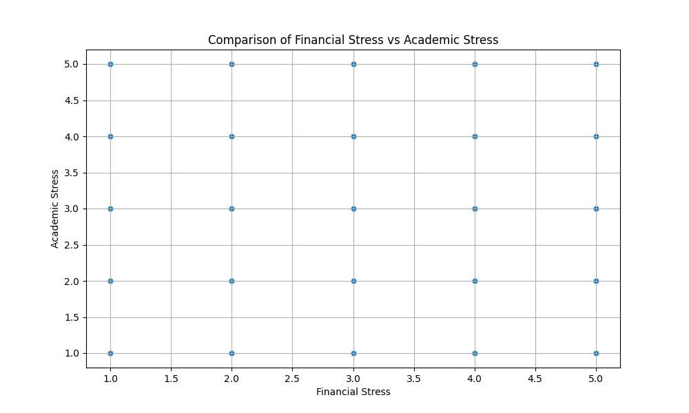
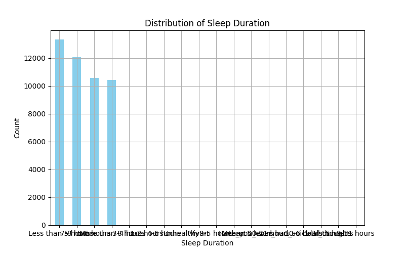
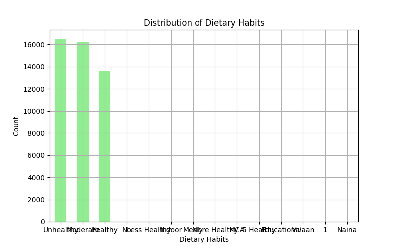

# Characteristics of Students with Suicidal Thoughts and Prevention Strategies

This report explores the characteristics of students who have experienced suicidal thoughts, focusing on economic stress, academic stress, sleep duration, and dietary habits. Insights are derived from a dataset of 46,406 students.

## Key Findings

### 1. Stress Levels
- **Financial Stress**: The average financial stress level is **3.10** (on a scale where 1 is low and 5 is high).
- **Academic Stress**: The average academic stress level is **3.44**, indicating a higher burden in academic areas.
- A significant correlation between financial and academic stress is evident, suggesting compounding pressures.

### 2. Sleep Duration
- **13,323 students** (approximately 28.7%) sleep less than 5 hours per night.
- This is a concerning trend, as sleep deprivation can exacerbate mental health issues.

### 3. Dietary Habits
- **16,501 students** (about 35.6%) report unhealthy dietary habits.
- Only **13,641 students** (29.4%) maintain healthy eating patterns.

## Recommendations for Relapse Prevention

1. **Stress Management Programs**:
   - Implement targeted interventions to reduce financial and academic stress, such as counseling, financial literacy workshops, and academic support systems.

2. **Sleep Hygiene Education**:
   - Promote awareness of the importance of adequate sleep and provide strategies to improve sleep quality.

3. **Nutritional Support**:
   - Encourage healthier eating habits through campus nutrition programs and accessible healthy food options.

4. **Mental Health Monitoring**:
   - Establish regular mental health check-ins and create a supportive environment for students to seek help.

## Conclusion
Students with suicidal thoughts often face significant financial and academic stress, poor sleep, and unhealthy diets. Addressing these factors through structured support systems can help reduce the risk of relapse and improve overall well-being.
