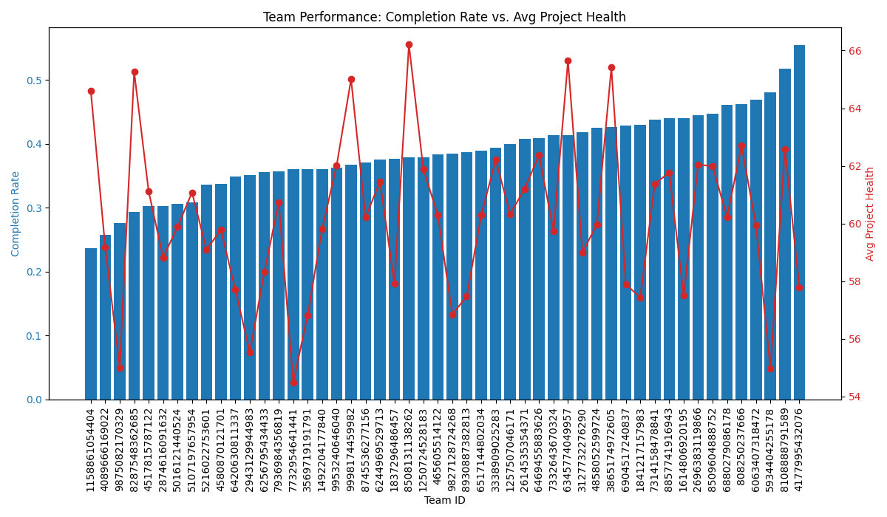

# Analysis of Project Delivery Efficiency

## Introduction
This report analyzes the reasons behind the decline in project delivery efficiency. By examining user and team performance, task characteristics, and time trends, we have identified key areas for improvement and formulated actionable recommendations.

## Individual Performance Analysis
We began by identifying users whose average task completion time was more than 1.5 times the overall average. Our analysis revealed that these "slower" users were not assigned tasks that were significantly more complex or urgent than the average.

| Metric | Slow Users | Overall |
| :--- | :--- | :--- |
| Avg. Complexity Score | 2.926 | 2.913 |
| Avg. Urgency Score | 2.361 | 2.307 |
| Avg. Project Health Score | 61.58 | 60.36 |

This suggests that the issue is not the difficulty of the work, but potentially factors like individual skill gaps, workflow inefficiencies, or motivation.

## Team Performance Analysis
A significant disparity in performance was observed across different teams. We calculated the task completion rate and average project health score for each team, which revealed a clear distinction between high-performing and low-performing teams.

The chart below visualizes this disparity, plotting each team's completion rate against their average project health score. Teams are sorted by completion rate in ascending order.

The teams on the left of the chart are clear outliers, with completion rates well below the average. For instance, the lowest-performing team has a completion rate of just 23.7%. This indicates that team-level dynamics, such as collaboration, leadership, and processes, are a major factor in project delivery efficiency.

## Time Trend Analysis
An examination of monthly average task completion times did not reveal a consistent downward trend. Instead, performance fluctuates from month to month. This volatility suggests a lack of standardized processes across the organization, leading to unpredictable delivery schedules.

## Conclusions and Recommendations
Our analysis indicates that the decline in project delivery efficiency is not a uniform problem but is concentrated within specific individuals and teams. The root causes appear to be related to individual performance factors and, more significantly, team-level dynamics and a lack of standardized processes.

Based on these findings, we recommend the following actions:

1.  **Targeted Support for Individuals:** For users with consistently high completion times, provide targeted support such as peer mentoring, additional training, or a review of their workload. The focus should be on improving their workflow and addressing any skill gaps.

2.  **Intervention in Underperforming Teams:** Management should prioritize intervention in the lowest-performing teams. This could involve:
    *   Conducting workshops on project management and collaboration.
    *   Facilitating knowledge sharing from high-performing teams.
    *   Reviewing the team composition and leadership.

3.  **Promote Process Standardization:** To reduce the volatility in performance and create more predictable outcomes, the company should implement a standardized project management framework across all teams. This will help to ensure that best practices are adopted universally, leading to a more consistent and efficient project delivery process.
