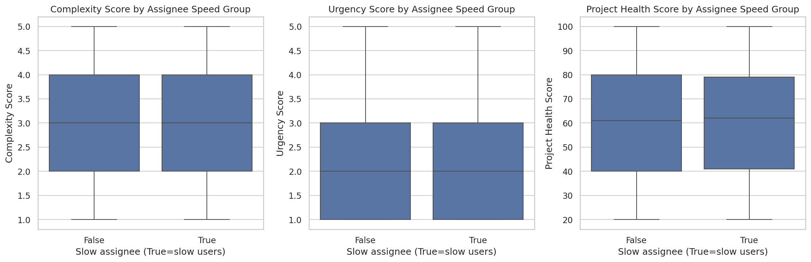
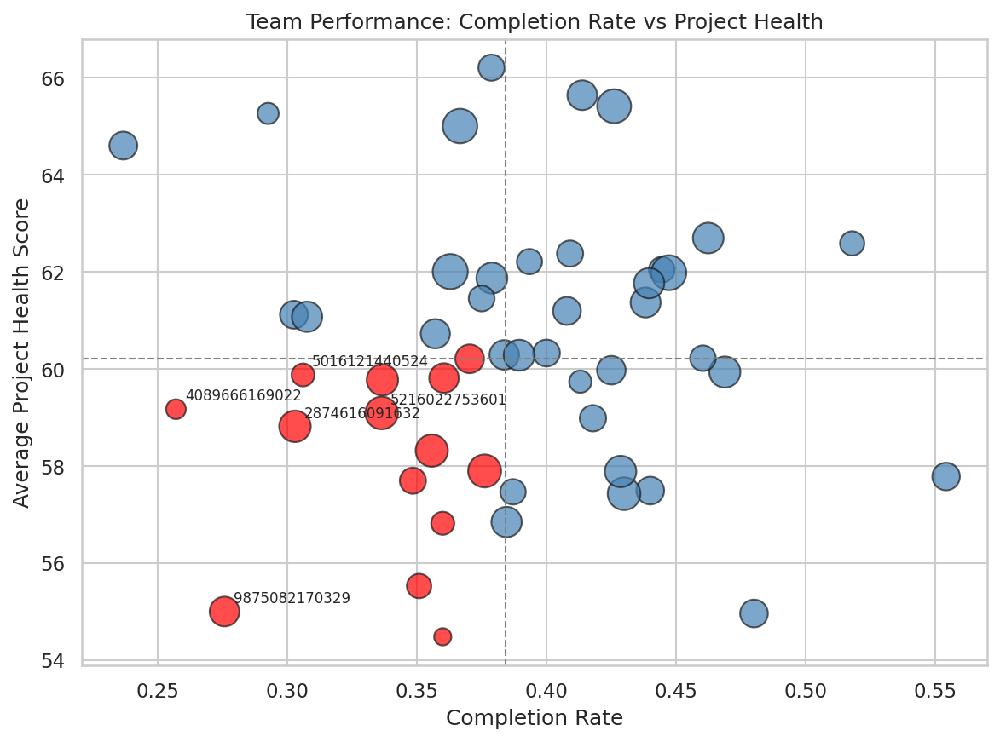
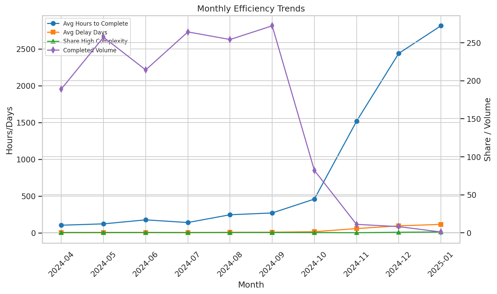

Project Delivery Efficiency Diagnostic: What’s Driving the Slowdown and How to Fix It

Executive summary
- Overall user efficiency: The average user avg_close_time_assigned_days is 8.169 days. We define “slow users” as those above 1.5× this average (threshold = 12.254 days). There are 191 slow users out of 1000 (19.1%).
- Task mix for slow users: Slow users handle slightly higher complexity (+2.4%) and urgency (+2.2%) tasks than others, and marginally higher project health scores. The differences are small—insufficient to fully explain the overall slowdown.
- Team performance: Across 50 teams, 14 teams are underperforming (both completion rate and project health below their medians). The bottom 5 teams by completion rate are: 1158861054404 (0.237), 4089666169022 (0.257), 9875082170329 (0.276), 8287548362685 (0.293), 4517815787122 (0.303).
- Time trends (systemic signal): Avg hours to complete and avg delay days escalated sharply from August onward (Oct–Dec show very large spikes), while completed volume dropped late in the year. Response times stayed ~2.3–2.8 days. This pattern suggests an accumulation of older work, schedule slippages, and delayed closures rather than only individual performance issues.

Key visuals
- Slow vs non-slow assignees: task attribute distributions

- Team performance: completion rate vs project health (size = workload, color = underperforming)

- Monthly efficiency trends: lifecycle hours, delays, complexity mix, and completed volume

Methodology and definitions
- Slow users: avg_close_time_assigned_days > 1.5 × overall average (12.254 days). Total users = 1000; slow users = 191.
- Distribution analysis: Compared slow vs non-slow assignees on complexity_score, urgency_score, and project_health_score for valid task records.
- Team performance: By team_id, computed completion_rate = completed_tasks / total_tasks, avg_project_health = mean(project_health_score). Underperforming teams are those below the median on both metrics.
- Time trends: Aggregated completed tasks by completion month, computing avg_hours_to_complete, avg_delay_days, avg_response_days, share_high_complexity (complexity ≥ 4), and completed volume.

What the data shows
1) Slow-user cohort profile (marginal differences)
- Complexity_score (mean): slow 2.974 vs non-slow 2.905 (+2.4%).
- Urgency_score (mean): slow 2.351 vs non-slow 2.301 (+2.2%).
- Project_health_score (mean): slow 60.84 vs non-slow 60.30 (+0.9%).
Interpretation: Slow assignees do slightly tougher and more urgent tasks, but the deltas are small. The slow cohort alone is unlikely to be the primary driver of the efficiency drop.

2) Team-level performance (pockets of weakness exist)
- 14 of 50 teams are underperforming on both completion rate and project health.
- Bottom 5 by completion rate:
  - 1158861054404 (0.236842), 4089666169022 (0.257143), 9875082170329 (0.275862), 8287548362685 (0.292683), 4517815787122 (0.302632).
- Bottom 5 by project health:
  - 7732954641441 (54.48), 5934404255178 (54.96), 9875082170329 (55.00), 2943129944983 (55.53), 3569719191791 (56.82).
- Correlations across teams:
  - Completion rate vs project health: ~0 (−0.002) — these dimensions are decoupled.
  - Share of tasks handled by slow users vs completion rate: +0.091 (slight positive).
  - Share of tasks handled by slow users vs project health: −0.070 (slight negative).
Interpretation: Teams differ in throughput and health; the proportion of “slow assignee” tasks does not strongly predict team outcomes. Underperformance seems more process/system than people-driven.

3) Time trends (root cause signal: slippages and backlog effects)
- Avg hours to complete and avg delay days increased markedly Aug–Nov–Dec:
  - Avg hours to complete jumped from ~102–176 in Apr–Jul to ~245 in Aug, ~269 in Sep, ~458 in Oct, then extremely high with very low volumes in Nov–Dec (likely closure of long-outstanding items).
  - Avg delay days rose in parallel from ~0.8–3.6 in Apr–Jul to 6.5 in Aug, 7.4 in Sep, 14.4 in Oct, and very high in Nov–Dec.
- Completed volume fell sharply in Oct–Dec while delays skyrocketed; response times remained ~2.3–2.8 days (stable).
- Share of high complexity (≥4) rose in May–Jun, dipped in Jul, then remained moderate; it does not track the huge increase in lifecycle hours and delays in late months.
Interpretation: The efficiency decline aligns with late-cycle schedule adherence issues and backlog aging: fewer tasks completed late in the year, but those completed had very long ages, inflating lifecycle hours and delay metrics. This suggests process bottlenecks (e.g., approvals, dependencies, or planning slippages), not just individual performance.

Diagnosis: likely root causes
- Schedule management and backlog hygiene:
  - Large spikes in delay_days and lifecycle hours with declining volume point to overdue tasks being closed in bursts, distorting cycle time and signaling poor WIP control and SLA adherence.
- Bottlenecks in late-stage workflow:
  - Rising delays with stable response times suggest the waiting happens after initial acknowledgment—likely in review, approval, dependency resolution, or cross-team handoffs.
- Workload/skill-task match:
  - Slow users handle only slightly harder and more urgent tasks; however, a subset of teams may be assigning complex tasks without adequate support. The complexity_execution_match indicator shows no explicit “mismatch” flags in this data, but that may reflect how the field is populated rather than true absence of mismatches.
- Team collaboration model:
  - Weak correlation between slow-user share and outcomes implies systemic coordination issues (prioritization, dependencies, shared resources) matter more than just individual speed.

Prescriptions: what to do next
1) Tighten planning and WIP control
- Enforce WIP limits per team and per assignee to prevent aging of tasks.
- Introduce age-in-stage alerts (e.g., >7 days in “Review/Blocked”) to trigger escalation before delays compound.
- Require due date updates when estimates change; audit tasks exceeding due by >3 days.

2) Protect the end-to-end critical path
- Map and monitor bottleneck stages (approvals, QA, cross-team dependencies).
- Set explicit SLAs for late-stage steps with dashboards for queue lengths and aging.
- Create a “fast lane” for urgent, small-scope items to avoid being trapped behind large, aging tasks.

3) Backlog hygiene program (4–6 weeks)
- Weekly “oldest-10” review per team; target reduction of average delay_days by ≥30%.
- Timebox triage to close/descoped stale items quickly.
- Track “tasks >30/60/90 days open” as a leading indicator.

4) Load balancing and skill alignment
- Use capability tagging and a skill matrix to route higher-complexity tasks to the right individuals; introduce pairing/mentoring on teams with high aging.
- Rebalance across teams during spikes (use cross-team pools for reviews/approvals) to avoid waiting on a single overloaded function.

5) Performance management and incentives
- Tie team-level objectives to on-time completion (delay_days) and cycle time; complement with quality metrics to avoid rushing.
- Recognize teams that reduce aged WIP and improve flow efficiency quarter-over-quarter.

6) Monitoring and next steps
- Track the following each month: avg_hours_to_complete, avg_delay_days, completed volume, share_high_complexity, and share_slow_tasks.
- For underperforming teams, add a drill-down: completion rate by lifecycle stage, blocked time share, and dependency wait time.

Evidence highlights (selected figures)
- Overall avg_close_time_assigned_days: 8.169 days; slow-user threshold: 12.254 days; slow users: 191/1000.
- Slow vs non-slow mean differences:
  - Complexity: 2.974 vs 2.905; Urgency: 2.351 vs 2.301; Project Health: 60.84 vs 60.30.
- Underperforming teams: 14/50; bottom 5 completion rates range 0.237–0.303.
- Trend spikes: Delay_days rose from ~0.8 (Apr) to ~14.4 (Oct), with extremely high values and very low volume in Nov–Dec.

Appendix: Python plotting code used
Note: The full script is in analysis.py in this directory. Excerpt of plotting code used to generate figures:
- Slow vs non-slow attributes boxplots:
  fig, axes = plt.subplots(1, 3, figsize=(15,5), sharey=False)
  for i, attr in enumerate(['complexity_score','urgency_score','project_health_score']):
      sns.boxplot(data=attr_df, x='slow_assignee', y=attr, ax=axes[i])
  plt.savefig('slow_vs_non_slow_task_attributes.png', dpi=150, bbox_inches='tight')

- Team performance scatter:
  plt.figure(figsize=(8,6))
  plt.scatter(team_perf['completion_rate'], team_perf['avg_project_health'],
              s=20+3*team_perf['total_tasks'],
              c=np.where(team_perf['underperforming'],'red','steelblue'),
              alpha=0.7, edgecolors='k')
  plt.axvline(median_completion, color='gray', linestyle='--', linewidth=1)
  plt.axhline(median_health, color='gray', linestyle='--', linewidth=1)
  plt.savefig('team_completion_vs_health.png', dpi=150, bbox_inches='tight')

- Monthly efficiency trends:
  fig, ax1 = plt.subplots(figsize=(10,6))
  ax1.plot(trend['month'], trend['avg_hours_to_complete'], marker='o', label='Avg Hours to Complete')
  ax1.plot(trend['month'], trend['avg_delay_days'], marker='s', label='Avg Delay Days')
  ax2 = ax1.twinx()
  ax2.plot(trend['month'], trend['share_high_complexity'], marker='^', label='Share High Complexity')
  ax2.plot(trend['month'], trend['n_completed'], marker='d', label='Completed Volume')
  plt.savefig('monthly_efficiency_trends.png', dpi=150, bbox_inches='tight')

End of report.
