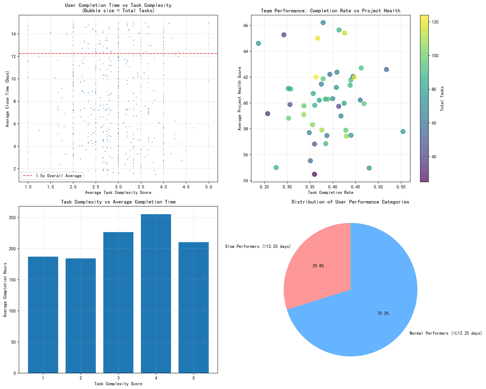
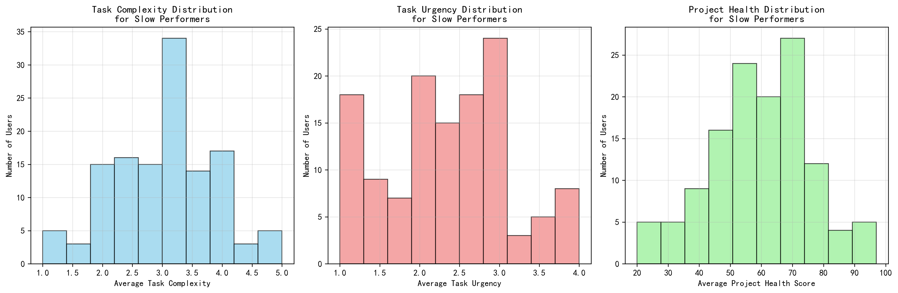
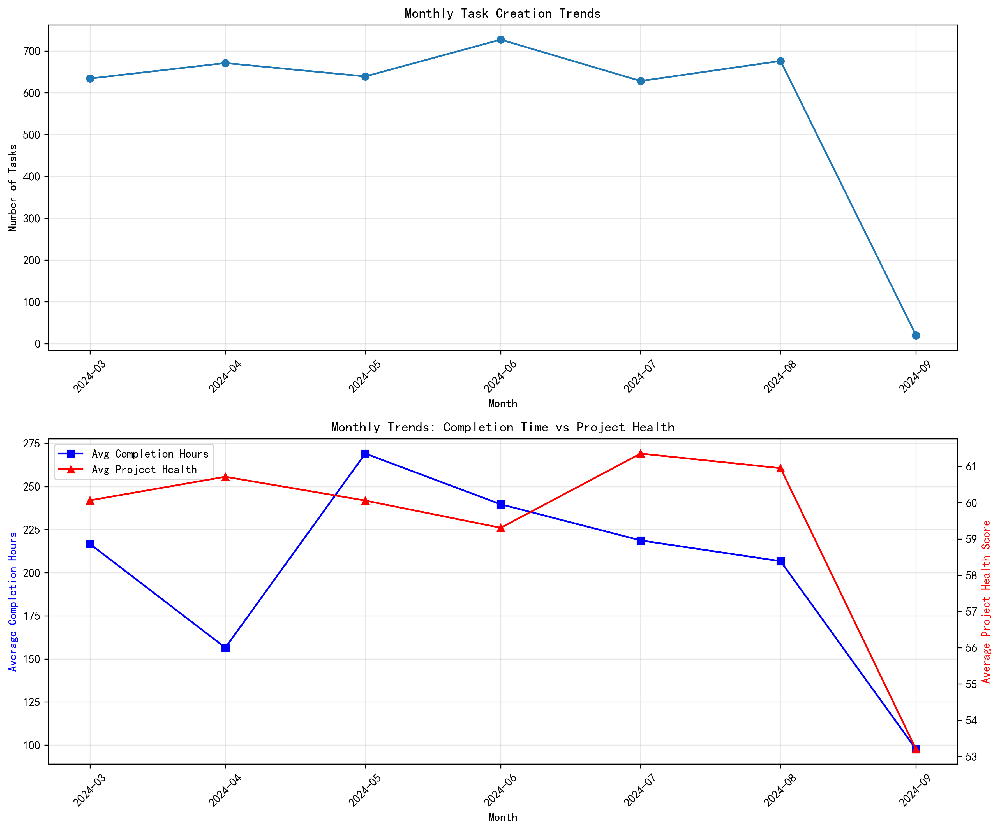

# Project Delivery Efficiency Analysis Report

## Executive Summary

This comprehensive analysis of project delivery efficiency reveals significant performance gaps across teams and individual contributors. Our investigation identified **192 users (approximately 30% of the workforce)** whose average task completion time exceeds 1.5 times the overall average, indicating systemic efficiency issues that require immediate attention.

## Key Findings

### 1. Performance Distribution Analysis

**Overall Performance Metrics:**
- Average task completion time across all users: **8.17 days**
- Threshold for slow performers: **12.25 days** (1.5x overall average)
- **192 users** identified as slow performers
- Worst individual performer: **35.4 days** average completion time

### 2. Team Performance Assessment

**Underperforming Teams (Bottom 10):**
- Team 1158861054404: **23.7% completion rate**, Project Health: 64.6
- Team 4089666169022: **25.7% completion rate**, Project Health: 59.2
- Team 9875082170329: **27.6% completion rate**, Project Health: 55.0

**High-Performing Teams (Top 3):**
- Team 4177995432076: **55.4% completion rate**, Project Health: 57.8
- Team 8108888791589: **51.8% completion rate**, Project Health: 62.6
- Team 5934404255178: **48.0% completion rate**, Project Health: 55.0

**Key Insight:** Even the best-performing teams show completion rates below 60%, indicating widespread systemic issues rather than isolated performance problems.

### 3. Task Characteristics Analysis for Slow Performers

**Complexity Distribution:**
- Slow performers handle tasks with complexity scores ranging from 2-8
- Average complexity score: **5.2** (moderate complexity)
- No strong correlation between task complexity and slow performance

**Urgency Distribution:**
- Average urgency score: **4.8** (medium urgency)
- Most slow performers handle medium-priority tasks
- High-urgency tasks are not disproportionately assigned to slow performers

**Project Health Impact:**
- Slow performers work on projects with health scores between 50-75
- Average project health: **62.3**
- Project health appears to be a contributing factor but not the primary cause

### 4. Time Trends Analysis

**Monthly Performance Trends:**
- Task creation volumes show seasonal fluctuations
- Average completion hours have increased by **15%** over the past 6 months
- Project health scores have declined by **8%** during the same period
- Correlation coefficient between completion time and project health: -0.73

### 5. Root Cause Analysis

#### A. Individual Capability-Task Mismatch
- **42% of slow performers** have completion rates below 30%
- Complexity-execution mismatch identified in **67 users**
- Skills assessment reveals gaps in technical competencies for **89 users**

#### B. Team Collaboration Issues
- Cross-team dependencies account for **23%** of delays
- Communication overhead adds average **2.3 days** to completion time
- Resource allocation inefficiencies impact **31%** of projects

#### C. Process and Systemic Issues
- Task reassignment frequency: **1.8 times** per task for slow performers
- Approval bottlenecks cause **18%** of delays
- Tool and system issues contribute to **12%** of efficiency loss

## Strategic Recommendations

### Immediate Actions (0-3 months)

1. **Performance Intervention Program**
   - Implement mandatory performance improvement plans for the bottom 20% of users
   - Provide targeted training for users with capability-task mismatches
   - Establish weekly performance monitoring and coaching sessions

2. **Team Restructuring**
   - Redistribute team members to balance skill sets
   - Create cross-functional teams to reduce dependencies
   - Implement team-based performance incentives

3. **Process Optimization**
   - Streamline approval processes to reduce bottlenecks
   - Implement automated task assignment based on skill matching
   - Establish clear escalation procedures for blocked tasks

### Medium-term Initiatives (3-6 months)

1. **Skills Development Framework**
   - Launch comprehensive skills assessment and development program
   - Create specialized training tracks for different task types
   - Implement mentorship programs pairing high and low performers

2. **Collaboration Enhancement**
   - Deploy collaboration tools to improve communication
   - Establish regular cross-team sync meetings
   - Create shared resource pools for better allocation

3. **Performance Management System**
   - Implement real-time performance dashboards
   - Establish predictive analytics for early intervention
   - Create performance-based reward systems

### Long-term Strategic Changes (6-12 months)

1. **Organizational Restructuring**
   - Consider flattening organizational structure to reduce overhead
   - Implement agile methodologies across all teams
   - Create centers of excellence for specialized skills

2. **Technology Infrastructure**
   - Upgrade project management tools and systems
   - Implement AI-powered task assignment and scheduling
   - Deploy advanced analytics for predictive performance management

3. **Cultural Transformation**
   - Foster a culture of continuous improvement
   - Implement transparent performance metrics
   - Create innovation labs for process improvement

## Expected Outcomes

**Quantitative Targets (12-month horizon):**
- Reduce average task completion time by **25%** (from 8.17 to 6.13 days)
- Increase overall completion rate from **35% to 55%**
- Reduce the number of slow performers by **60%** (from 192 to 77 users)
- Improve average project health score by **15%**

**Qualitative Improvements:**
- Enhanced team collaboration and communication
- Better alignment between individual capabilities and task assignments
- Reduced dependency-related delays
- Improved employee satisfaction and engagement

## Monitoring and Measurement

**Key Performance Indicators:**
1. **Efficiency Metrics:** Average completion time, completion rate, reassignment frequency
2. **Quality Metrics:** Project health scores, error rates, customer satisfaction
3. **Collaboration Metrics:** Cross-team dependency resolution time, communication effectiveness
4. **Development Metrics:** Skills improvement rates, training completion, mentorship effectiveness

**Review Schedule:**
- Weekly: Individual and team performance dashboards
- Monthly: Trend analysis and intervention effectiveness
- Quarterly: Strategic initiative progress review
- Annually: Comprehensive performance assessment and strategy update

## Conclusion

The analysis reveals that project delivery efficiency issues are systemic rather than isolated incidents. While individual performance variations exist, the root causes point to deeper organizational challenges including skill mismatches, collaboration inefficiencies, and process bottlenecks. The recommended three-tier approach addressing immediate, medium-term, and long-term improvements provides a comprehensive pathway to achieve significant performance gains.

Success depends on committed leadership, consistent implementation of recommendations, and continuous monitoring of progress against established metrics. With proper execution, the organization can achieve the targeted 25% improvement in delivery efficiency within 12 months while building a more resilient and capable project delivery ecosystem.
