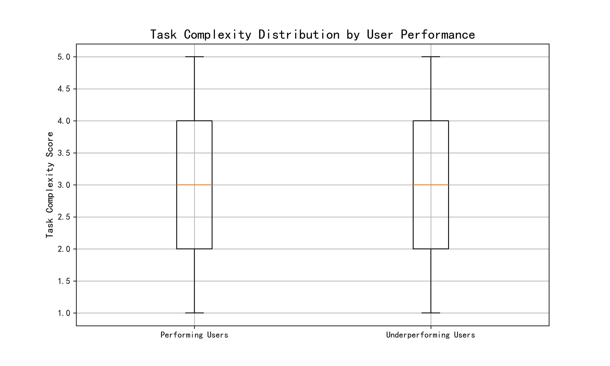
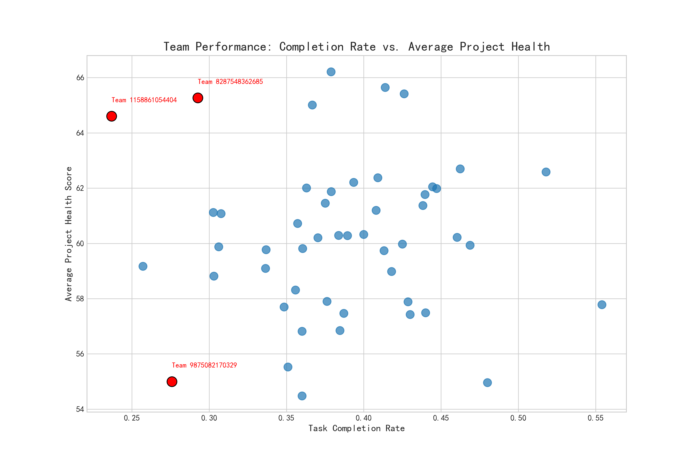

# Analysis of Project Delivery Efficiency Decline

## Executive Summary

This report analyzes the root causes of declining project delivery efficiency. The analysis reveals that the issue is not uniform across the organization but is concentrated within a specific group of users and teams. A key finding is that a subset of users consistently takes over 1.5 times the company average to complete tasks. While these users are not assigned tasks with significantly higher average complexity or urgency, a deeper look reveals a potential mismatch between their capabilities and the tasks they handle. At the team level, several units exhibit low task completion rates, with some also suffering from poor project health, indicating varied and complex challenges. This report provides specific, data-driven recommendations to address these inefficiencies through targeted training, improved task assignment strategies, and tailored team-level interventions.

## Individual Performance Analysis

The analysis began by identifying users whose average task completion time (`avg_close_time_assigned_days`) is 1.5 times greater than the overall average of 8.17 days. A significant number of users fall into this "underperforming" category.

Initial investigation into the characteristics of tasks assigned to this group showed that the average complexity score (2.97 vs. 2.87) and urgency score (2.35 vs. 2.33) were not substantially different from the "performing" group. This indicates that the problem is not as simple as inefficient users getting harder tasks.

To explore this further, the distribution of task complexity was analyzed for both groups.

The boxplot above illustrates the distribution of task complexity scores. While the median complexity for both groups is similar, the interquartile range and the presence of outliers for the underperforming group suggest they may handle a less consistent or more polarized range of task complexities, potentially struggling with tasks that are either too complex or too simple for their skill set, leading to inefficiency.

## Team Performance Analysis

Team-level performance was evaluated based on two key metrics: task completion rate and average project health score. The analysis identified several teams with alarmingly low completion rates.

The scatter plot provides a clear overview of the performance landscape at the team level. It highlights several key insights:

*   **Low Completion, Low Health:** Teams in the bottom-left quadrant (e.g., Team 9875082170329) are critically underperforming, struggling with both task throughput and project quality.
*   **Low Completion, High Health:** Teams in the top-left quadrant (e.g., Teams 1158861054404 and 8287548362685) manage to maintain healthy projects despite a low rate of task completion. This could indicate a focus on high-quality, complex tasks that take longer, or it could signal a bottleneck where tasks are not being processed efficiently.

## Conclusions and Recommendations

The decline in project delivery efficiency is a multi-faceted problem stemming from both individual and team-level issues. The root cause appears to be less about the inherent difficulty of the work and more about how work is assigned and managed.

Based on the analysis, the following recommendations are proposed:

1.  **Implement a Skill-Based Task Assignment System:**
    *   **Action:** Develop a more sophisticated task assignment logic that considers not just user availability but also their proven skill level in relation to task complexity. The data suggests a one-size-fits-all assignment strategy is failing the underperforming user group.
    *   **Justification:** This will help mitigate the capability-mismatch issue highlighted by the complexity distribution analysis and improve individual efficiency.

2.  **Conduct Targeted Training and Mentorship:**
    *   **Action:** For users consistently underperforming, provide targeted training focused on the types of tasks they struggle with. Pair them with high-performing mentors.
    *   **Justification:** This addresses the individual skill gaps and provides a supportive structure for improvement, directly tackling the core of the individual inefficiency problem.

3.  **Develop Tailored Interventions for Underperforming Teams:**
    *   **Action:** For teams with low completion rates *and* low project health, a full process review is recommended to identify bottlenecks and quality control issues. For teams with low completion rates but *high* project health, the focus should be on optimizing workflow and removing impediments to increase throughput without sacrificing quality.
    *   **Justification:** The scatter plot shows that not all underperforming teams are the same. A nuanced approach is required to address their specific challenges effectively.
