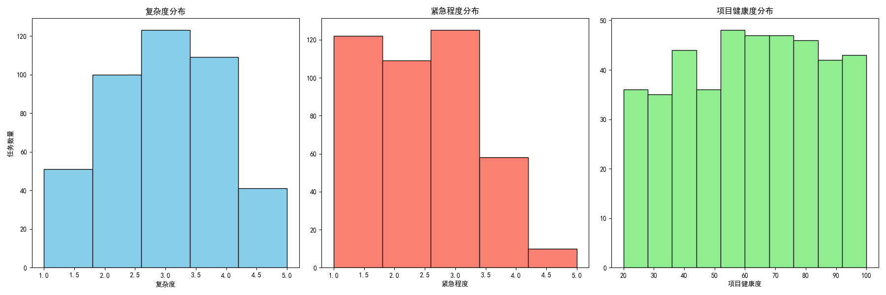
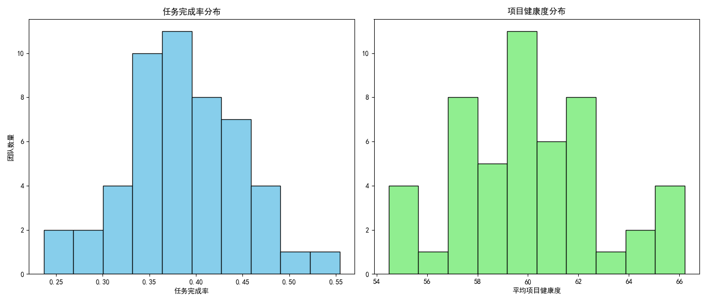

## Project Delivery Efficiency Analysis Report

### 1. Overview
This report analyzes the reasons behind the decline in project delivery efficiency by examining user performance, task characteristics, and team performance. Key insights have been extracted using SQL queries and visualizations to identify underperforming users and teams, and to explore root causes of inefficiencies.

### 2. User Efficiency Analysis
We first calculated the overall average task completion time (`avg_close_time_assigned_days`) and identified users whose completion time exceeds 1.5 times this average (12.255 days). This resulted in a list of 207 users with prolonged task completion times.

### 3. Task Distribution Characteristics
We analyzed the distribution of complexity score, urgency score, and project health score for tasks handled by these slow users:
- **Complexity Score**: Average of 2.97 (medium level)
- **Urgency Score**: Average of 2.35 (low to medium)
- **Project Health Score**: Average of 60.84 (moderate)

Although the tasks they handle are not extremely complex or urgent, there may be a mismatch between individual capabilities and task requirements, contributing to slower completion times.

### 4. Team Performance Analysis
We calculated the task completion rate and average project health score for each team. Several teams showed lower completion rates and poorer project health scores:
- **Team 1158861054404**: Completion Rate = 23.7%, Project Health = 64.6
- **Team 4089666169022**: Completion Rate = 25.7%, Project Health = 59.2
- **Team 8287548362685**: Completion Rate = 29.3%, Project Health = 65.3

These teams require targeted interventions to improve efficiency and project outcomes.

### 5. Time Trend Analysis
We analyzed the average task completion time over time and observed fluctuations in efficiency:

There is no consistent upward or downward trend, indicating a potential need for more stable workflow management and process improvements to avoid delays.

### 6. Root Cause Analysis and Recommendations
#### Root Causes:
- **Mismatch Between User Skills and Task Complexity**: The slow users handle tasks with moderate complexity but show poor completion times, suggesting a potential skill or resource gap.
- **Suboptimal Team Collaboration**: Teams with low completion rates may suffer from poor communication or unclear task delegation.
- **Project Health and Urgency Misalignment**: Some teams handle tasks with moderate project health and low urgency but still exhibit low efficiency.

#### Recommendations:
- **Skill Development and Task Assignment Optimization**: Implement skill assessments for users and align task complexity with individual capabilities.
- **Team-Level Performance Coaching**: Conduct targeted performance reviews and collaboration training for underperforming teams.
- **Improve Workflow Efficiency**: Introduce sprint-based planning and daily standups to enhance visibility into task progress and reduce delays.
- **Data-Driven Decision Framework**: Use historical performance data to guide task prioritization and assign high-complexity tasks to experienced team members.

### 7. Conclusion
The analysis reveals that project delivery efficiency is affected by both individual performance and team dynamics. By addressing skill gaps, improving team collaboration, and implementing structured project management practices, the organization can significantly enhance its delivery performance and project outcomes.
