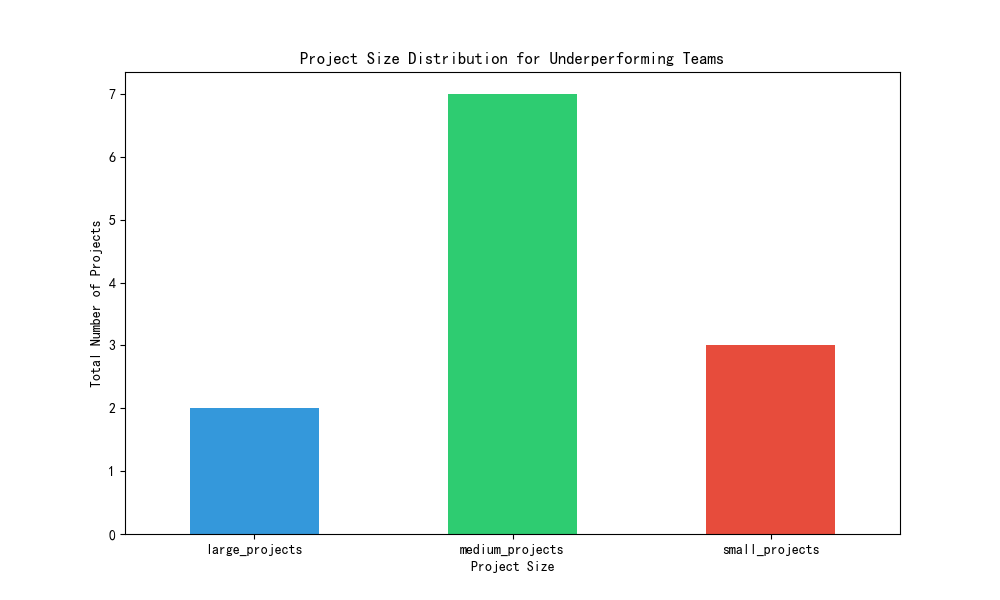

# Analysis of Mismatch Between Team Efficiency Scores and Completion Rates

## 1. Introduction
This report analyzes teams that exhibit high efficiency scores (`collaboration_efficiency_score` >= 8 and `resource_optimization_score` >= 8) but demonstrate a low actual completion rate (`avg_completion_rate` in the bottom 25th percentile). The objective is to identify the underlying reasons for this discrepancy and propose targeted recommendations for improvement.

## 2. Key Findings

An initial exploration of the data revealed a crucial insight: the highest `avg_completion_rate` across all teams is only 63%, with the average being 47.9%. This indicates a systemic issue with project completion across the organization. Our analysis, therefore, focused on teams with high efficiency scores but an `avg_completion_rate` in the lowest quartile (below 35.56%).

Our investigation into these specific teams yielded the following key findings:

### 2.1 Project Size Distribution
The underperforming teams manage a mix of project sizes, with a predominance of medium-sized projects. This suggests that the issue is not an overload of large, complex projects. The distribution is as follows:
- **Large Projects:** 2
- **Medium Projects:** 7
- **Small Projects:** 3

This is visualized in the chart below:

### 2.2 Member Workload and Task Complexity
The analysis points to high task complexity and potential workload imbalance as the primary drivers of the low completion rates:

*   **High Task Complexity:** The average estimated completion time for projects is **65 days**. This indicates that projects are inherently complex and long-term, which naturally suppresses the completion rate metric.
*   **Low Project Velocity:** The average project velocity for these teams is a mere **0.3**. This extremely low value suggests that tasks are progressing through the workflow at a very slow pace.
*   **Workload Imbalance:** The teams have an average of **18.91 tasks per member** and **2 members identified as having a high workload**. This concentration of tasks on a few individuals can create bottlenecks, slowing down the entire team's progress.

## 3. Conclusion: The "Efficient Inefficiency" Trap

The combination of high collaboration and resource optimization scores with low completion rates suggests a phenomenon of **"efficient inefficiency."** Teams are proficient at planning, communicating, and managing resources on paper. However, they are stuck in a cycle of handling highly complex, long-duration tasks without an effective execution strategy. The high efficiency scores may reflect good internal processes for managing complexity, but they fail to translate into tangible outputs.

In essence, the teams are **"busy being busy"** on complex tasks but are not completing them in a timely manner.

## 4. Recommendations

To address this issue and bridge the gap between perceived efficiency and actual performance, the following recommendations are proposed:

1.  **Implement Agile Methodologies:**
    *   **Action:** Transition from traditional project management to an agile framework like Scrum or Kanban.
    *   **Justification:** This will enforce the breakdown of large, 65-day projects into smaller, manageable tasks (sprints/user stories). It will improve project velocity and provide a more accurate, incremental measure of progress.

2.  **Proactive Workload Balancing:**
    *   **Action:** Team leads must actively monitor and manage the workload of team members, particularly those identified as `high_workload_members`.
    *   **Justification:** Redistributing tasks will alleviate bottlenecks and prevent burnout. This will improve the overall throughput of the team and leverage the full capacity of all members.

3.  **Re-evaluate Performance Metrics:**
    *   **Action:** Supplement the `avg_completion_rate` with metrics that better capture the nature of complex, long-term projects. Consider metrics such as **cycle time**, **lead time**, and **work-in-progress (WIP) limits**.
    *   **Justification:** The current `avg_completion_rate` is misleading for teams handling long-duration projects. More nuanced agile metrics will provide a truer picture of performance and progress.

By focusing on execution, breaking down complexity, and ensuring balanced workloads, these highly "efficient" teams can transform their planning skills into tangible results, improving their real-world completion rates and overall effectiveness.
