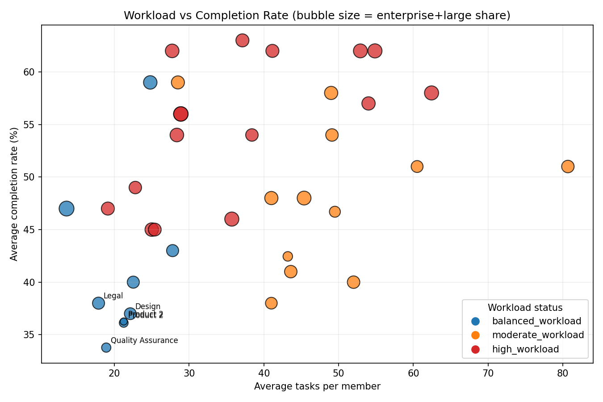
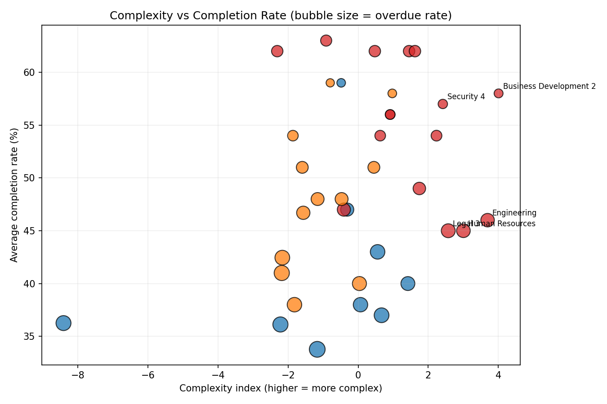
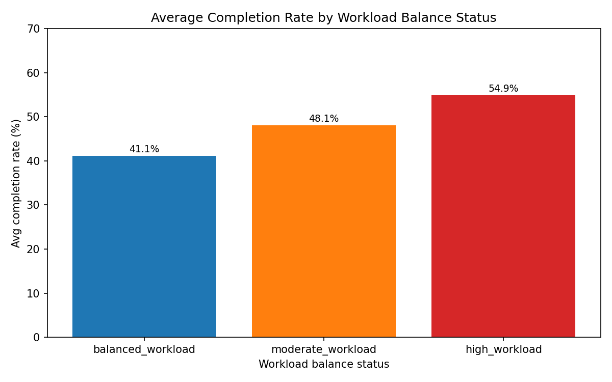

# Why do some high-health teams underperform on completion? A diagnostic deep dive

Scope and data
- Dataset: asana__team_efficiency_metrics (SQLite)
- Focus: teams with collaboration_efficiency_score >= 8 and resource_optimization_score >= 8, yet avg_completion_rate < 70%
- Filtered teams: 37

Key metrics snapshot (filtered cohort)
- Average completion rate: 49.3%
- On-schedule rate: 43.0%
- Overdue tasks (estimated share): ~16%
- Project size mix: enterprise+large share averages 51.9% (i.e., most work is larger/complex)
- Average tasks per member: 36.7 (consistent between reported and calculated)
- Average estimated completion days: 71.3; Average risk percentage: 28.8%

What correlates with completion (within this cohort)?
- Strong negative: overdue_rate (corr = -0.896)
- Strong positive: on_schedule_rate_pct (corr = +0.962)
- Also positive: enterprise_large_share (corr = +0.659), avg_project_velocity (corr = +0.593), avg_estimated_completion_days (corr = +0.395), tasks_per_member (corr ≈ +0.374)
Interpretation:
- Execution reliability is the central bottleneck: higher overdue share strongly suppresses completion. Conversely, staying on schedule is tightly aligned with higher completion.
- Within this low-completion slice, teams handling a higher proportion of large/enterprise projects are not necessarily worse off—those that preserve schedule discipline and maintain velocity achieve better completion even with complex portfolios.

Group-level signals
- By workload balance status:
  - High_workload teams have the lowest overdue rate (13.2%) and highest on-schedule rate (50.2%).
  - Balanced_workload teams have the highest overdue rate (20.6%) and the lowest on-schedule rate (33.5%).
  - Implication: the label \"balanced\" does not guarantee execution rigor; some balanced teams may be under-controlling WIP or underestimating tasks, leading to slippage.
- By team size:
  - Medium teams show the best on-schedule rates (46.7%) and the lowest overdue rates (14.1%) vs. large (37.7% on-schedule, 19.3% overdue) and small teams (41.4% on-schedule, 15.7% overdue).
  - Implication: mid-sized pods appear to be a sweet spot for throughput and schedule adherence.

Visual diagnostics
- Workload vs completion: bubble size shows enterprise+large share; color encodes workload status. Completion tends to be higher when teams maintain throughput even at higher task loads, with moderate evidence that schedule discipline matters more than raw load levels.

- Complexity vs completion: constructed a normalized complexity index (longer estimates + higher risk + more large/enterprise share − velocity). Teams with higher complexity often cluster at lower completion, while pockets of high complexity + decent completion coincide with better schedule adherence and velocity.

- Average completion by workload status: despite the label, balanced_workload lags high_workload on completion in this cohort—consistent with the overdue/schedule story.

What’s behind the mismatch between high health scores and low completion?
- Health scores (collaboration and resource optimization >= 8) reflect coordination and allocation quality, but not necessarily schedule discipline or risk execution. The diagnostic evidence points to:
  1) Schedule reliability as the dominant lever: Overdue rate is highly anticorrelated with completion (-0.90) while on-schedule rate is highly correlated (+0.96). Many teams with good collaboration/resource scores still slip on dates.
  2) Complex portfolios require tighter cadence: The cohort’s work skews large/enterprise (52% of projects). Teams that remain on schedule and keep velocity up can still complete; those without tight cadence fall behind.
  3) Workload labeling vs. operational reality: Balanced_workload teams show more slippage than high_workload teams here, suggesting under-enforced WIP limits, fragmented focus, or overly optimistic due dates.
  4) Team size matters: Medium teams deliver better schedule reliability; large teams may suffer coordination overhead, and small teams may face capacity constraints for big initiatives.

Targeted optimization recommendations
1) Tighten due-date governance and WIP control
- Set explicit guardrails: if overdue_rate > 16% (cohort average), freeze new intake for a sprint; if on_schedule_rate < 45%, trigger corrective plan.
- Introduce milestone gatekeeping: no-start unless dependencies are cleared; mid-sprint checkpoint to preempt overdue rollovers.
- Enforce per-assignee WIP limits; focus on finishing before starting (finish-to-start rules for multi-project contributors).

2) Improve schedule realism and estimation quality
- Calibrate estimates using historical velocity and actual cycle times; require evidence-based estimates for large/enterprise projects.
- Break enterprise/large projects into smaller, time-bound increments with measurable intermediate outcomes.
- Add rolling look-ahead planning (1–2 weeks) to de-risk upcoming milestones and balance resource allocation dynamically.

3) Accelerate throughput and unblock faster
- Raise avg_project_velocity via automation (test/deploy), checklists, and definition-of-done standards.
- Establish a cross-functional swarm protocol for blockers with same-day SLAs; track time-to-first-response on at-risk tasks.
- Weekly risk burn-down: aim to reduce avg risk percentage by 5pp; enforce early risk surfacing in status updates.

4) Optimize team structure, especially for complex work
- Recompose large teams into medium-sized pods for complex initiatives; align pod KPIs to on-schedule and overdue targets.
- For balanced_workload teams that underperform, reduce concurrent project count, consolidate focus areas, and protect focus time.

5) Instrument leading indicators and run a pilot
- Monitor overdue_rate and on_schedule_rate weekly alongside completion. Share a simple execution scorecard.
- Pilot with 2–3 balanced_workload teams at the bottom of completion distribution; the objective is a 10pp increase in on-schedule over 6 weeks. Given the strong association with completion, this should yield a material lift.

Appendix: How the analysis was done
- SQL filter: teams with collaboration_efficiency_score >= 8, resource_optimization_score >= 8, avg_completion_rate < 70.
- Derived metrics: enterprise_large_share; overdue_rate; tasks_per_member; complexity_index (z-normalized: longer estimates, higher risk, more large/enterprise, minus velocity).
- Correlations and group summaries by workload balance status and team size category.
- Plots generated with Python and saved in the working directory: workload_vs_completion.png, complexity_vs_completion.png, completion_by_workload_status.png.

Evidence summary (selected figures)
- Overdue_rate has the strongest negative correlation with completion (-0.896).
- On_schedule_rate has the strongest positive association (+0.962).
- Medium teams show the best schedule adherence (on_schedule ≈ 46.7%, overdue ≈ 14.1%).
- Balanced_workload teams show worse schedule adherence (on_schedule ≈ 33.5%, overdue ≈ 20.6%) than high_workload.

Bottom line
If you want higher completion from these otherwise healthy teams, prioritize schedule discipline and milestone governance, not just collaboration and resource allocation. Reduce overdues, improve estimation, and right-size teams to medium pods for complex work. This will align health with real execution performance.
