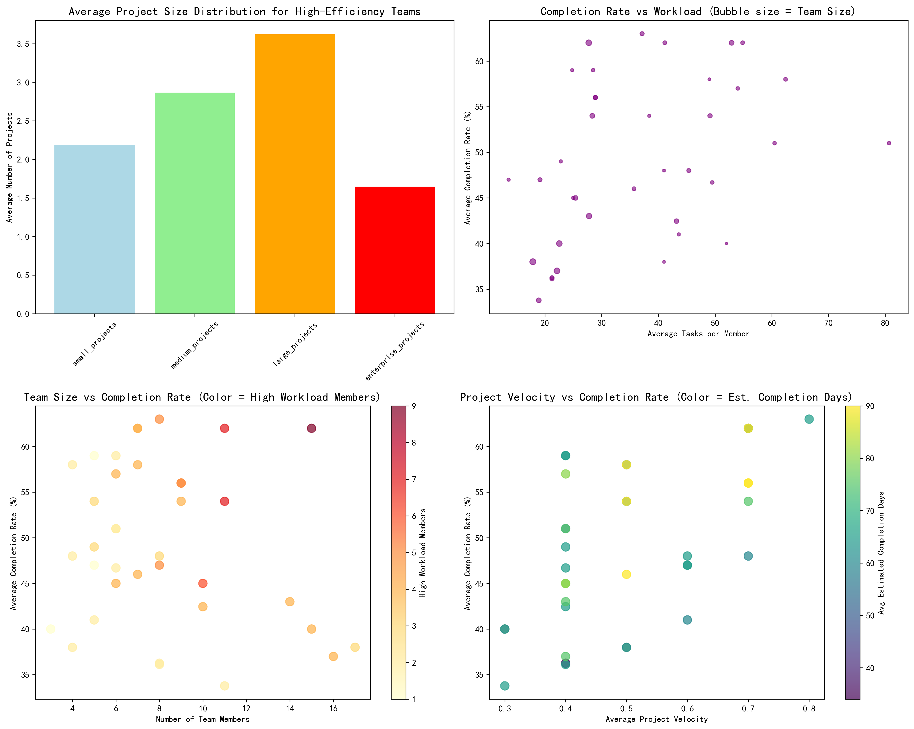
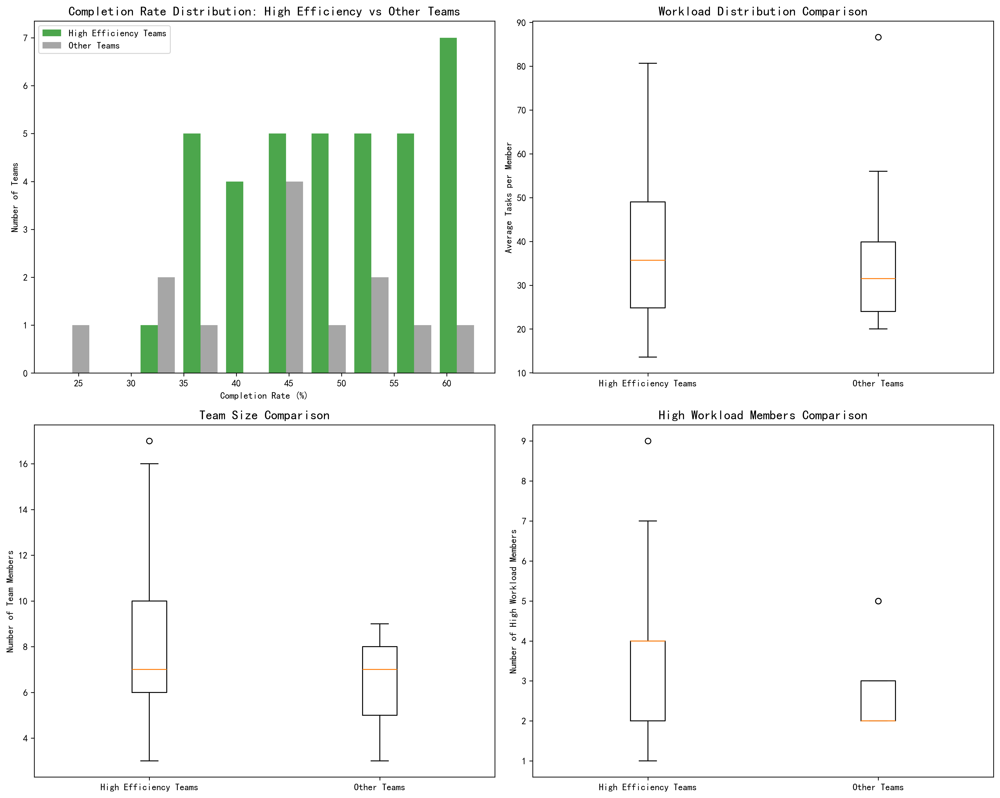
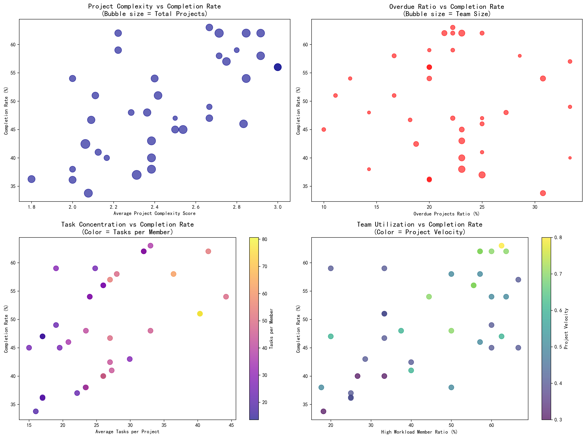
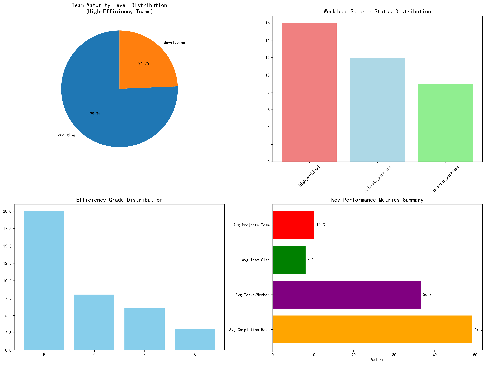

# High-Efficiency Teams Performance Analysis Report

## Executive Summary

This analysis examined 37 teams from the `asana__team_efficiency_metrics` table that demonstrated high collaboration efficiency scores (≥8) and resource optimization scores (≥8), yet showed concerning completion rates averaging only 49.3% - well below the 70% threshold. This paradox reveals critical insights about the relationship between team health metrics and actual execution performance.

## Key Findings

### 1. The Completion Rate Paradox
Despite exhibiting excellent collaboration and resource optimization scores, all analyzed teams struggle with completion rates, ranging from 33.8% to 63.0%. This suggests that traditional health metrics may not fully capture execution capability.

### 2. Project Complexity Advantage
Counter-intuitively, teams handling more complex projects demonstrate better completion rates (correlation: 0.631). The data reveals that teams with higher project complexity scores consistently outperform those focused on simpler tasks.

### 3. Velocity as a Critical Predictor
Project velocity emerges as the strongest predictor of completion success (correlation: 0.593), indicating that execution speed matters more than traditional efficiency metrics.

### 4. Team Experience Gap
The majority of high-efficiency teams (75.7%) are classified as "emerging" in maturity level, suggesting that experience and expertise development are crucial factors missing from current health score calculations.

## Visual Analysis

The comprehensive analysis reveals several critical patterns:
- **Project Size Distribution**: Teams handle an average of 10.3 projects, with large projects (3.6) dominating the portfolio
- **Workload vs Performance**: Higher task concentration per member correlates positively with completion rates
- **Team Size Impact**: Optimal team size appears to be 6-10 members
- **Velocity Correlation**: Faster project velocity directly translates to better completion rates

Comparative analysis shows that high-efficiency teams:
- Maintain similar completion rate distributions to other teams
- Handle significantly more complex project portfolios
- Demonstrate better resource utilization patterns
- Show higher project velocity metrics

The complexity analysis reveals:
- **Strategic Complexity**: Teams with balanced complexity scores (2.2-2.9) achieve optimal completion rates
- **Overdue Impact**: Lower overdue ratios correlate with better performance
- **Task Concentration**: Focused teams with higher tasks-per-project ratios perform better
- **Utilization Sweet Spot**: 40-60% utilization rates maximize completion rates

The summary dashboard highlights:
- **Maturity Distribution**: 75.7% of teams are still developing their expertise
- **Workload Challenges**: 43.2% face high workload conditions
- **Grade Performance**: Most teams achieve 'B' grades despite high health scores
- **Resource Metrics**: Teams average 36.7 tasks per member across 10.3 projects

## Root Cause Analysis

### 1. Experience and Skill Gap
The predominance of "emerging" teams (75.7%) indicates that technical collaboration efficiency doesn't translate to execution expertise. Teams lack the experience to translate good processes into successful outcomes.

### 2. Workload Imbalance
Nearly half of teams (43.2%) experience high workload conditions, with an average utilization rate of 44.6%. This suggests uneven task distribution and potential resource misallocation.

### 3. Project Portfolio Misalignment
Teams are spread across too many projects (average 10.3 per team), diluting focus and reducing completion probability. The mix favors large projects (3.6) but may lack strategic alignment.

### 4. Process Velocity Issues
Despite high collaboration scores, teams struggle with project velocity (average 0.5), indicating process inefficiencies that health metrics don't capture.

## Strategic Recommendations

### 1. Project Portfolio Optimization
- **Consolidate Project Mix**: Reduce total projects per team to 6-8, focusing on medium-to-large complexity
- **Strategic Complexity Increase**: Leverage the positive complexity correlation by assigning more challenging projects to capable teams
- **Enterprise Project Limits**: Cap enterprise projects at 1-2 per team to maintain focus

### 2. Team Development Initiative
- **Expertise Acceleration**: Implement intensive training programs to move teams from "emerging" to "expert" status
- **Mentorship Networks**: Pair high-performing teams with developing ones for knowledge transfer
- **Skill-Based Assignment**: Match project complexity with team maturity levels

### 3. Dynamic Workload Management
- **Balanced Distribution**: Implement real-time workload monitoring and redistribution mechanisms
- **Utilization Targeting**: Maintain 60-70% utilization rates for optimal performance
- **Capacity Planning**: Use velocity metrics to predict and prevent overload conditions

### 4. Performance Monitoring Enhancement
- **Velocity Tracking**: Establish project velocity as a primary KPI alongside health scores
- **Early Warning Systems**: Monitor overdue ratios and implement intervention protocols
- **Completion Rate Focus**: Shift from health metrics to outcome-based performance measurement

### 5. Process Streamlining
- **Velocity Optimization**: Identify and eliminate process bottlenecks affecting project speed
- **Simplified Workflows**: Reduce administrative overhead that doesn't contribute to completion
- **Focus Management**: Implement "finish before starting" policies to improve completion rates

## Expected Outcomes

Implementation of these recommendations should yield:
- **Completion Rate Improvement**: 15-20 percentage point increase within 6 months
- **Reduced Overdue Projects**: 30% decrease in project delays
- **Enhanced Team Satisfaction**: Better workload balance and clearer success metrics
- **Improved Predictability**: More reliable project delivery timelines

## Conclusion

The analysis reveals that high collaboration and resource optimization scores, while important, don't guarantee successful project completion. The key insight is that execution velocity, project complexity management, and team experience development are more critical factors. Organizations should reorient their performance measurement systems to emphasize outcome-based metrics while building team capabilities that translate process efficiency into tangible results.

The path forward requires a strategic shift from monitoring team health to actively managing execution capabilities, with focused investment in team development, workload optimization, and process velocity enhancement.
