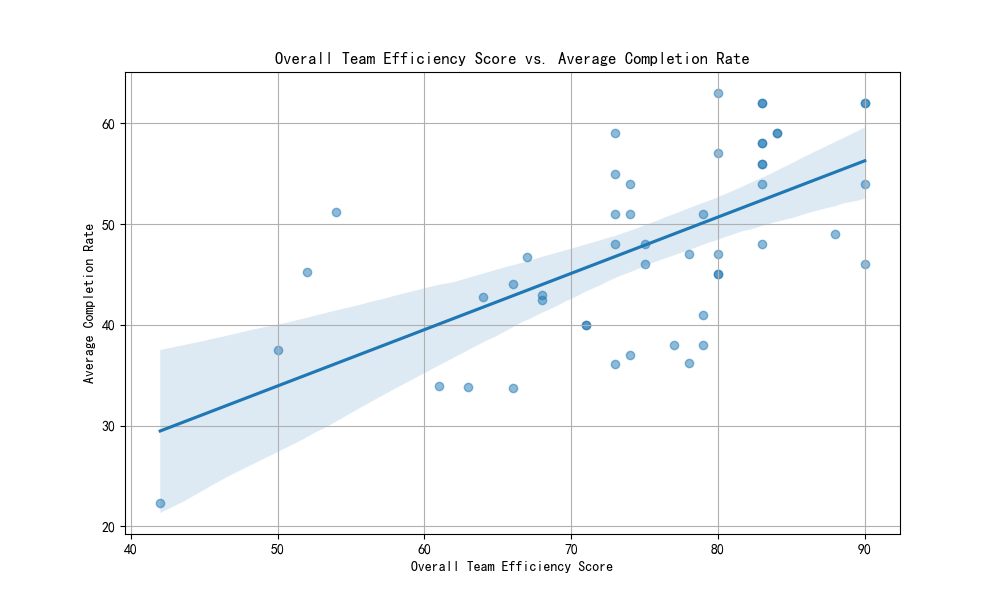

# Analysis of Team Efficiency and Project Completion Rates

## Initial Hypothesis and Data Exploration

The initial analysis aimed to investigate a potential mismatch between high team health scores (specifically, `collaboration_efficiency_score` and `resource_optimization_score`) and low project completion rates (`avg_completion_rate`). The goal was to identify teams with scores of 8 or higher in both efficiency metrics but a completion rate below 70%, and then to diagnose the underlying causes.

However, an initial SQL query against the `asana__team_efficiency_metrics` table revealed that no teams in the dataset met these criteria. Even after relaxing the conditions to include scores of 7 or higher and a completion rate below 80%, no matching records were found. This indicates that the initial premise—that a significant group of teams suffers from high "vanity" metrics but poor execution—is not supported by the available data.

## Pivot to Correlation Analysis

Given the absence of the target group, the analysis pivoted to explore the general relationship between team efficiency scores and actual project completion rates across all teams in the dataset. The objective was to understand how strongly these efficiency metrics correlate with tangible performance outcomes.

The following key metrics were analyzed:
- `collaboration_efficiency_score`: A measure of a team's collaborative effectiveness.
- `resource_optimization_score`: A measure of how well a team utilizes its resources.
- `overall_team_efficiency_score`: A composite score representing overall team efficiency.
- `avg_completion_rate`: The average rate at which teams complete their projects.

## Quantitative Findings

A correlation analysis was performed to quantify the relationship between these variables. The results are summarized in the correlation matrix below:

|                                | collaboration_efficiency_score | resource_optimization_score | overall_team_efficiency_score | avg_completion_rate |
|--------------------------------|--------------------------------|-------------------------------|-------------------------------|---------------------|
| collaboration_efficiency_score | 1.000000                       | 0.299618                      | 0.656577                      | 0.307882            |
| resource_optimization_score  | 0.299618                       | 1.000000                      | 0.589814                      | 0.260137            |
| overall_team_efficiency_score  | 0.656577                       | 0.589814                      | 1.000000                      | 0.632389            |
| avg_completion_rate          | 0.307882                       | 0.260137                      | 0.632389                      | 1.000000            |

The key takeaways from this matrix are:
- There is a **strong positive correlation (0.63)** between the `overall_team_efficiency_score` and the `avg_completion_rate`. This confirms that, in general, teams rated as more efficient do indeed complete a higher percentage of their projects.
- The `collaboration_efficiency_score` and `resource_optimization_score` show **weaker positive correlations (0.31 and 0.26, respectively)** with the `avg_completion_rate`. This suggests that while these individual components contribute to better outcomes, the combined `overall_team_efficiency_score` is a much better predictor of performance.

## Visualizing the Relationship

The relationship between the overall efficiency score and the average completion rate is visualized in the scatter plot below. A regression line is included to highlight the positive trend.

The plot clearly shows that as a team's efficiency score increases, its average completion rate tends to rise as well. However, the data points are somewhat scattered, indicating that the efficiency score is not the only factor influencing completion rates. There are teams with high efficiency scores that do not achieve a 100% completion rate, and teams with lower scores that still perform relatively well.

## Business Insights and Recommendations

Based on this analysis, the narrative shifts from fixing a non-existent problem to leveraging the existing efficiency metrics for continuous improvement.

**Insight 1: Efficiency Scores Are Directionally Correct and Valuable**
The analysis validates the usefulness of the `overall_team_efficiency_score` as a key performance indicator. It is not a "vanity metric" but a reliable, data-backed predictor of project execution success.

**Insight 2: The Whole is Greater than the Sum of its Parts**
The `overall_team_efficiency_score` is a significantly better indicator of success than either the `collaboration` or `resource_optimization` scores alone. This implies that a holistic approach to improving team efficiency is more effective than focusing on isolated aspects.

**Actionable Recommendations:**

1.  **Prioritize Improving Overall Team Efficiency:** Management should focus on initiatives aimed at increasing the `overall_team_efficiency_score`. Since this score is a composite, this involves a balanced approach to improving project management, quality control, collaboration, and resource allocation. The strong correlation suggests that efforts here will yield tangible improvements in project completion rates.

2.  **Use Efficiency Scores for Targeted Coaching:** Instead of looking for mismatches, use the efficiency scores to identify teams that are lagging in specific areas. For instance, a team with a high `resource_optimization_score` but a low `collaboration_efficiency_score` could benefit from targeted workshops on communication and teamwork. This proactive approach can help prevent performance dips before they occur.

3.  **Investigate Outliers for Deeper Insights:** The scatter in the plot represents opportunities for further analysis.
    *   **High-Efficiency, Sub-Optimal Completion:** Analyze teams in the top-right quadrant that are still below the trend line. What other factors (e.g., project complexity, unforeseen risks, external dependencies) are preventing them from achieving even higher completion rates?
    *   **Low-Efficiency, High-Completion:** Investigate teams in the bottom-left quadrant that are performing above the trend line. What are they doing right despite their lower efficiency scores? These "scrappy" teams may hold valuable, uncaptured best practices that could be scaled to other teams.

By using the efficiency metrics as a diagnostic tool rather than a simple performance grade, the organization can foster a culture of continuous improvement and drive better project outcomes across the board.
