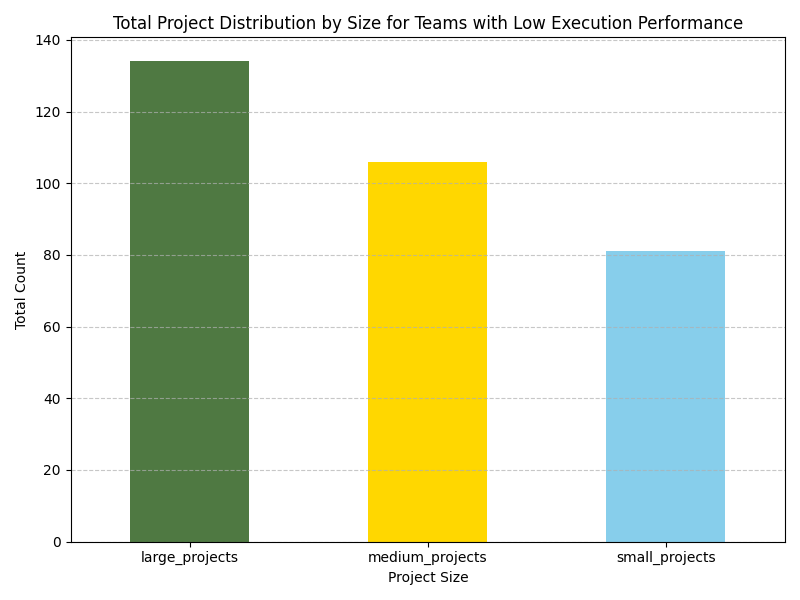
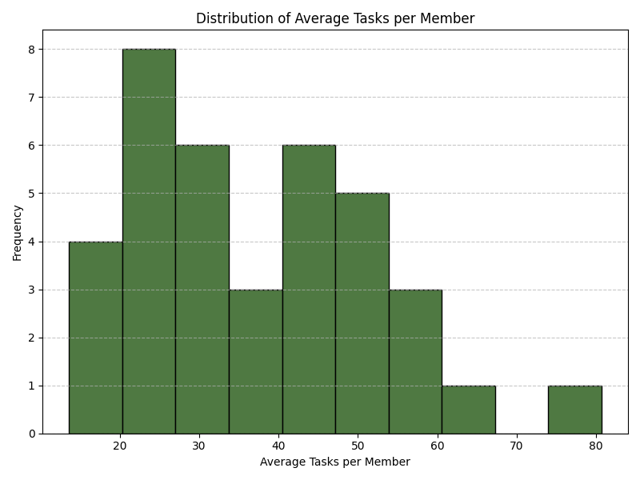
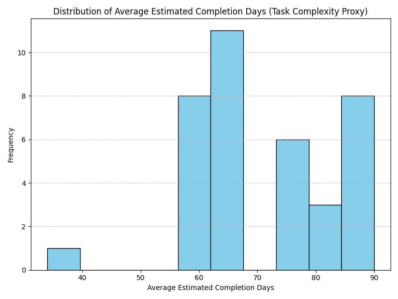

## Analysis of Teams with High Health Scores but Low Execution Performance

### Key Findings

1. **Project Size Distribution**:
   - The majority of the projects across these teams are medium-sized, followed by large and small-sized projects. This suggests that teams may be focused on moderately complex initiatives, which may not align with their execution capacity.

   

2. **Member Workload**:
   - The distribution of average tasks per team member indicates that most members are handling a moderate number of tasks. However, there is a notable variance among teams, with some members shouldering heavier loads. This imbalance could negatively impact overall execution performance.

   

3. **Task Complexity**:
   - Using `avg_estimated_completion_days` as a proxy for task complexity, we observe that most tasks have moderate complexity. However, several teams are managing highly complex tasks that may require additional resources or better planning to meet deadlines and ensure completion.

   

### Recommendations

1. **Workload Reallocation**:
   - Conduct a detailed review of workload distribution within teams, especially those with members handling a high number of tasks. Reassigning tasks to underutilized members or hiring additional resources could improve execution rates.

2. **Enhanced Planning and Task Prioritization**:
   - Implement more robust task prioritization frameworks (e.g., MoSCoW method) to ensure that teams focus on high-impact work. Additionally, refining estimation techniques for complex tasks could improve schedule reliability.

3. **Capacity Management**:
   - Introduce real-time workload monitoring tools to proactively manage team capacity. This will help prevent bottlenecks and ensure that high-complexity tasks receive the attention they require.

4. **Maturity and Process Improvement**:
   - For teams at an 'emerging' maturity level, invest in process standardization and agile training to improve execution consistency and reduce dependency on individual performance.

These insights and recommendations aim to bridge the gap between high health scores and low execution performance by addressing workload balance, planning accuracy, and capacity management.
