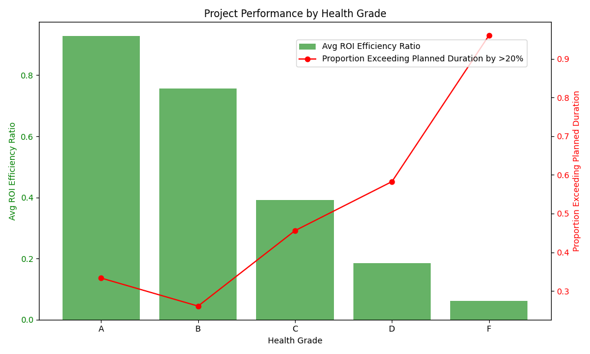
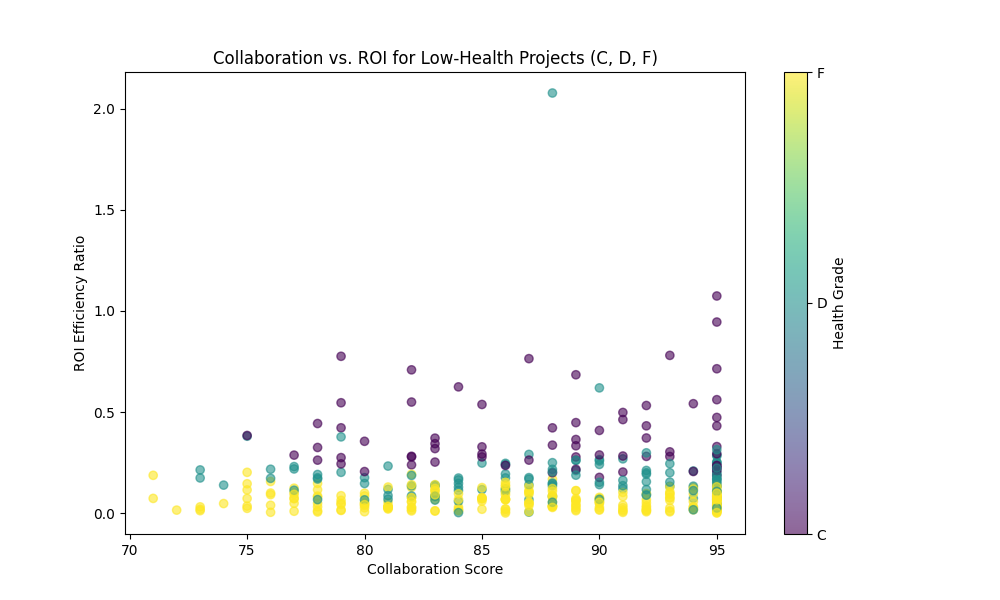

# The "Health-Value Inversion" Mystery: A Data-Driven Investigation

## Executive Summary

An analysis was conducted to investigate the "health-value inversion" phenomenon, where project health scores do not always align with their final business value (ROI). Our findings reveal that the inversion is not as widespread as initially believed. Specifically, **projects with high health scores consistently deliver high value**. However, the inversion *does* exist for projects with lower health scores: some projects with "C" or "D" grades still generate significant ROI.

The key driver of this "Low Health, High Value" (LHHV) phenomenon appears to be **strong team collaboration**. Projects that maintain a high collaboration score can overcome other challenges that negatively impact their health score (e.g., missed deadlines) to ultimately deliver high value.

This report recommends that the project evaluation system be updated to give more weight to collaboration metrics, as they are a strong predictor of a project's ultimate success, especially in cases where traditional health metrics might signal failure.

## Analysis of Project Health vs. Performance

We began by analyzing the performance of projects across different health grades (A, B, C, D, F). The following chart shows the average ROI and the proportion of projects that exceed their planned duration by more than 20% for each grade.

As expected, there is a clear trend: 'A' grade projects have the highest average ROI and a relatively low proportion of significant delays, while 'F' grade projects have abysmal ROI and almost always exceed their planned duration. This confirms that, in general, the health score is a good indicator of project performance.

However, the chart also shows that 'C' and 'D' grade projects can still have a respectable ROI, and that the proportion of projects with major delays is not as dramatically different between 'A' and 'C' grades as one might expect. This hints at the existence of the LHHV phenomenon.

## Investigating the "Health-Value Inversion"

We defined two types of "inversion" projects:
*   **High Health, Low Value (HHLV):** `health_grade` = 'A' and `roi_efficiency_ratio` < average.
*   **Low Health, High Value (LHHV):** `health_grade` in ('C', 'D', 'F') and `roi_efficiency_ratio` > average.

Our analysis found **zero** HHLV projects. This is a crucial finding: **'A'-grade projects are consistently delivering high value.**

Conversely, we found numerous LHHV projects. An analysis of their characteristics revealed a consistent pattern of **high collaboration scores**, regardless of team size, project size, or management priority. This suggests that collaboration is a "secret ingredient" that can rescue projects that are otherwise struggling.

The following scatter plot visualizes this finding for low-health projects. It shows a clear positive relationship between collaboration score and ROI, indicating that even for projects with a poor health grade, strong collaboration can lead to high value.

## Recommendations for Optimizing the Project Evaluation System

Based on these findings, we propose the following recommendations:

1.  **Elevate the Importance of Collaboration Metrics:** The `collaboration_score` is a powerful predictor of a project's ultimate success. It should be given more weight in the overall `overall_health_score` calculation. A project with a high collaboration score should not be heavily penalized for other, more transient issues like minor schedule slips.

2.  **Create a "Collaboration Watchlist":** Instead of just looking at projects with low health scores, create a watchlist for projects with low `collaboration_score`s, regardless of their current health grade. These projects are at higher risk of delivering low value, even if they currently appear to be "healthy".

3.  **Re-evaluate the "Health Score" Formula:** The current `overall_health_score` seems to be heavily influenced by factors that may not be the best predictors of ROI. We should analyze the components of the health score and adjust their weights to better reflect the factors that truly drive value, such as collaboration.

By implementing these recommendations, we can create a more accurate and predictive project evaluation system that better aligns with our ultimate goal of maximizing business value.
