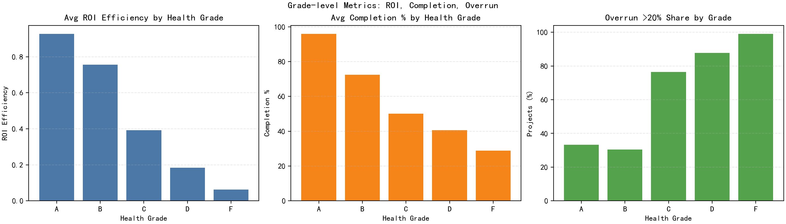
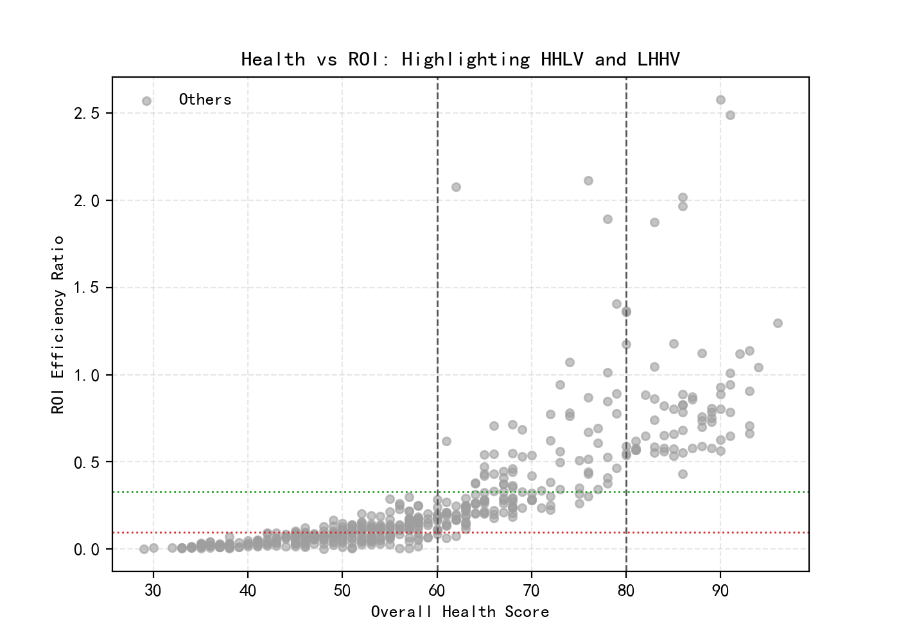
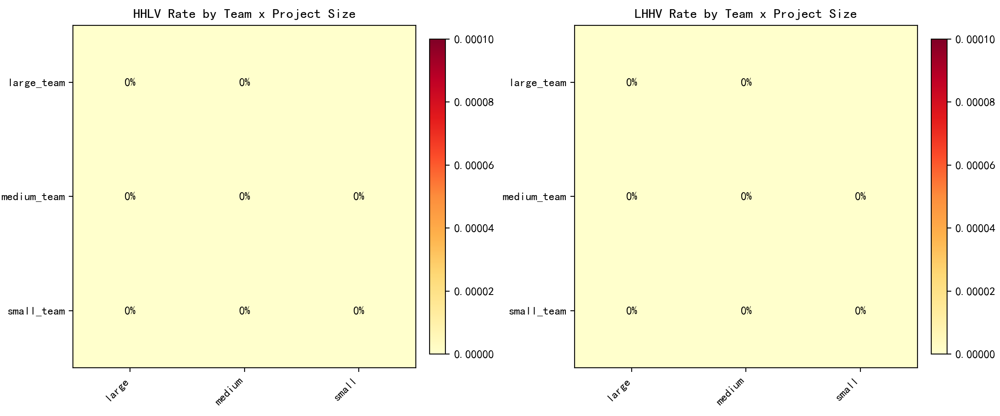
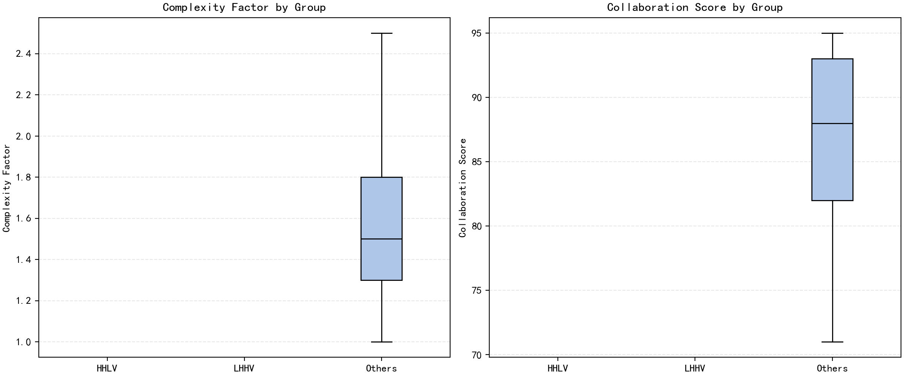
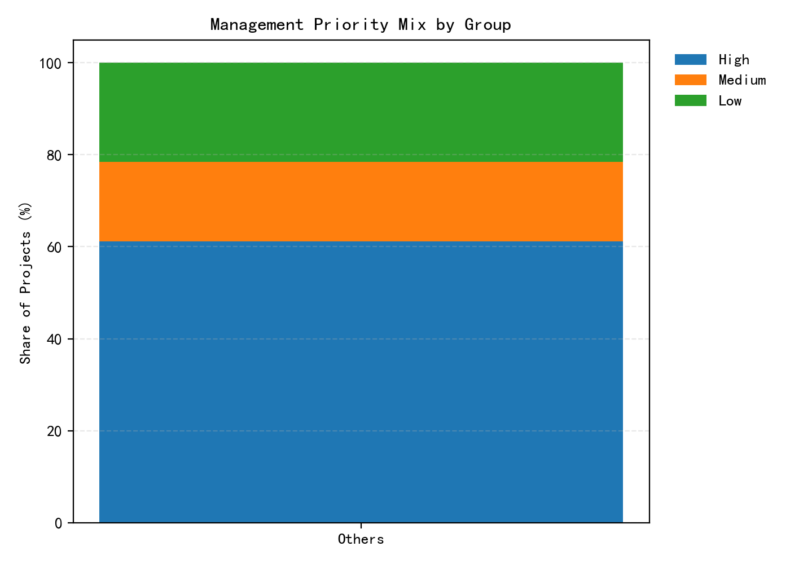
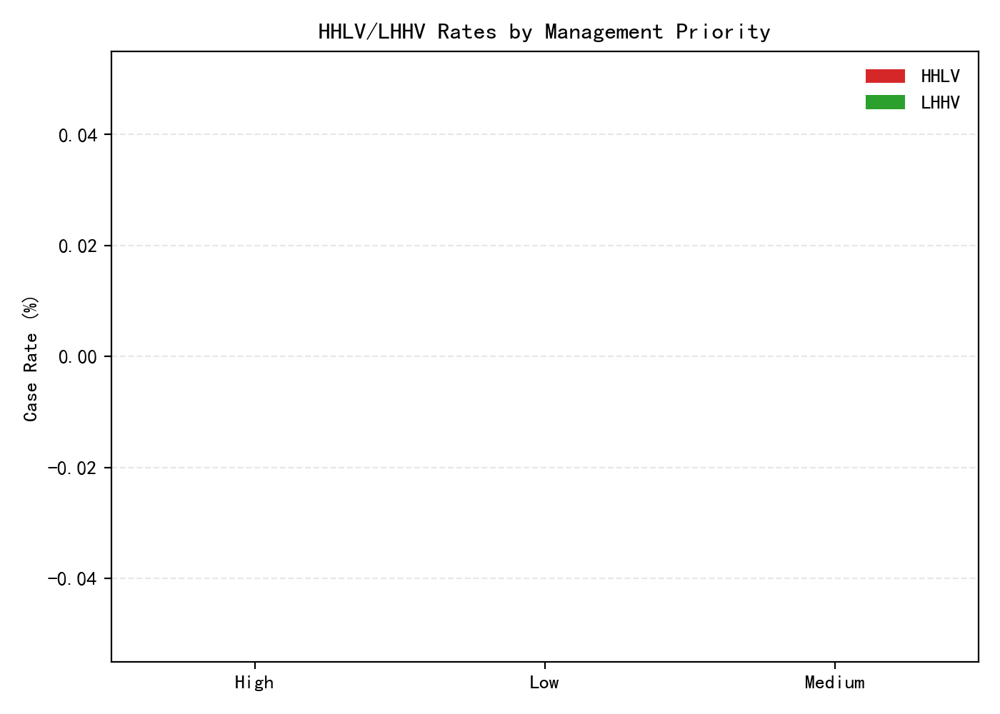

Project Health–Value Inversion Analysis (Based on asana__project_analytics)

Scope
- Dataset: 500 valid projects in asana__project_analytics.
- Goal: Explain why “seemingly healthy” projects sometimes produce low ROI, and why some lower-health projects produce high value. Deliver metrics, drivers, and system optimization recommendations.

Part 1 — Required Grade-Level Metrics
For each health grade (A/B/C/D/F), we computed:
- Average ROI efficiency ratio
- Average completion percentage
- Proportion of projects exceeding planned_duration_days by more than 20% (elapsed_days > 1.2 × planned_duration_days)

Results by health_grade:
- A (n=45): avg ROI=0.928, avg completion=96.0%, exceeded >20% = 33.3%
- B (n=46): avg ROI=0.756, avg completion=72.4%, exceeded >20% = 26.1%
- C (n=68): avg ROI=0.392, avg completion=50.1%, exceeded >20% = 45.6%
- D (n=115): avg ROI=0.184, avg completion=40.5%, exceeded >20% = 58.3%
- F (n=226): avg ROI=0.062, avg completion=28.8%, exceeded >20% = 96.0%

Takeaways:
- Health and ROI trend together on average (A > B > C > D > F), but see below for within-grade inversions.
- Schedule overruns rise sharply as grades drop, but even A has 33% with significant overruns.

This visualization consolidates grade-level ROI, completion, and >20% overrun shares, reinforcing the overall trend while highlighting substantial schedule risk even among A projects. It underscores why schedule adherence and delivery efficiency must be weighted more heavily in health scoring to align with value outcomes.

Part 2 — Defining and Quantifying Inversion Cohorts
Initial absolute definitions (e.g., overall_health_score >80 and ROI below median) yielded no HHLV cases. To capture meaningful within-grade inversions, we used cohort-relative thresholds:
- HHLV (High Health, Low Value) proxy: A/B-grade projects with ROI in the bottom quartile of A/B ROI distribution.
  • A/B ROI quartiles: Q1=0.569, median=0.736, Q3=0.894 (n=91).
  • HHLV_AB defined as ROI ≤ 0.569.
  • Incidence: 23 of 91 A/B projects (25.3%).
- LHHV (Low Health, High Value) proxy: D/F-grade projects with ROI in the top quartile of D/F ROI distribution.
  • D/F ROI quartiles: Q1=0.0368, median=0.0797, Q3=0.136 (n=341).
  • LHHV_DF defined as ROI ≥ 0.136.
  • Incidence: 86 of 341 D/F projects (25.2%).

The scatter reveals distinct pockets where health and ROI diverge—confirming HHLV and LHHV clusters under cohort-relative thresholds. This matters because it visually validates that health alone cannot predict value without integrating ROI-leading indicators.

Note: Absolute HHLV is rare because A/B ROI is generally high (even bottom quartile is 0.569). Relative definitions reveal underperformers within “healthy” cohorts and outperformers within “low-health” cohorts.

Part 3 — What drives the inversions?

A) HHLV within A/B (ROI ≤ 0.569; 25.3% of A/B)
Key categorical patterns:
- Team size: Large teams are much more prone to HHLV.
  • HHLV rate by team_size_category among A/B: large_team 72.7% (8/11), medium_team 22.4% (11/49), small_team 12.9% (4/31).
- Project size: HHLV concentrates in larger scopes; zero in small.
  • HHLV rate by project_size_category among A/B: large 38.9%, medium 30.2%, small 0.0%.
- Schedule: Lagging schedules drive HHLV risk.
  • HHLV rate by schedule_forecast among A/B: behind_schedule 48.3%, on_schedule 25.0%, ahead_of_schedule 3.3%.
- Risk level: A caveat on sample size, but noteworthy.
  • HHLV rate: low_risk 66.7% (6/9) vs minimal_risk 20.7% (17/82). Low sample for low_risk suggests caution.

Heatmaps show elevated HHLV rates for larger teams and scopes, with distinct LHHV pockets in certain size combinations. This visual supports the need for complexity- and scale-adjusted benchmarks so health reflects operational difficulty and likely value realization.

Key numeric driver deltas (HHLV_AB vs NonHHLV_AB):
- Collaboration score: higher in HHLV (89.8 vs 85.8) — strong collaboration alone doesn’t guarantee value.
- Efficiency score: lower (81.9 vs 85.6).
- Time management score: lower (72.2 vs 77.9).
- Complexity factor: higher (1.813 vs 1.509; +20%).
- Completion percentage: lower (79.2% vs 85.7%).
- Quality percentage: lower (80.9% vs 84.1%).
- Risk percentage: higher (21.4% vs 11.5%).
- Completion rate per day: roughly half (0.953 vs 1.904; -50%).
- Overdue tasks: higher (8.3 vs 3.7).
- Exceeded planned duration by >20%: much higher (56.5% vs 20.6%).
Interpretation:
- Within A/B, HHLV projects tend to be larger and more complex, with weaker throughput and time management, more schedule slippage, and higher risk. Despite strong collaboration, they realize relatively lower ROI vs their A/B peers. This indicates the current health grade may overweight collaboration/quality and underweight schedule adherence, throughput, and risk trajectory for complex, large-team projects.

Boxplots indicate higher complexity for HHLV groups alongside strong collaboration levels, highlighting a misalignment between collaboration-heavy health signals and value-driving execution factors. This is important because it points to the need to rebalance weights toward throughput, schedule, and risk in complex projects.

B) LHHV within D/F (ROI ≥ 0.136; 25.2% of D/F)
Key categorical patterns:
- Schedule: Strongly linked to higher ROI even within D/F.
  • LHHV rate by schedule_forecast among D/F: ahead_of_schedule 70.6%, on_schedule 47.4%, behind_schedule 18.4%.
- Risk: Risk mitigation is a differentiator.
  • LHHV rate by risk_level among D/F: minimal_risk 64.9%, low_risk 31.0%, medium_risk 28.8%, high_risk 12.3%.
- Team size and project size: Slight skew toward larger initiatives.
  • LHHV rate by team_size_category: large_team 33.3% > medium 24.7% > small 23.2%.
  • LHHV rate by project_size_category: large 27.1% ≈ small 26.6% > medium 24.0%.

Key numeric driver deltas (LHHV_DF vs NonLHHV_DF):
- Efficiency score: higher (70.5 vs 67.9).
- Time management score: notably higher (64.3 vs 52.9).
- Completion percentage: higher (42.8% vs 29.4%).
- Risk percentage: much lower (47.4% vs 78.8%).
- Completion rate per day: ~2.7x higher (0.351 vs 0.129).
- Overdue tasks: lower (18.6 vs 20.7).
- Exceeded planned duration by >20%: far lower (60.5% vs 91.0), though still high in absolute terms.
Interpretation:
- Some D/F projects generate strong ROI by staying on/ahead of schedule, managing time well, and materially reducing risk, even if other dimensions keep their overall health grade low. This suggests the current health evaluation may under-recognize improvements in schedule adherence, risk mitigation, and throughput that are predictive of ROI.

Synthesis: Why does inversion happen?
- Overweighting collaboration and static quality vs dynamic delivery: A/B HHLV projects collaborate well and have decent quality, but underperform in throughput, time management, schedule adherence, and risk trajectory—key enablers of financial return.
- Lack of complexity and scale normalization: Large teams and larger projects face coordination overhead and complexity; without complexity-adjusted benchmarks, health can look “good” while ROI lags.
- Underweighting schedule performance and risk reduction: D/F LHHV projects that are ahead/on schedule with lower risk deliver higher ROI but remain classified as low-health, implying health scoring underweights these drivers.

Part 4 — Recommendations to Optimize the Project Evaluation System

1) Rebalance the health scoring model toward ROI-leading indicators
- Add ROI efficiency ratio as a direct (e.g., 20–30%) component or use it as a gating check for top health grades.
- Increase weights for:
  • Schedule adherence (e.g., penalties for elapsed_days > 1.2 × planned).
  • Completion rate per day and its trend (throughput momentum).
  • Risk percentage and its trend (reward risk burn-down).
- Rationale: Within A/B, low throughput and schedule slippage explain most HHLV; within D/F, adherence and risk reduction explain most LHHV.

2) Complexity- and scale-adjusted benchmarks
- Normalize efficiency/time management expectations by complexity_factor and team_size_category.
- For large_team and large projects, set adjusted targets for rate/day and schedule buffers; penalize slippage more heavily at scale.
- Rationale: A/B HHLV concentrates in large teams and larger scopes with higher complexity; normalization prevents inflated health for projects that are operationally struggling at scale.

3) Dynamic performance emphasis over static snapshots
- Incorporate trajectory-based metrics:
  • Week-over-week change in completion_rate_per_day.
  • Trend in risk_percentage and overdue_tasks.
  • Variance to plan in estimated_days_to_completion vs baseline.
- Rationale: D/F LHHV projects reveal that trajectory (improving schedule and risk) predicts value even when baseline health is low.

4) Governance and early-warning triggers
- HHLV watchlist triggers (especially for A/B):
  • Behind_schedule AND rising overdue_tasks.
  • Decreasing completion_rate_per_day for 2+ intervals.
  • High complexity_factor AND low time_management_score.
  • Risk_percentage above A/B peer norm.
- LHHV best-practice replication:
  • Ahead/on-schedule playbooks, lightweight risk controls, cadence rituals that improved time management and throughput.
- Rationale: Reduce underperformance among “healthy” and surface positive outliers among “unhealthy.”

5) Clarify and enforce management priority
- In A/B, nearly all projects were labeled low management_priority—suggests either data capture issues or a weak signal in health scoring.
- Action: Revisit priority definitions and ensure it influences resourcing and health; validate that high-priority projects meet higher schedule/risk standards.

Priority distributions indicate selection effects, with some low-priority projects delivering outsized value and some high-priority ones underperforming. This implies governance and resourcing choices can materially affect health–value alignment.

Case rates differ by priority tier, suggesting that tuning prioritization and oversight could reduce HHLV incidence and help scale LHHV practices into portfolio bets.

6) Measurement framework and backtesting
- Backtest revised weights on historical projects to reduce inversion rates (target: cut HHLV and LHHV rates by 40–60% relative to the within-grade baselines of ~25%).
- Establish monitoring KPIs by grade and cohort:
  • Inversion rates (HHLV within A/B; LHHV within D/F).
  • Schedule overrun rate by grade and team size.
  • Throughput per day vs complexity-adjusted benchmark.

7) Operational playbooks
- For HHLV candidates: schedule triage, throughput focus (WIP limits), critical-path replanning, and risk burn-down sprints.
- For LHHV candidates: recognize and propagate practices; consider reevaluating their health grading promptly when forward indicators are strong.

Limitations and Notes
- Absolute HHLV using global thresholds is rare; A/B ROI is high overall. Relative within-grade definitions best reveal underperformance risks.
- Some subgroup counts are small (e.g., A/B low_risk), so interpret those rates with caution.
- This analysis did not perform data cleaning; results assume curated dataset fidelity.

Executive Summary
- Requirement 1 delivered: grade-level averages and >20% schedule overrun proportions computed.
- Inversion exists primarily as within-grade variance:
  • About 25% of A/B projects are HHLV relative to their A/B peers—characterized by larger teams/scopes, higher complexity, schedule slippage, lower throughput, and elevated risk despite strong collaboration.
  • About 25% of D/F projects are LHHV relative to their D/F peers—characterized by ahead/on-schedule execution, better time management, lower risk, higher throughput, and better progress.
- Recommended to rebalance health evaluation to include ROI-leading indicators, trajectory-based performance, and complexity/scale normalization, plus operational governance to minimize HHLV and uplift LHHV best practices.
