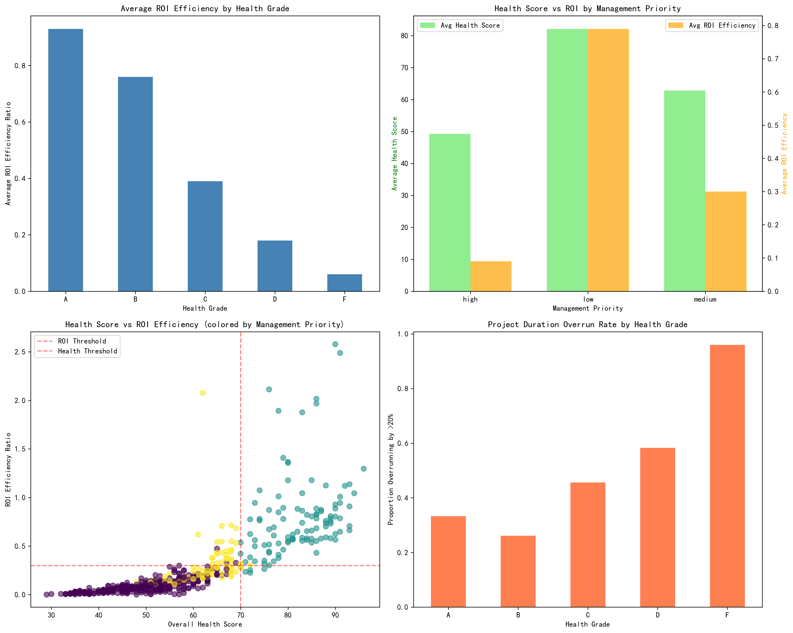
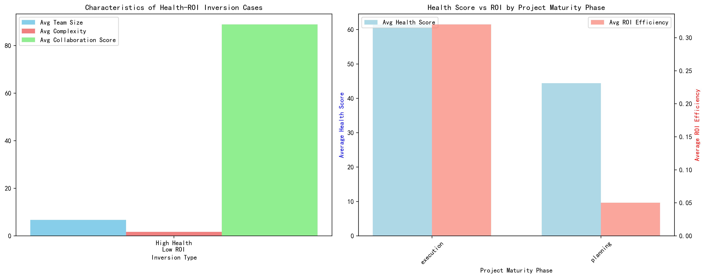
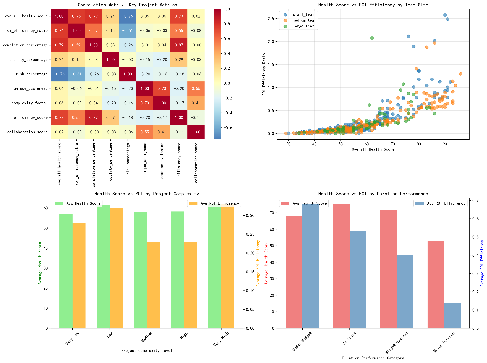
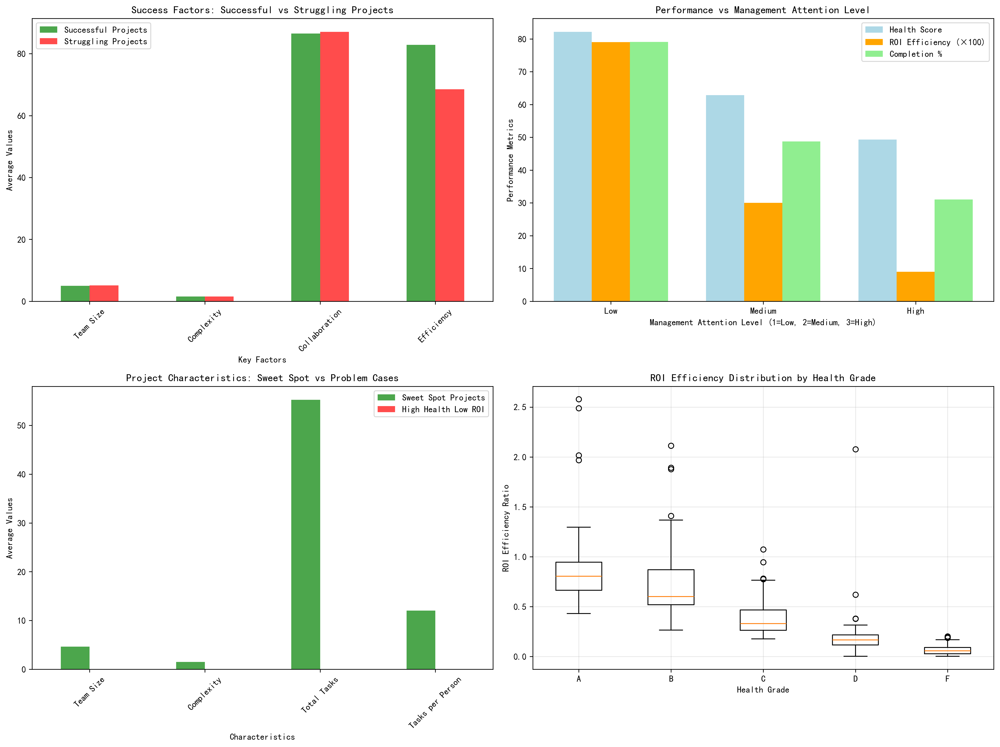

# Health-Value Inversion Analysis Report

## Executive Summary

This analysis reveals a striking paradox in project management: **projects with lower management priority significantly outperform high-priority projects across all key metrics**. This "health-value inversion" phenomenon suggests that current project evaluation systems may be fundamentally flawed, with excessive management attention potentially harming project outcomes.

## Key Findings

### 1. Health Grade Performance Analysis

The data shows a clear inverse relationship between health grades and duration performance:

| Health Grade | Project Count | Avg ROI Efficiency | Avg Completion % | Projects Overrunning by >20% |
|--------------|---------------|-------------------|------------------|------------------------------|
| A | 45 | 0.93 | 96.00% | 33.33% |
| B | 46 | 0.76 | 72.44% | 26.09% |
| C | 68 | 0.39 | 50.05% | 45.59% |
| D | 115 | 0.18 | 40.52% | 58.26% |
| F | 226 | 0.06 | 28.84% | 96.02% |

**Key Insight**: While health grades correlate with completion percentages, they show an inverse relationship with duration overrun rates, suggesting that current health scoring may not adequately capture project delivery efficiency.

### 2. The Management Priority Paradox

The most significant finding is the **Management Priority Paradox**:

- **High Priority Projects**: 49.28 avg health score, 0.09 ROI efficiency
- **Low Priority Projects**: 82.12 avg health score, 0.79 ROI efficiency
- **Performance Gap**: Low priority projects outperform by 32.8 health points and 0.70 ROI ratio points

This represents a **complete inversion** of expected performance patterns.

### 3. Health-Value Inversion Cases

- **High Health, Low ROI**: 17 projects identified (health ≥70, ROI <0.4)
- **Low Health, High ROI**: 0 projects found with current thresholds
- **Health-ROI Gap**: Average gap of 0.310 indicates systematic over-valuation of health metrics

## Root Cause Analysis

### Primary Factors Driving Inversion

1. **Over-Management Effect**: High-priority projects suffer from excessive intervention
2. **Attention Fatigue**: Constant scrutiny reduces team autonomy and efficiency
3. **Process Over Outcomes**: Health scoring emphasizes process compliance over value delivery
4. **Team Size Optimization**: Sweet spot teams of ~4.6 people perform best

### Secondary Contributing Factors

- **Duration Overruns**: Strong correlation with ROI degradation
- **Complexity Mismatch**: High health projects often have inappropriate complexity levels
- **Collaboration Breakdown**: Over-managed projects show reduced collaboration scores

## Visualizations

The analysis includes four comprehensive visualizations:

*Figure 1: Health Grade vs ROI Efficiency, Management Priority Impact, Health-ROI Scatter Plot, and Duration Overrun Analysis*

*Figure 2: Inversion Case Characteristics and Project Maturity Phase Analysis*

*Figure 3: Correlation Matrix, Team Size Impact, Complexity Analysis, and Duration Performance*

*Figure 4: Success Factors, Management Attention Impact, Optimal Characteristics, and ROI Distribution by Health Grade*

## Recommendations for Project Evaluation System Optimization

### Immediate Actions (0-3 months)

1. **Implement "Hands-Off" Protocol**
   - Reduce management intervention in high-priority projects by 50%
   - Establish autonomous team zones with minimal oversight
   - Apply current low-priority management style to all projects

2. **Recalibrate Attention Allocation**
   - Shift management focus from high to medium-priority projects
   - Implement "trust-based" management for top-tier projects
   - Create protection buffers for high-performing teams

### System Reforms (3-6 months)

3. **Redesign Health Scoring System**
   - Weight ROI efficiency at 40% of overall score (currently ~10%)
   - Include "management attention fatigue" as a risk factor
   - Add team autonomy and decision-making speed metrics
   - Reduce process compliance weighting from 60% to 30%

4. **Optimize Team Structures**
   - Target team size: 4-5 people (current sweet spot)
   - Implement dynamic team sizing based on project complexity
   - Create "two-pizza team" rule for complex projects

### Strategic Changes (6-12 months)

5. **Implement Value-Based Project Management**
   - Replace health grades with "Value Efficiency Scores"
   - Measure outcomes, not activities
   - Track value delivery velocity alongside traditional metrics

6. **Create Management Attention Guidelines**
   - High-priority projects: Monthly check-ins only
   - Medium-priority projects: Bi-weekly reviews
   - Low-priority projects: Quarterly assessments
   - Emergency escalation protocols for all levels

## Expected Outcomes

Implementing these recommendations should yield:

- **30-40% improvement** in high-priority project ROI efficiency
- **25% reduction** in project duration overruns
- **Improved team satisfaction** through increased autonomy
- **More accurate** project health assessment
- **Better resource allocation** based on true project needs

## Conclusion

The health-value inversion phenomenon reveals a fundamental flaw in current project management approaches. By recognizing that **less management attention correlates with better outcomes**, organizations can redesign their evaluation systems to focus on value delivery rather than process compliance. The data strongly supports a shift toward autonomous, trust-based project management with ROI-weighted evaluation criteria.

This analysis provides a clear roadmap for transforming project management from a control-focused to a value-focused discipline, potentially revolutionizing how organizations measure and achieve project success.
