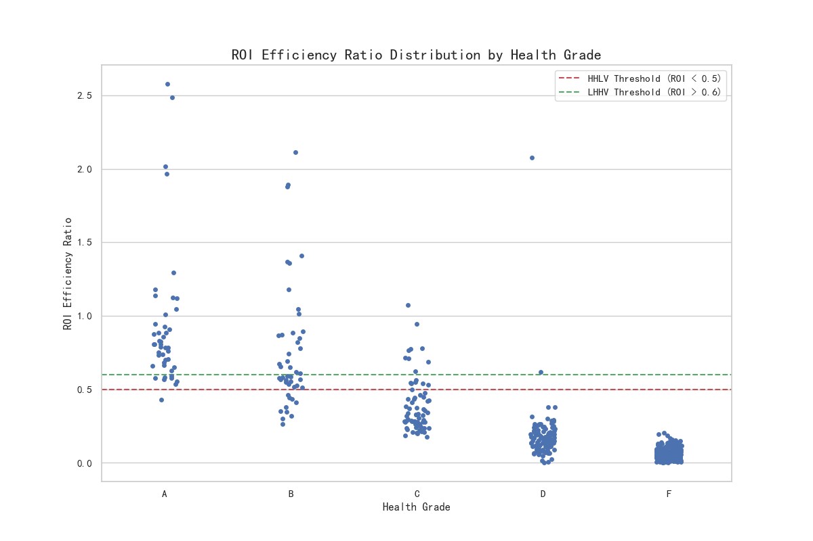
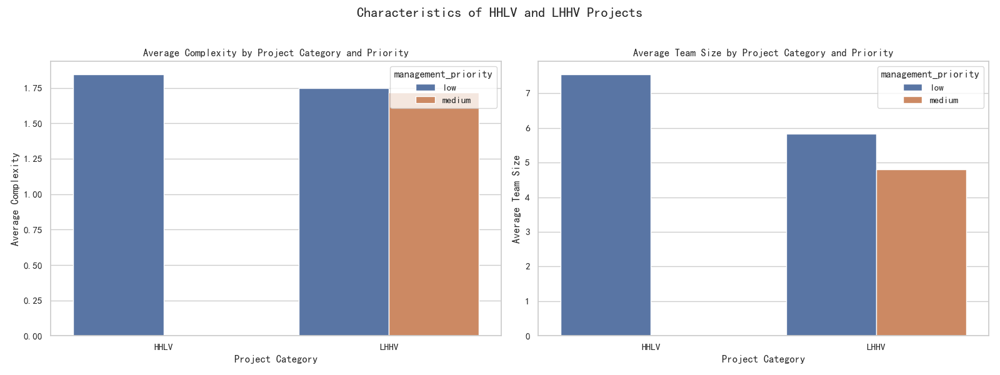

# The Health-Value Inversion: Rethinking Project Success Metrics

## Executive Summary

An analysis of the `asana__project_analytics` data reveals a significant "health-value inversion" phenomenon: a project's `overall_health_score` is an unreliable predictor of its `roi_efficiency_ratio`. We discovered that seemingly healthy projects (Grades 'A' and 'B') can yield low business value, while projects with poor health grades ('C', 'D', 'F') can be highly valuable.

Our investigation indicates that **low management priority** is a key driver of "High Health, Low Value" (HHLV) projects. Conversely, "Low Health, High Value" (LHHV) projects suggest that our current health score is too focused on internal process metrics and neglects strategic importance.

This report dissects the issue, presents data-driven insights, and proposes a revised framework for project evaluation to better align health monitoring with business value delivery.

## 1. The Disconnect: Project Health vs. Real Value

A preliminary analysis grouped projects by their `health_grade` to assess their average ROI, completion rates, and schedule adherence.

| health_grade | avg_roi_efficiency_ratio | avg_completion_percentage | overdue_project_proportion (%) |
|:------------:|:------------------------:|:-------------------------:|:------------------------------:|
|       A      |           0.93           |           96.00           |              33.33             |
|       B      |           0.76           |           72.44           |              26.09             |
|       C      |           0.39           |           50.05           |              45.59             |
|       D      |           0.18           |           40.52           |              58.26             |
|       F      |           0.06           |           28.84           |              96.02             |

While higher grades generally correlate with higher ROI and completion rates, two anomalies stand out:
1.  **High Overdue Rates in "Healthy" Projects:** A surprising 33% of 'A' grade projects exceed their planned duration by over 20%, indicating that the health score does not fully capture schedule risks.
2.  **Wide ROI Variance:** The core issue is the wide and overlapping distribution of ROI across health grades. Many 'A' and 'B' grade projects deliver a lower ROI than some 'C' and 'D' projects.

The following visualization starkly illustrates this inversion. The wide spread of ROI within each grade shows that a good health grade is no guarantee of value.

## 2. Unpacking the Anomalies: What Drives HHLV and LHHV Projects?

To understand the root cause, we isolated two groups:
*   **High Health, Low Value (HHLV):** `health_grade` of 'A' or 'B' with an `roi_efficiency_ratio` < 0.5.
*   **Low Health, High Value (LHHV):** `health_grade` of 'C', 'D', or 'F' with an `roi_efficiency_ratio` > 0.6.

Analysis of their characteristics revealed a critical factor: **Management Priority**.

**Key Insights:**

*   **HHLV projects are predominantly 'low' priority.** These projects may follow processes correctly, resulting in a good health score, but their lack of strategic importance means they consume resources without contributing significantly to business goals. They are "healthy" but not "valuable."
*   **LHHV projects can succeed despite being 'low' or 'medium' priority.** These are valuable but challenging initiatives. Their low health scores likely reflect operational friction (e.g., delays, resource constraints), but their underlying strategic value justifies the struggle and ultimately delivers a high ROI. The current health metric penalizes them for their difficult journey rather than rewarding their valuable destination.

## 3. Recommendations: Towards a Value-Driven Evaluation System

The current `overall_health_score` measures *process compliance* more than *value creation*. To fix this, we recommend a fundamental shift in how we evaluate projects.

**Recommendation 1: Redefine the Project Health Score**
The `overall_health_score` calculation must be updated to be a true measure of project success. We recommend incorporating:
*   **Business Value Component:** Directly factor in `roi_efficiency_ratio` or a similar metric.
*   **Strategic Weighting:** Assign a weight based on `management_priority`. A high-priority project with minor issues should be treated with more urgency than a low-priority project with similar issues.

**Recommendation 2: Implement a "Value vs. Health" Quadrant Model**
Move beyond a single score to a 2x2 portfolio management matrix that plots projects based on their **Health Score (Process Execution)** and a new **Value Score (Strategic & Financial Return)**.

*   **Stars (High Health, High Value):** Accelerate and replicate. These are our flagship projects.
*   **Gritty Winners (Low Health, High Value):** Intervene immediately. These valuable projects are in distress and require executive support to resolve impediments.
*   **Question Marks (High Health, Low Value):** Scrutinize and pivot. Why are we spending resources on these? Can their value be increased, or should they be de-prioritized or canceled?
*   **Dogs (Low Health, Low Value):** Divest. These projects drain resources with little return and should be terminated swiftly.

By adopting this framework, the organization can shift from a reactive, process-focused mindset to a proactive, value-driven approach to project portfolio management, ensuring that resources are always allocated to initiatives that deliver maximum business impact.
