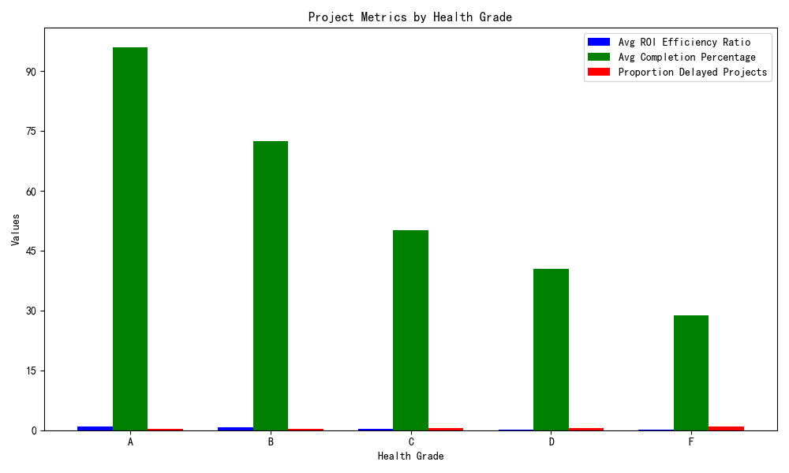

## Analysis of 'Health-Value Inversion' in Projects

### Overview
This analysis explores a peculiar phenomenon where some projects with high health scores have low ROI efficiency, while some with low health scores demonstrate high ROI efficiency. The analysis focuses on understanding this inversion by examining key metrics and project characteristics.

### Key Findings by Health Grade
The analysis grouped projects by health grade (A/B/C/D/F) and calculated:
- Average ROI efficiency ratio
- Average completion percentage
- Proportion of projects exceeding planned duration by more than 20%

From the bar chart above, we observe that:
- Health Grade A projects show high ROI efficiency and high completion percentage, but a notable proportion still exceeds planned duration.
- Lower health grades generally correlate with lower ROI efficiency and completion percentage, though exceptions exist.

### Factor Analysis: Team Size, Complexity, Priority, and Collaboration
Further analysis explored combinations of team size, project complexity, management priority, and collaboration efficiency to identify patterns associated with 'High Health, Low Value' (HHLV) and 'Low Health, High Value' (LHHV) projects.

From the visualization, we see that higher collaboration scores and appropriate management priority can lead to higher ROI efficiency even in projects with moderate or low overall health scores. Conversely, projects with high health scores but lower collaboration or misaligned management priority can show lower ROI performance.

### Recommendations
Based on the analysis, we recommend:
1. **Reassessing Evaluation Metrics**: Supplement overall health scores with detailed collaboration metrics and management prioritization effectiveness to better predict ROI.
2. **Enhancing Collaboration Practices**: Invest in tools and practices that improve team collaboration, especially for projects with high complexity or large team sizes.
3. **Aligning Management Priority with Complexity**: Ensure that project complexity is matched with appropriate management attention and resource allocation.
4. **Monitoring Duration Overruns**: Implement proactive duration monitoring and risk mitigation strategies for all health grades to reduce the proportion of delayed projects.

By addressing these areas, the organization can better align project health indicators with business value outcomes, reducing the occurrence of health-value inversions.
